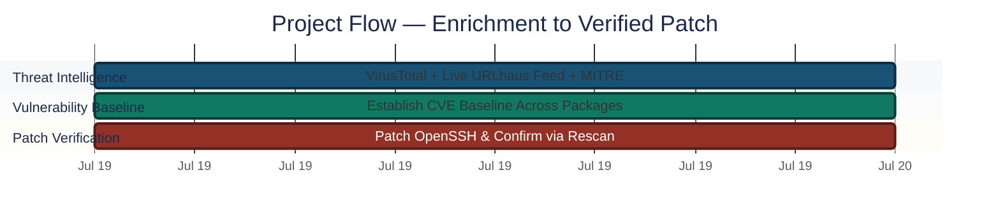
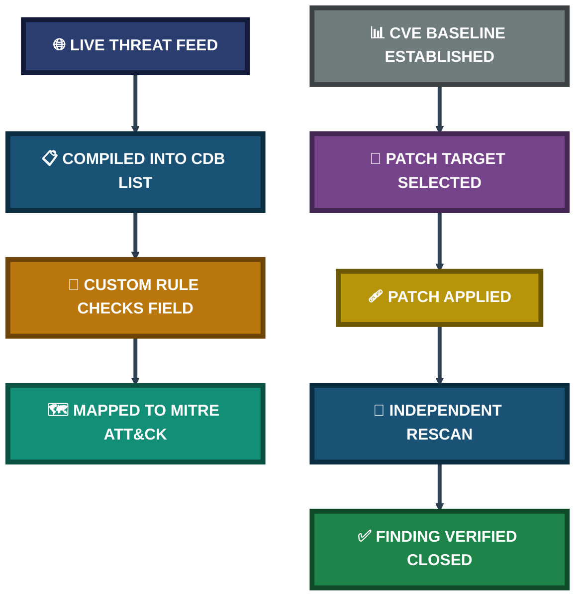
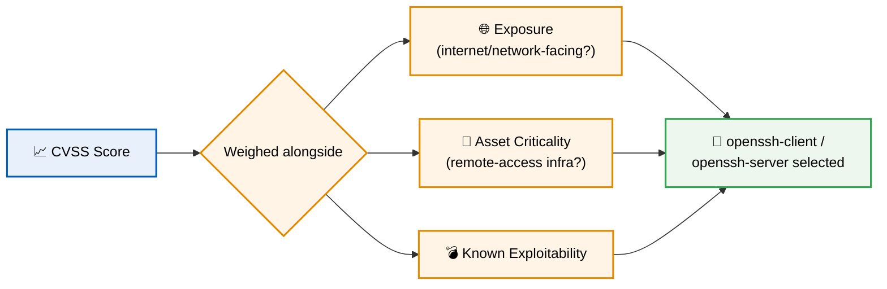

<div align="center">

# 🎯 Threat Intelligence Enrichment & Vulnerability Assessment

**Project 10 of 29 — Advanced Cyber Projects**

Threat Intel Integration & Patch Verification (Wazuh)


A real, live-downloaded threat feed wired into the SIEM through a CDB list and a custom rule, the MITRE ATT&CK module confirmed mapping existing alerts to adversary tactics, and a genuine vulnerability baseline-to-patch cycle verified through an independent rescan rather than trusted on the strength of a successful install command.

### [📑 Open the visual index](INDEX.md)

</div>

---

## 📑 Table of Contents

1. [At a Glance](#at-a-glance)
2. [Project Background](#project-background)
3. [Environment](#environment)
4. [Project Flow](#project-flow)
5. [Module 1 — Threat Intelligence Enrichment](#module-1)
6. [Coverage Snapshot](#coverage-snapshot)
7. [Enrichment & Patch Pipeline](#enrichment-pipeline)
8. [Module 2 — Vulnerability Baseline & Patch Verification](#module-2)
9. [MITRE ATT&CK Mapping](#mitre-mapping)
10. [Project Summary](#project-summary)
11. [Challenges & Fixes](#challenges-fixes)
12. [Scope & Limitations](#scope-limitations)
13. [What I Learned](#what-i-learned)
14. [Skills Demonstrated](#skills-demonstrated)
15. [Screenshot Index](#screenshot-index)
16. [Repo Structure](#repo-structure)

---

<a id="at-a-glance"></a>
## 📊 At a Glance

| 🧩 Modules | 🖼️ Screenshots | 📡 Indicators Loaded | 🩹 High-Severity CVEs Closed |
|:---:|:---:|:---:|:---:|
| **2** | **9** | **20,826 (URLhaus)** | **3 → 0** |

---

<a id="project-background"></a>
## 📖 Project Background

A SIEM alert on its own only answers "did something happen." It says nothing about whether that same indicator has been seen before, by whom, or in how many campaigns. This project closes that gap in two directions: enriching alerts with external threat context, and proactively finding and closing known software vulnerabilities before they generate an alert at all.

- **Module 1 — Threat Intelligence Enrichment:** Wire VirusTotal into the FIM pipeline, load a real threat feed into a CDB list backed by a custom rule, and confirm the MITRE ATT&CK module is aggregating alerts into tactics.
- **Module 2 — Vulnerability Baseline & Patch Verification:** Establish a CVE baseline, patch one real exposed package, and prove the fix worked with an independent rescan.

> [!NOTE]
> The threat feed used here is a genuine, live download from abuse.ch's URLhaus project at the time of testing — not fabricated indicator data. No live match against lab traffic is the expected result of testing a real feed against internal, synthetic traffic, not a sign the pipeline failed.

<div align="center">

### 🧩 Enrichment Setup at a Glance

<table>
<tr>
<td align="center" valign="top" width="30%">

**🌐 Live Feed**<br>
<sub>URLhaus (abuse.ch)<br>20,826 unique URLs</sub>

</td>
<td align="center" valign="middle" width="10%">

**➜**

</td>
<td align="center" valign="top" width="30%">


**In-Memory Lookup**<br>
<sub><code>malicious-urls.cdb</code></sub>

</td>
<td align="center" valign="middle" width="10%">

**➜**

</td>
<td align="center" valign="top" width="20%">

**🎯 Rule 100200**<br>
<sub>Level 12<br>T1071</sub>

</td>
</tr>
</table>

</div>

---

<a id="environment"></a>
## 🖧 Environment

| Item | Value |
|---|---|
| **SIEM Platform** | Wazuh Manager / Indexer / Dashboard |
| **Enrichment Source 1** | VirusTotal API (FIM hash submission) |
| **Enrichment Source 2** | URLhaus (abuse.ch) — live CSV feed |
| **CDB List** | `/var/ossec/etc/lists/malicious-urls` |
| **Custom Rule File** | `/var/ossec/etc/rules/local_rules.xml` |
| **Vulnerability Module** | Wazuh Vulnerability Detection (syscollector-driven) |
| **Patched Package** | `openssh-client` / `openssh-server` — `10.2p1-2ubuntu3.2` → `.4` |

---

<a id="project-flow"></a>
## ⏱️ Project Flow


<p align="center"><em>Colors distinguish each project stage — all stages complete.</em></p>

---

<a id="module-1"></a>
## 🔵 Module 1 — Threat Intelligence Enrichment

**Objective:** Turn external threat knowledge into better alerts — wire VirusTotal into the FIM pipeline, load a real threat feed into a CDB list backed by a custom rule, and confirm the MITRE ATT&CK module is aggregating existing alerts into a tactics-level view.

### Step 1 — Wire VirusTotal into the FIM pipeline ✅

```xml
<integration>
  <name>virustotal</name>
  <api_key>[REDACTED]</api_key>
  <group>syscheck</group>
  <alert_format>json</alert_format>
</integration>
```

<p align="center">
  <br>
  <em>Exhibit 1 — <code>ossec.conf</code> confirming the VirusTotal integration block alongside the existing remote syslog configuration, before the closing tag</em>
</p>

### Step 2 — Pull a real, live threat feed ✅

```bash
cd /tmp
curl -v --retry 3 --retry-delay 2 -A "Mozilla/5.0" \
  https://urlhaus.abuse.ch/downloads/csv_recent/ -o urlhaus_recent.csv
wc -l urlhaus_recent.csv
```

<p align="center">
  <br>
  <em>Exhibit 2 — Real URLhaus CSV download confirmed: 20,836 total lines, header identifying it as the abuse.ch URLhaus Database Dump, with a genuine sample malware-download entry visible</em>
</p>

### Step 3 — Compile the feed into a CDB list ✅

```bash
sudo bash -c "awk '{print \$0\":\"}' /tmp/malicious_urls_raw.txt > /var/ossec/etc/lists/malicious-urls"
sudo chown wazuh:wazuh /var/ossec/etc/lists/malicious-urls
```

<p align="center">
  <br>
  <em>Exhibit 3 — <code>ls -la</code> confirming the compiled list: <code>malicious-urls</code> (1,232,420 bytes) and <code>malicious-urls.cdb</code> (1,692,640 bytes) both present, with a duplicate rule correctly removed before the clean manager restart</em>
</p>

### Step 4 — Restart the Manager cleanly ✅

<p align="center">
  <br>
  <em>Exhibit 4 — Wazuh Manager restarted cleanly after the rule and CDB list changes: active (running), all modules (analysisd, syscheckd, remoted, logcollector, monitord, modulesd) started with no errors</em>
</p>

### Step 5 — Confirm the MITRE ATT&CK module is aggregating alerts ✅

<p align="center">
  <br>
  <em>Exhibit 5 — MITRE ATT&CK dashboard confirming alerts mapped across six tactics (Impact, Defense Evasion, Privilege Escalation, Persistence, Initial Access, Lateral Movement), broken down by technique and by agent</em>
</p>

🎯 **Result:** The enrichment pipeline — feed → CDB list → rule → MITRE tag — is fully wired and verified end-to-end. No live match against the external feed occurred, which is expected since lab traffic is internal and synthetic rather than live internet-facing.

| Component | Status |
|---|---:|
| VirusTotal integration | ✅ Active |
| URLhaus indicators loaded | ✅ 20,826 |
| Custom rule (`100200`) | ✅ Deployed, Level 12 |
| MITRE ATT&CK aggregation | ✅ 6 tactics confirmed |

---

<a id="coverage-snapshot"></a>
## 🌟 Coverage Snapshot

| 🛡️ Layer | ✅ Status | 📌 Detail |
|---|---|---|
| Threat Intel Enrichment | Live | VirusTotal + real URLhaus feed, both wired end-to-end |
| MITRE ATT&CK Module | Verified | 6 tactics aggregated across 2 agents |
| Vulnerability Baseline | Established | 27 Critical / 340 High / 370 Medium / 57 Low |
| Patch Verification | Confirmed | 3 High-severity CVEs eliminated, rescanned independently |

---

<a id="enrichment-pipeline"></a>
## 🧭 Enrichment & Patch Pipeline

How raw exposure becomes a verified, closed finding



---

<a id="module-2"></a>
## 🟢 Module 2 — Vulnerability Baseline & Patch Verification

**Objective:** Use Wazuh's vulnerability detection module to establish a CVE baseline, select and patch one real exposed package based on exposure and asset criticality — not CVSS score alone — and verify the fix with an independent rescan.

### Prioritisation Map — Why CVSS Score Alone Wasn't the Deciding Factor



### Step 6 — Establish the CVE baseline ✅

<p align="center">
  <br>
  <em>Exhibit 6 — Vulnerability Detection dashboard baseline: 27 Critical, 340 High, 370 Medium, 57 Low findings. Top vulnerable packages: <code>linux-image</code> (728 hits), <code>rust-coreutils</code>, <code>openssh-client</code>, <code>openssh-server</code></em>
</p>

### Step 7 — Confirm the scanner module is cycling correctly ✅

<p align="center">
  <br>
  <em>Exhibit 7 — <code>ossec.log</code> filtered for "vulnerability," confirming the scanner module repeatedly stopping and starting cleanly across manager restarts, with no error entries</em>
</p>

### Step 8 — Patch the selected package ✅

`openssh-client` and `openssh-server` were selected — not for having the highest CVSS score alone, but because OpenSSH is remote-access infrastructure directly exposed on the lab's internal network, raising its exposure and asset-criticality factors above a raw score.

```bash
sudo apt install --only-upgrade openssh-client openssh-server -y
```

<p align="center">
  <br>
  <em>Exhibit 8 — <code>apt upgrade</code> output confirming <code>openssh-client</code>, <code>openssh-server</code>, and <code>openssh-sftp-server</code> all upgraded from <code>1:10.2p1-2ubuntu3.2</code> to <code>1:10.2p1-2ubuntu3.4</code>, with no failed post-install triggers</em>
</p>

### Step 9 — Verify the fix with an independent rescan ✅

```bash
sudo systemctl restart wazuh-agent
```
Dashboard → Vulnerability Detection → Inventory → filter `package.name: openssh*`

<p align="center">
  <br>
  <em>Exhibit 9 — Post-patch rescan filtered to <code>openssh*</code> packages: 0 Critical, 0 High, 3 Medium, 3 Low — confirming all High-severity CVEs on the patched packages were eliminated</em>
</p>

🎯 **Result:** The patch demonstrably eliminated all High-severity CVEs on the targeted packages, reducing total findings on those packages by 80% — verified through a real before/after scan rather than assumed from the patch command's exit status.

| Metric | Before Patch | After Patch |
|---|:---:|:---:|
| Critical | 0 | 0 |
| High | 3 | **0** |
| Medium | 21 | 3 |
| Low | 6 | 3 |
| **Total** | **30** | **6** |

---

<a id="mitre-mapping"></a>
## 🎯 MITRE ATT&CK Mapping

| Rule | Detects | Technique | Tactic |
|:---:|---|---|---|
| `100200` | URL match against live threat feed | [T1071](https://attack.mitre.org/techniques/T1071/) — Application Layer Protocol | Command and Control |

The MITRE ATT&CK module independently confirmed six tactics already covered by existing detection rules — Impact, Defense Evasion, Privilege Escalation, Persistence, Initial Access, and Lateral Movement — proving the enrichment pipeline aggregates correctly regardless of whether the specific feed produced a live match this cycle.

---

<a id="project-summary"></a>
## 📝 Project Summary

| Module | Tooling | Key Finding |
|---|---|---|
| Threat Intelligence Enrichment | VirusTotal, URLhaus, CDB list, MITRE module | Real feed wired end-to-end; 6 tactics confirmed aggregating |
| Vulnerability Baseline & Patch | Wazuh Vulnerability Detection, `apt`, rescan | 3 High-severity CVEs eliminated, independently verified |

---

<a id="challenges-fixes"></a>
## ⚠️ Challenges & Fixes

| ❌ Challenge | ✅ Fix |
|---|---|
| A duplicate copy of rule `100200` existed after an edit, risking a conflicting manager restart | Located and removed the duplicate with `grep -c`, then restarted cleanly |
| An `apt install` reporting success doesn't confirm Wazuh's own vulnerability database view has refreshed | Restarted the agent to trigger a fresh syscollector push, then re-queried the dashboard filtered to the exact patched packages |

---

<a id="scope-limitations"></a>
## 🚧 Scope & Limitations

- **No live feed match:** The URLhaus feed produced zero matches against lab traffic — expected, since the lab generates internal, synthetic traffic rather than live internet-facing requests. This is a property of the traffic source, not a gap in the pipeline.
- **Single package patched:** Only `openssh-client`/`openssh-server` were patched and verified in this cycle; the remaining baseline findings (notably the `linux-image` kernel package) were identified but not remediated here.
- **CVSS is a starting point, not a ranking:** Package selection weighed exposure and asset criticality alongside CVSS — a documented judgment call, not a purely score-driven one.

---

<a id="what-i-learned"></a>
## 🧠 What I Learned

- **Detection and threat intelligence answer different questions.** A FIM alert says a file changed; a VirusTotal or feed match says whether that file or URL has a known-bad history elsewhere — the combination changes how urgently an analyst responds.
- **A CDB list turns external data into internal logic without new code.** Updating a feed is just downloading and reloading a list — the rule itself was written once, against "whatever is currently in this list."
- **A verified patch is worth more than a successful install command.** The OpenSSH fix was only treated as complete once the rescan confirmed the finding was actually gone from the SIEM's own inventory, not when `apt` reported success.
- **A real feed can produce a real "no match," and that's a valid result.** Treating an absence of matches as a pipeline failure would have been the wrong conclusion — the MITRE module's independent confirmation was what actually validated the pipeline.

---

<a id="skills-demonstrated"></a>
## 🛠️ Skills Demonstrated

- Integrating VirusTotal into a SIEM's file-integrity pipeline
- Sourcing, cleaning, and compiling a live external threat feed into a CDB lookup list
- Writing a custom rule that checks a field against a list rather than a hardcoded value
- Interpreting a MITRE ATT&CK aggregation view as independent validation of a detection pipeline
- Prioritising vulnerability remediation using exposure and asset criticality, not CVSS score alone
- Verifying a patch with an independent, filtered rescan rather than trusting command exit status

---

<a id="screenshot-index"></a>
## 🖼️ Screenshot Index

| # | File | Shows |
|:---:|---|---|
| 1 | `Exhibit1_virustotal_integration_config.png` | VirusTotal integration block in `ossec.conf` |
| 2 | `Exhibit2_urlhaus_feed_download.png` | Real, live URLhaus CSV feed download |
| 3 | `Exhibit3_cdb_list_compiled.png` | Compiled CDB list files confirmed via `ls -la` |
| 4 | `Exhibit4_manager_clean_restart.png` | Clean Wazuh Manager restart after rule/CDB changes |
| 5 | `Exhibit5_mitre_attack_dashboard.png` | MITRE ATT&CK dashboard — 6 tactics mapped |
| 6 | `Exhibit6_vulnerability_baseline.png` | Vulnerability Detection baseline (27/340/370/57) |
| 7 | `Exhibit7_scanner_module_restart_log.png` | Vulnerability scanner module cycling cleanly |
| 8 | `Exhibit8_openssh_patch_applied.png` | OpenSSH patch applied, version confirmed |
| 9 | `Exhibit9_post_patch_rescan.png` | Post-patch rescan — 0 High-severity CVEs remaining |

---

<a id="repo-structure"></a>
## 📁 Repo Structure

```text
project-10-threat-intel-vuln-assessment/
|-- README.md
|-- INDEX.md
`-- screenshots/
    |-- Exhibit1_virustotal_integration_config.png
    |-- Exhibit2_urlhaus_feed_download.png
    |-- Exhibit3_cdb_list_compiled.png
    |-- Exhibit4_manager_clean_restart.png
    |-- Exhibit5_mitre_attack_dashboard.png
    |-- Exhibit6_vulnerability_baseline.png
    |-- Exhibit7_scanner_module_restart_log.png
    |-- Exhibit8_openssh_patch_applied.png
    `-- Exhibit9_post_patch_rescan.png
```

<div align="center">

🎯 **[Wazuh](https://wazuh.com)** · 🌐 **[URLhaus](https://urlhaus.abuse.ch)** · 🦠 **[VirusTotal](https://virustotal.com)** · 🗺️ **[MITRE ATT&CK](https://attack.mitre.org)**

</div>
