<div align="center">

# 🦠 Malware Analysis & Incident Response

**Project 11 of 29 — Blue Team Internship Portfolio**

Sample Acquisition · Static & Dynamic Analysis · Suricata Detection Engineering


Two real malware samples — njRAT and a Zeus/ZeroAccess dropper — acquired safely, analyzed statically and dynamically, and converted into working detection logic. One custom Suricata rule proven firing independently of the default ruleset; a second written but stopped mid-verification by a genuine hardware failure, disclosed exactly as it happened rather than smoothed over.

### [📑 Open the visual index](INDEX.md)

</div>

---

## 📑 Table of Contents

1. [At a Glance](#at-a-glance)
2. [Project Background](#project-background)
3. [Environment](#environment)
4. [Sample Comparison](#sample-comparison)
5. [Project Flow](#project-flow)
6. [Module 1 — Sample Acquisition & Environment Lockdown](#module-1)
7. [Module 2 — Static Malware Analysis](#module-2)
8. [Module 3 — Interactive Dynamic Analysis](#module-3)
9. [Module 4 — Detection Engineering (Suricata)](#module-4)
10. [Module 5 — Host Detection & IR Plan (Not Started)](#module-5)
11. [Coverage Snapshot](#coverage-snapshot)
12. [Troubleshooting Pipeline](#troubleshooting-pipeline)
13. [Command Reference](#command-reference)
14. [Project Summary](#project-summary)
15. [Challenges & Fixes](#challenges-fixes)
16. [Scope & Limitations](#scope-limitations)
17. [What I Learned](#what-i-learned)
18. [Skills Demonstrated](#skills-demonstrated)
19. [Screenshot Index](#screenshot-index)
20. [Repo Structure](#repo-structure)

---

<a id="at-a-glance"></a>
## 📊 At a Glance

| 🧩 Samples Analyzed | 🖼️ Screenshots | 🎯 Custom Rules Written | ✅ Rules Verified | 💰 Cost |
|:---:|:---:|:---:|:---:|:---:|
| **2** | **15** | **2** | **1** | **$0** |

---

<a id="project-background"></a>
## 📖 Project Background

Two malware samples were deliberately chosen to cover different attack patterns: **njRAT** (a Remote Access Trojan using domain-based Dynamic DNS command-and-control) and a **Zeus/ZeroAccess** sample (a banking-trojan-family dropper using hardcoded-IP peer-to-peer C2 disguised as DNS traffic). Both were downloaded from theZoo repository, hashed before any handling, and analyzed only after the lab was verified airgapped at the hypervisor level.

| Task Block | Status | Note |
|---|:---:|---|
| Sample Acquisition & Lockdown | ✅ Complete | Both samples acquired, hashed, airgapped, permission-locked |
| Static Malware Analysis | ✅ Complete | `file`/`exiftool`/`binwalk`/`strings` run on both, VT cross-checked |
| Dynamic Analysis (ANY.RUN) | ✅ Complete | Both samples detonated interactively, full IOC/IOA set extracted |
| Suricata Detection (njRAT) | ✅ Complete | Custom rule written, verified combined **and** isolated |
| Suricata Detection (Zeus) | 🟡 Partial | Rule written, structurally sound, **live replay verification pending** |
| Wazuh Custom Rules | ❌ Not Started | Blocked by hardware failure on the analysis machine |
| Incident Response Plan | ❌ Not Started | Depends on the Wazuh rules above; all supporting evidence is ready |

> [!IMPORTANT]
> A hardware failure (recurring motherboard-level instability under VM load) interrupted work partway through Day 34 and halted Day 35 entirely. This is disclosed directly, with an itemized list of exactly what remains and the estimated effort to finish it — not fabricated or silently skipped.

---

<a id="environment"></a>
## 🖧 Environment

| Item | Value |
|---|---|
| **Sample Source** | theZoo GitHub repository (individual file `wget`, not a full clone) |
| **Analysis VM** | Kali Linux, hypervisor-level NAT adapter disabled for airgap |
| **Sample Directory** | `~/malware_samples`, `chmod 700` |
| **Final Sample Permissions** | `chmod 400` (read-only, non-executable) |
| **Dynamic Sandbox** | ANY.RUN (interactive, Windows 10 64-bit, Public visibility, Fake Net enabled) |
| **Detection Engine** | Suricata 8.0.6, full ET ruleset (52,725 rules) |
| **Baseline Capture** | `tcpdump` on `eth0`, 61 packets, `baseline_capture.pcap` |

---

<a id="sample-comparison"></a>
## 🔬 Sample Comparison

| | njRAT v0.6.4 | Zeus / ZeroAccess (26 Nov 2013 build) |
|---|---|---|
| **SHA256** | `fd624aa2...822199` | `69e966e7...168af169` |
| **File type** | .NET/Mono assembly | 32-bit Windows PE, disguised as `.pdf.exe` |
| **VirusTotal** | 62/70 — bladabindi/msil | 64/71 — zaccess/sirefef (true family: ZeroAccess) |
| **C2 mechanism** | Domain via Dynamic DNS (`*.zapto.org`) | Hardcoded IP, encrypted P2P over UDP/53 |
| **Persistence** | Startup-folder drop, randomized filename | DLL search-order hijack (`msimg32.dll`) |
| **Evasion** | Self-renaming process chain, firewall self-allow | Fake installer masquerade, geolocation anti-sandbox check |
| **Suricata rule needed** | Domain-content match | IP + port + payload match |

---

<a id="project-flow"></a>
## ⏱️ Project Flow

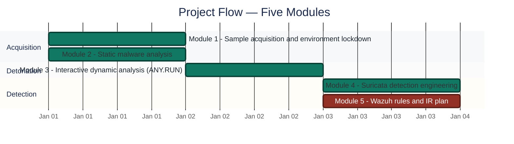
<p align="center"><em>Module 5 is marked critical (red) — blocked by hardware failure, not yet started.</em></p>

---

<a id="module-1"></a>
## 🔵 Module 1 — Sample Acquisition & Environment Lockdown

**Objective:** Acquire both samples safely, hash them before any other handling, then lock the lab down to a verified airgap before any analysis begins.

### Step 1 — Confirm connectivity, then lock the sample directory ✅

<p align="center">
  <br>
  <em>Exhibit 1 (Figure 3.1) — <code>ping -c 4 google.com</code>, 0% packet loss, confirming an active internet path before acquisition begins</em>
</p>

<p align="center">
  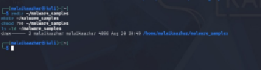<br>
  <em>Exhibit 2 (Figure 3.2) — <code>ls -ld</code> confirms <code>drwx------</code> (700) on <code>~/malware_samples</code></em>
</p>

### Step 2 — Locate and download both samples individually ✅

```
wget <theZoo raw path>/njRAT-v0.6.4.pass
wget <theZoo raw path>/njRAT-v0.6.4.zip
wget <theZoo raw path>/njRAT-v0.6.4.sha256
```

<p align="center">
  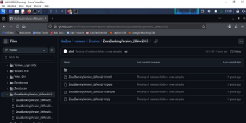<br>
  <em>Exhibit 3 (Figure 3.3) — theZoo repository, ZeusBankingVersion_26Nov2013 folder, four component files</em>
</p>

<p align="center">
  <br>
  <em>Exhibit 4 (Figure 3.4) — theZoo repository, njRAT-v0.6.4 folder, same four-file structure</em>
</p>

<p align="center">
  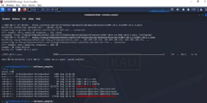<br>
  <em>Exhibit 5 (Figure 3.5) — Individual <code>wget</code> download (not a repo clone), all four component files confirmed present</em>
</p>

### Step 3 — Extract and hash immediately ✅

```
unzip -P infected njRAT-v0.6.4.zip
md5sum njRAT.exe && sha256sum njRAT.exe
```

<p align="center">
  <br>
  <em>Exhibit 6 (Figure 3.6) — Extraction confirmed, including the Plugin/ subfolder (cam.dll, ch.dll, fm.dll, Mic.dll, pw.dll, sc2.dll)</em>
</p>

<p align="center">
  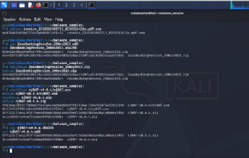<br>
  <em>Exhibit 7 (Figure 3.7) — <code>md5sum</code>/<code>sha256sum</code> cross-checked directly against theZoo's published values — exact match</em>
</p>

🎯 **Why hash before anything else?** A filename is trivially changed; a cryptographic hash is a fingerprint of the actual binary content. Computing it immediately after extraction, before any tool touches the file, guarantees the hash on record corresponds to the exact bytes analyzed.

### Step 4 — Airgap at the hypervisor level, then lock permissions ✅

The NAT adapter was disabled in VirtualBox settings — not from inside the guest OS — because disabling a NIC inside the VM still leaves the hypervisor's virtual attachment active.

<p align="center">
  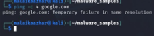<br>
  <em>Exhibit 8 (Figure 3.8) — <code>ping</code> returns "Temporary failure in name resolution" — a <b>failed</b> test, which is the correct airgap confirmation. A passing ping here would have proven nothing.</em>
</p>

<p align="center">
  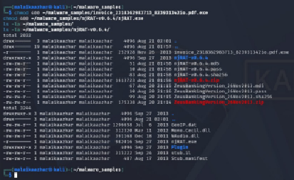<br>
  <em>Exhibit 9 (Figure 3.9) — <code>ls -la</code> confirms both samples at <code>-r--------</code> (400: read-only, non-executable, owner-only)</em>
</p>

<p align="center">
  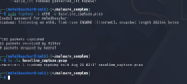<br>
  <em>Exhibit 10 (Figure 3.10) — <code>tcpdump</code> baseline capture: 61 packets over idle observation, establishing "normal" before the samples are touched</em>
</p>

---

<a id="module-2"></a>
## 🟠 Module 2 — Static Malware Analysis

**Objective:** Examine both samples without executing them, cataloguing what each file contains and which questions dynamic analysis will need to answer.

### Step 5 — File-type identification ✅

<p align="center">
  <br>
  <em>Exhibit 11 (Figure 4.1) — Zeus is a 32-bit Windows PE despite its <code>.pdf.exe</code> disguise; njRAT is a .NET/Mono assembly</em>
</p>

### Step 6 — Metadata inspection ✅

<p align="center">
  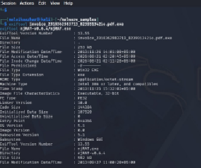<br>
  <em>Exhibit 12 (Figure 4.2) — Zeus compile timestamp 2013-11-25, unsigned; njRAT's internal original filename confirmed as <code>njRAT.exe</code></em>
</p>

### Step 7 — Embedded payload detection ✅

<p align="center">
  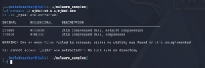<br>
  <em>Exhibit 13 (Figure 4.3) — Two embedded Zlib-compressed blobs found in njRAT.exe; extraction itself failed ("no utility found"), disclosed as a tooling limitation, not evidence the payload is absent</em>
</p>

### Step 8 — ASCII vs. Unicode strings comparison ✅

<p align="center">
  <br>
  <em>Exhibit 14 (Figure 4.4) — Zeus's Unicode pass: only 30 bytes, all punctuation — a strong packing indicator, not a null result</em>
</p>

| Sample | ASCII strings | Unicode (`-el`) strings |
|---|:---:|:---:|
| Zeus | 147,205 bytes | 30 bytes (punctuation only) |
| njRAT | 63,436 bytes | 3,593 bytes (genuine content) |

### Step 9 — VirusTotal cross-verification ✅

<p align="center">
  <br>
  <em>Exhibit 15 (Figure 4.5) — njRAT flagged 62/70, family tags bladabindi / msil / msilperseus</em>
</p>

🎯 **Finding:** VirusTotal confirms the "Zeus"-named sample's dominant classification across vendors is actually **ZeroAccess/Sirefef** — theZoo's folder name reflects its own labelling convention, not the payload's true family, later confirmed independently by the Day 32–33 dynamic behavior.

---

<a id="module-3"></a>
## 🟢 Module 3 — Interactive Dynamic Analysis 📝

**Objective:** Detonate both samples in ANY.RUN, an interactive cloud sandbox, to recover the runtime behavior static analysis cannot reach.

> [!NOTE]
> No screenshots were captured/retained for this module in the source report (all figures show as empty placeholders there). Every finding below is documented from the report's own text, not fabricated.

### njRAT.exe — [ANY.RUN task](https://app.any.run/tasks/a129669d-1d0b-42fb-b50c-cd1c8047dc34) — Verdict: Malicious, danger score 100/100, runtime 71s 📝

- **Process chain:** `njRAT.exe → njRAT.exe → njRAT.exe → njq8.exe → windows.exe → {netsh.exe, conhost.exe}` — njRAT progressively renames its own copies, a basic evasion technique against filename-based detection.
- **Persistence:** final drop lands in the Startup folder under a randomized hex filename (`ecc7c8c5...02f20.exe`) — relaunches on every login without needing a registry Run key.
- **C2 via Dynamic DNS:** resolves through `*.zapto.org` (SID 2028703, ET POLICY DynDNS) — lets the attacker's real IP change freely without touching the malware binary.
- **Firewall self-allow (IOA):** `netsh.exe firewall add allowedprogram "...\windows.exe" ENABLE` — opens a hole in Windows Firewall for itself, a behavioral indicator no static signature could surface.

### invoice_..._io.pdf.exe (Zeus/ZeroAccess) — [ANY.RUN task](https://app.any.run/tasks/19c0da7a-8389-47d2-854b-39208744e930) — Verdict: Malicious, danger score 100/100, runtime 248s 📝

- **Fake installer masquerade:** drops and runs `InstallFlashPlayer.exe`, forging Adobe's own version metadata.
- **DLL masquerading:** drops `msimg32.dll` — the name of a legitimate Windows system DLL — consistent with DLL search-order hijacking.
- **C2 via hardcoded IP disguised as DNS:** hardcoded IP `85.114.128.127`, encrypted P2P data over UDP/53 (SID 2015474, ET MALWARE ZeroAccess) — deliberately using the DNS port to blend in without the traffic actually being DNS.
- **Anti-sandbox check:** a YARA warning flagged geolocation lookup functionality, corroborated by an HTTP request to `cj.maxmind.com` — checks its own apparent location before proceeding.

### MITRE ATT&CK Techniques Observed

| Technique | Name | Evidence |
|---|---|---|
| T1547.001 | Registry Run Keys / Startup Folder | njRAT Startup-folder drop |
| T1562.004 | Disable or Modify System Firewall | njRAT `netsh` allow-rule |
| T1012 | Query Registry | njRAT reads machine GUID |
| T1082 | System Information Discovery | njRAT environment fingerprinting |

---

<a id="module-4"></a>
## 🟣 Module 4 — Detection Engineering (Suricata)

**Objective:** Convert the recovered IOCs into working Suricata detection logic, verified by offline PCAP replay — the correct method since both samples executed on ANY.RUN's infrastructure, not the local lab network.

### Step 10 — njRAT custom rule: written, verified combined and isolated ✅

```
alert dns any any -> any any (msg:"CUSTOM RAT C2 DNS Query to zapto.org DynDNS domain";
dns.query; content:"zapto.org"; nocase; endswith; classtype:trojan-activity; sid:9000004; rev:1;)
```

- **Combined-ruleset replay:** fired 8 times, matching the exact timestamps/ports of the default ET rule.
- **Isolated replay** (`-S local.rules` only, no default ruleset): fired the same 8 times with nothing else in the log — proving the custom rule works independently, satisfying the task's isolation-test requirement.

### Step 11 — Zeus custom rule: written, live verification pending 🟡

```
alert udp any any -> 85.114.128.127 53 (msg:"CUSTOM Zeus ZeroAccess C2 UDP Traffic";
content:"|37 CF EC 34|"; classtype:trojan-activity; sid:9000005; rev:1;)
```

> [!WARNING]
> **STATUS — LIVE VERIFICATION PENDING.** This rule is written and structurally sound — same format as the verified njRAT rule, keyed to the confirmed Zeus IOC exactly. It could not be loaded and replay-tested against the Zeus PCAP because the analysis machine began experiencing recurring motherboard-level hardware failure partway through this session. The same three-step verification already proven for njRAT (config test, combined-ruleset replay, isolated `-S` replay) remains outstanding.

### Host-Behavior Gap — Why Suricata Cannot Detect Everything Observed

None of the following can be detected by Suricata — they're host-level events with no network signature: njRAT's Startup-folder persistence write, njRAT's firewall rule addition via `netsh`, or Zeus's DLL drop for search-order hijacking. Each requires host-based detection via Wazuh — this is the exact handoff point to Module 5.

---

<a id="module-5"></a>
## 🔴 Module 5 — Host Detection & IR Plan (Not Started)

**Objective:** Cover what Suricata structurally cannot — host-level persistence and process behavior — then use both detection layers as direct inputs to a NIST SP 800-61 Incident Response Plan.

> [!CAUTION]
> **Both items in this module are genuinely not started**, not partially done and underreported. Writing the IR Plan now would mean inventing rule levels and MITRE mappings that haven't actually been built and tested — which would defeat the purpose of an evidence-grounded IR document.

### Draft Wazuh rule logic (not yet written into `local_rules.xml`, not tested)

| # | Category | Trigger (from evidence) | MITRE Mapping |
|---|---|---|---|
| 1 | Persistence | File creation in `...\Startup\` (matches njRAT's randomized-name drop) | T1547.001 |
| 2 | Process/command-line | `netsh.exe` invoked with `firewall add allowedprogram` (matches njRAT) | T1562.004 |
| 3 | Persistence/masquerade | New `.dll` in `AppData\Local\Temp` matching a known system DLL name (matches Zeus's `msimg32.dll`) | T1574.001 |

This work cannot be completed or verified without the Windows 10 agent and Wazuh Manager, both running on the physical machine currently experiencing hardware failure.

### What's already ready to go into the IR Plan once Wazuh work is complete

- Full attack timeline data — ANY.RUN timestamps for both sessions at millisecond granularity
- The complete 12-row IOC/IOA table (see Coverage Snapshot)
- The confirmed detection-layer split: Suricata for network-layer C2, Wazuh for host-layer persistence/firewall/DLL hijacking
- Eradication specifics already known precisely: the exact Startup-folder path, the exact Temp DLL name, the exact firewall rule to reverse

### Summary of Outstanding Work

| Item | Status | Estimated Effort Once Unblocked |
|---|---|:---:|
| Zeus custom Suricata rule | Written, needs live replay verification | ~10 minutes |
| 3 Wazuh custom rules | Drafted at concept level, not written or tested | ~30–45 minutes |
| Full Incident Response Plan | Not started; all required evidence already collected | ~20–30 minutes |

---

<a id="coverage-snapshot"></a>
## 🌟 Coverage Snapshot

| 🛡️ Module | ✅ Status | 📌 Detail |
|---|---|---|
| Sample Acquisition & Lockdown | Complete | Both samples hashed, airgapped, permission-locked |
| Static Analysis | Complete | 4 tools run on both samples, VT cross-checked |
| Dynamic Analysis | Complete (📝 notes only) | Full behavioral picture recovered, no screenshots in source |
| Suricata — njRAT | Complete | Verified combined AND isolated (8/8 both modes) |
| Suricata — Zeus | Partial | Written, structurally sound, live-fire unverified |
| Wazuh Custom Rules | Not started | Blocked by hardware failure |
| Incident Response Plan | Not started | Depends on Wazuh rules above |

### 🧾 Consolidated IOC / IOA Table

| # | Type | Value | Sample | Significance |
|:---:|---|---|:---:|---|
| 1 | SHA256 | `fd624aa2...822199` | njRAT | Sample identifier |
| 2 | SHA256 | `69e966e7...168af169` | Zeus | Sample identifier |
| 3 | Domain (DynDNS) | `*.zapto.org` | njRAT | C2 via free dynamic-DNS provider |
| 4 | Dest. IP:Port | `85.114.128.127:53/UDP` | Zeus | Hardcoded P2P C2, disguised as DNS |
| 5 | File path | `...\Startup\ecc7c8c5...02f20.exe` | njRAT | Persistence, randomized filename |
| 6 | File path | `...\Temp\msimg32.dll` | Zeus | DLL search-order hijack masquerade |
| 7 | Process rename | `njq8.exe`, `windows.exe` | njRAT | Self-renaming evasion |
| 8 | Process masquerade | `InstallFlashPlayer.exe` | Zeus | Fake-installer masquerade |
| 9 | Command line | `netsh firewall add allowedprogram ...` | njRAT | Firewall self-allow (IOA) |
| 10 | Behavioral | Geolocation lookup via `cj.maxmind.com` | Zeus | Anti-sandbox check (IOA) |
| 11 | Suricata SID | 2028703 (ET POLICY DynDNS) | njRAT | Default rule confirms domain C2 |
| 12 | Suricata SID | 2015474 (ET MALWARE ZeroAccess) | Zeus | Default rule confirms IP-based C2 |

---

<a id="troubleshooting-pipeline"></a>
## 🧭 Troubleshooting Pipeline

How a hardware failure becomes an itemized, honest handoff instead of a fabricated finish

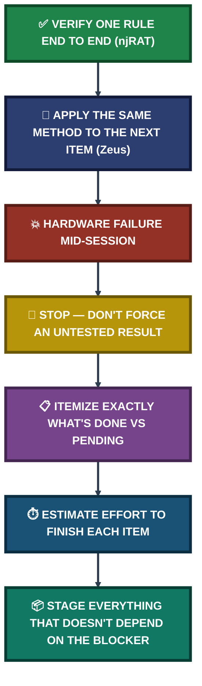

---

<a id="command-reference"></a>
## 🧰 Command Reference

| # | Command | Used In | Purpose |
|:---:|---|---|---|
| 1 | `chmod 700 ~/malware_samples` | Module 1 | Lock the sample directory to owner-only access |
| 2 | `wget <path>` (individual files) | Module 1 | Acquire samples without a full repo clone |
| 3 | `unzip -P infected <file>.zip` | Module 1 | Extract using theZoo's standard archive password |
| 4 | `md5sum` / `sha256sum` | Module 1 | Hash samples immediately post-extraction |
| 5 | `chmod 400 <sample>` | Module 1 | Lock samples read-only, non-executable |
| 6 | `file`, `exiftool`, `binwalk`, `strings -el` | Module 2 | Static analysis toolchain |
| 7 | `suricata -r <pcap> -k none` | Module 4 | Offline PCAP replay against the default ruleset |
| 8 | `suricata -r <pcap> -S local.rules` | Module 4 | Isolated replay proving a custom rule fires independently |

---

<a id="project-summary"></a>
## 📝 Project Summary

| Module | Tooling | Key Outcome |
|---|---|---|
| Module 1 — Acquisition & Lockdown | `wget`, hashing, hypervisor NAT disable | Both samples safely acquired, hashed, and airgapped |
| Module 2 — Static Analysis | `file`, `exiftool`, `binwalk`, `strings`, VirusTotal | Packing indicator found in Zeus; true family (ZeroAccess) confirmed |
| Module 3 — Dynamic Analysis | ANY.RUN interactive sandbox | Full behavioral picture: persistence, evasion, C2 for both samples |
| Module 4 — Suricata Detection | Offline PCAP replay, custom rules | njRAT rule fully verified; Zeus rule written, verification pending |
| Module 5 — Wazuh & IR Plan | — | Not started; blocked by hardware, fully itemized for handoff |

---

<a id="challenges-fixes"></a>
## ⚠️ Challenges & Fixes

| ❌ Challenge | ✅ Fix |
|---|---|
| `binwalk` extraction failed on the embedded Zlib blobs | Documented as a tooling/environment limitation, not evidence the payload is absent — presence confirmed, contents not |
| ANY.RUN screenshots were not captured/retained in the source report | Findings documented from the report's own detailed text instead of omitted or fabricated |
| Zeus Suricata rule verification interrupted by motherboard-level hardware failure | Rule kept in its written, structurally-sound state; marked "verification pending" rather than falsely marked complete |
| Wazuh rules and IR Plan blocked by the same hardware issue | Left explicitly "Not Started" with draft logic and effort estimates staged, rather than fabricated to look finished |

---

<a id="scope-limitations"></a>
## 🚧 Scope & Limitations

- **Zeus Suricata rule unverified:** written and structurally sound, but never loaded/replay-tested against the Zeus PCAP due to hardware failure.
- **Wazuh custom rules not started:** requires the Windows 10 agent and Wazuh Manager, both on the affected physical machine.
- **Incident Response Plan not started:** deliberately not written against untested detection logic — would not hold up under review if it were.
- **No screenshots for dynamic analysis:** all Module 3 findings are documented from the source report's text; the empty image placeholders there were not filled by this session.
- **binwalk extraction incomplete:** the two Zlib blobs in njRAT were detected but not extracted, due to a missing utility on this Kali installation.

---

<a id="what-i-learned"></a>
## 🧠 What I Learned

- **A near-empty result is still a finding.** Zeus's 30-byte Unicode strings output isn't a null result — it's itself strong evidence of packing, and it directly motivated closer attention during dynamic analysis.
- **Verify a rule two ways, not one.** Combined-ruleset and isolated (`-S`) replay together prove a custom rule both matches real traffic and works independently — either check alone would have left a gap.
- **Suricata and Wazuh split by design, not by gap.** Startup-folder persistence, firewall self-allow, and DLL hijacking are host-level events with no network signature — Suricata was never going to catch them, which is exactly why Wazuh is the next required layer, not an afterthought.
- **A hardware failure mid-task is a reporting event, not just a delay.** Itemizing exactly what's done, what's pending, and the estimated effort to finish it turns an interruption into a usable handoff instead of a vague "ran out of time."
- **theZoo's folder naming isn't the ground truth.** Independent VirusTotal consensus and actual dynamic behavior — not the sample's file path — is what confirmed the "Zeus" sample is really ZeroAccess.

---

<a id="skills-demonstrated"></a>
## 🛠️ Skills Demonstrated

- Safe malware acquisition following a connect → download → verify → airgap → analyze sequence
- Hypervisor-level airgap verification (and why guest-OS-level disabling is insufficient)
- Static analysis triage with `file`, `exiftool`, `binwalk`, and dual-mode `strings`
- Interpreting interactive sandbox behavior: process trees, persistence, C2 architecture comparison
- Writing and independently verifying custom Suricata signatures via offline PCAP replay
- Mapping observed behavior to MITRE ATT&CK techniques
- Recognizing and documenting the boundary between network-layer and host-layer detection
- Producing an honest, itemized handoff when work is genuinely blocked, rather than fabricating completion

---

<a id="screenshot-index"></a>
## 🖼️ Screenshot Index

| # | File | Shows |
|:---:|---|---|
| 1 | `ss-01-kali-connectivity-preacquisition.PNG` | Pre-acquisition connectivity check |
| 2 | `ss-02-sample-directory-700-permissions.PNG` | Sample directory locked to 700 |
| 3 | `ss-03-thezoo-zeus-repo-folder.PNG` | theZoo Zeus sample folder |
| 4 | `ss-04-thezoo-njrat-repo-folder.PNG` | theZoo njRAT sample folder |
| 5 | `ss-05-wget-individual-download.PNG` | Individual wget download, no repo clone |
| 6 | `ss-06-unzip-extraction-confirmation.PNG` | Extraction confirmed, Plugin/ subfolder visible |
| 7 | `ss-07-hash-verification-md5-sha256.PNG` | Hash cross-check against theZoo's published values |
| 8 | `ss-08-airgap-failed-ping-confirmation.PNG` | Failed ping — correct airgap confirmation |
| 9 | `ss-09-chmod400-readonly-confirmation.PNG` | Samples locked to 400 (read-only) |
| 10 | `ss-10-tcpdump-baseline-capture.PNG` | Baseline network capture before touching samples |
| 11 | `ss-11-file-command-output.PNG` | File-type identification for both samples |
| 12 | `ss-12-exiftool-metadata.PNG` | Metadata inspection for both samples |
| 13 | `ss-13-binwalk-embedded-payload.PNG` | Embedded Zlib payloads found in njRAT |
| 14 | `ss-14-strings-unicode-comparison.PNG` | Zeus's near-empty Unicode strings (packing indicator) |
| 15 | `ss-15-virustotal-njrat-result.PNG` | VirusTotal result for njRAT |

---

<a id="repo-structure"></a>
## 📁 Repo Structure

```text
project-14-malware-analysis-incident-response/
|-- README.md
|-- INDEX.md
`-- screenshots/
    |-- ss-01-kali-connectivity-preacquisition.PNG
    |-- ss-02-sample-directory-700-permissions.PNG
    |-- ss-03-thezoo-zeus-repo-folder.PNG
    |-- ss-04-thezoo-njrat-repo-folder.PNG
    |-- ss-05-wget-individual-download.PNG
    |-- ss-06-unzip-extraction-confirmation.PNG
    |-- ss-07-hash-verification-md5-sha256.PNG
    |-- ss-08-airgap-failed-ping-confirmation.PNG
    |-- ss-09-chmod400-readonly-confirmation.PNG
    |-- ss-10-tcpdump-baseline-capture.PNG
    |-- ss-11-file-command-output.PNG
    |-- ss-12-exiftool-metadata.PNG
    |-- ss-13-binwalk-embedded-payload.PNG
    |-- ss-14-strings-unicode-comparison.PNG
    `-- ss-15-virustotal-njrat-result.PNG
```

<div align="center">

🦠 **[theZoo Malware Repository](https://github.com/ytisf/theZoo)** · 🧪 **[ANY.RUN](https://any.run)** · 🦈 **[Suricata](https://suricata.io)** · 🧭 **[MITRE ATT&CK](https://attack.mitre.org)** · 🧭 **[Troubleshooting Pipeline](#troubleshooting-pipeline)**

</div>
