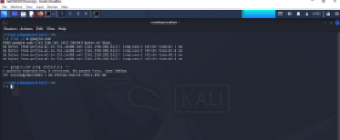
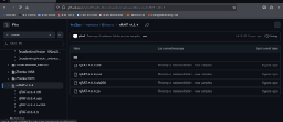
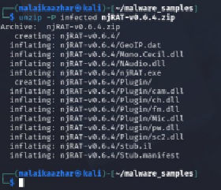
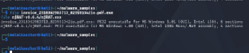
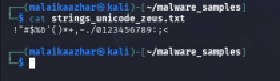
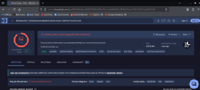

# 🦠 Project 11 — Index
### Malware Sample Acquisition & Static Analysis
**Project 11 of 18 — Blue Team Internship Portfolio**

**Quick guide to every step and screenshot in this project.**

### [📖 Open the full README](README.md)

---

| 🧩 Samples | 🖼️ Screenshots | 🧪 Static Tools | ✅ Steps |
|:---:|:---:|:---:|:---:|
| **2** | **15** | **4** | **9** |

🧩 <b>Samples:</b> njRAT v0.6.4 ➜ Zeus (26 Nov 2013 build) — acquired, hashed, airgapped, statically analyzed

---

## 📑 Step Index

All 9 steps of the project, with the screenshot that shows each one.

| # | Step | Module | Result | Evidence |
|:---:|---|:---:|---|:---:|
| 1 | Confirm connectivity, lock sample directory | 🔵 Module 1 | Directory at `700`, connectivity confirmed | Exhibits [1](#ex1), [2](#ex2) |
| 2 | Locate and download both samples individually | 🔵 Module 1 | Individual `wget`, no repo clone | Exhibits [3](#ex3), [4](#ex4), [5](#ex5) |
| 3 | Extract and hash immediately | 🔵 Module 1 | Archive hashes match theZoo's published values | Exhibits [6](#ex6), [7](#ex7) |
| 4 | Airgap at hypervisor level, lock permissions | 🔵 Module 1 | Failed ping confirms airgap; samples at `400` | Exhibits [8](#ex8), [9](#ex9), [10](#ex10) |
| 5 | File-type identification | 🟠 Module 2 | Zeus is a disguised PE; njRAT is .NET/Mono | [Exhibit 11](#ex11) |
| 6 | Metadata inspection | 🟠 Module 2 | Zeus compile date 2013-11-25 | [Exhibit 12](#ex12) |
| 7 | Embedded payload detection | 🟠 Module 2 | 2 Zlib blobs found in njRAT | [Exhibit 13](#ex13) |
| 8 | Unicode strings (`-el`) check | 🟠 Module 2 | Zeus Unicode output near-empty — packing indicator | [Exhibit 14](#ex14) |
| 9 | VirusTotal cross-verification | 🟠 Module 2 | njRAT flagged 62/70 | [Exhibit 15](#ex15) |

---

## 🔵 Module 1 — Sample Acquisition & Environment Lockdown

Exhibits 1 to 10. Click a screenshot to open it full size.

<table>
<tr>
<td align="center" valign="top" width="50%">

 <b>Exhibit 1 — Connectivity check</b>
 0% packet loss before acquisition
</td>
<td align="center" valign="top" width="50%">

 <b>Exhibit 2 — 700 permissions</b>
 Sample directory owner-only access
</td>
</tr>
<tr>
<td align="center" valign="top" width="50%">

 <b>Exhibit 3 — theZoo Zeus folder</b>
 Four component files
</td>
<td align="center" valign="top" width="50%">

 <b>Exhibit 4 — theZoo njRAT folder</b>
 Same four-file structure
</td>
</tr>
<tr>
<td align="center" valign="top" width="50%">

 <b>Exhibit 5 — Individual wget</b>
 No repo clone
</td>
<td align="center" valign="top" width="50%">

 <b>Exhibit 6 — Extraction confirmed</b>
 Plugin/ subfolder visible
</td>
</tr>
<tr>
<td align="center" valign="top" width="50%">

 <b>Exhibit 7 — Hash verification</b>
 Archive hashes match theZoo's published values
</td>
<td align="center" valign="top" width="50%">

 <b>Exhibit 8 — Airgap confirmation</b>
 Failed ping = correct isolation
</td>
</tr>
<tr>
<td align="center" valign="top" width="50%">

 <b>Exhibit 9 — 400 permissions</b>
 Read-only, non-executable
</td>
<td align="center" valign="top" width="50%">

 <b>Exhibit 10 — Baseline capture</b>
 61 packets, idle observation
</td>
</tr>
</table>

---

## 🟠 Module 2 — Static Malware Analysis

Exhibits 11 to 15.

<table>
<tr>
<td align="center" valign="top" width="50%">

 <b>Exhibit 11 — File-type ID</b>
 Zeus disguised PE; njRAT .NET/Mono
</td>
<td align="center" valign="top" width="50%">

 <b>Exhibit 12 — Metadata</b>
 Zeus 2013-11-25 compile date
</td>
</tr>
<tr>
<td align="center" valign="top" width="50%">

 <b>Exhibit 13 — Embedded payload</b>
 2 Zlib blobs in njRAT
</td>
<td align="center" valign="top" width="50%">

 <b>Exhibit 14 — Unicode strings</b>
 Zeus: near-empty Unicode — packing indicator
</td>
</tr>
<tr>
<td align="center" valign="top" width="50%">

 <b>Exhibit 15 — VirusTotal</b>
 njRAT 62/70
</td>
<td></td>
</tr>
</table>

---

## 🎯 Verification Checklist

| Check | Method | Module | Status |
|:---:|---|---|:---:|
| Archives hashed and matched to theZoo | `md5sum`/`sha256sum` vs theZoo published `.md5`/`.sha256` | Module 1 | ✅ Confirmed |
| Airgap verified at hypervisor level | Failed ping test | Module 1 | ✅ Confirmed |
| Static analysis run | `file`/`exiftool` (both), `binwalk` (njRAT), Unicode `strings` (Zeus), VirusTotal (njRAT) | Module 2 | ✅ Confirmed |

> [!NOTE]
> Everything claimed in this project is shown in the screenshots above. Dynamic analysis, detection rules and host-based detection are outside its scope.

---

[⬆️ Back to top](#top) &nbsp;·&nbsp; [📖 Full README](README.md)

🦠 **[theZoo](https://github.com/ytisf/theZoo)** · 🛡️ **[VirusTotal](https://www.virustotal.com)**

