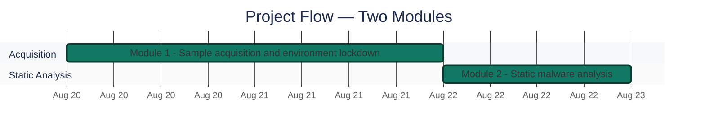

<div align="center">

# 🦠 Malware Sample Acquisition & Static Analysis

**Project 11 of 18 — Blue Team Internship Portfolio**

Safe Acquisition · Airgap Lockdown · Static Analysis


Two real malware samples — njRAT and a dropper from theZoo's Zeus folder — acquired safely, hashed before any handling, locked down behind a hypervisor-level airgap, and examined statically with `file`, `exiftool`, `binwalk`, `strings` and VirusTotal.

### [📑 Open the visual index](INDEX.md)

</div>

---

## 📑 Table of Contents

1. [At a Glance](#at-a-glance)
2. [Project Background](#project-background)
3. [Environment](#environment)
4. [Sample Comparison](#sample-comparison)
5. [Project Flow](#project-flow)
6. [Module 1 — Sample Acquisition & Environment Lockdown](#module-1)
7. [Module 2 — Static Malware Analysis](#module-2)
8. [Coverage Snapshot](#coverage-snapshot)
9. [Command Reference](#command-reference)
10. [Project Summary](#project-summary)
11. [Challenges & Fixes](#challenges-fixes)
12. [Scope & Limitations](#scope-limitations)
13. [What I Learned](#what-i-learned)
14. [Skills Demonstrated](#skills-demonstrated)
15. [Screenshot Index](#screenshot-index)
16. [Repo Structure](#repo-structure)

---

<a id="at-a-glance"></a>
## 📊 At a Glance

| 🧩 Samples Analyzed | 🖼️ Screenshots | 🧱 Modules | 🧪 Static Tools | 💰 Cost |
|:---:|:---:|:---:|:---:|:---:|
| **2** | **15** | **2** | **4** | **$0** |

---

<a id="project-background"></a>
## 📖 Project Background

Two malware samples were deliberately chosen: **njRAT** (a Remote Access Trojan) and a dropper from theZoo's **Zeus** folder, disguised with a `.pdf.exe` double extension. Both were downloaded from theZoo repository, hashed before any handling, and the lab was then verified airgapped at the hypervisor level.

| Task Block | Status | Note |
|---|:---:|---|
| Sample Acquisition & Lockdown | ✅ Complete | Both samples acquired, hashed, airgapped, permission-locked |
| Static Malware Analysis | ✅ Complete | `file`/`exiftool` on both samples, `binwalk` on njRAT, Unicode `strings` on Zeus, VirusTotal on njRAT |

---

<a id="environment"></a>
## 🖧 Environment

| Item | Value |
|---|---|
| **Sample Source** | theZoo GitHub repository (individual file `wget`, not a full clone) |
| **Analysis VM** | Kali Linux; NAT adapter disabled at the hypervisor level for sample handling (Step 4); VirusTotal lookup run from the VM's browser (Step 9) |
| **Sample Directory** | `~/malware_samples`, `chmod 700` |
| **Final Sample Permissions** | `chmod 400` (read-only, non-executable) |
| **Static Tools** | `file`, `exiftool`, `binwalk`, `strings`, VirusTotal |
| **Baseline Capture** | `tcpdump` on `eth0`, 61 packets, `baseline_capture.pcap` |

---

<a id="sample-comparison"></a>
## 🔬 Sample Comparison

| | njRAT v0.6.4 | Zeus (theZoo, 26 Nov 2013 build) |
|---|---|---|
| **MD5** | `0431311b...91f2563` | `ea039a85...1a51c34` |
| **File type** | .NET/Mono assembly | 32-bit Windows PE, disguised as `.pdf.exe` |
| **File size** | 982 kB | 253 kB |

---

<a id="project-flow"></a>
## ⏱️ Project Flow


<p align="center"><em>Module 1 dates come from the file timestamps in Exhibits 2 and 10. Module 2 is drawn immediately after; its exact date is not shown in the screenshots.</em></p>

---

<a id="module-1"></a>
## 🔵 Module 1 — Sample Acquisition & Environment Lockdown

**Objective:** Acquire both samples safely, hash them before any other handling, then lock the lab down to a verified airgap before any analysis begins.

### Step 1 — Confirm connectivity, then lock the sample directory ✅

<p align="center">
  <br>
  <em>Exhibit 1 (Figure 3.1) — <code>ping -c 4 google.com</code>, 0% packet loss, confirming an active internet path before acquisition begins</em>
</p>

<p align="center">
  <br>
  <em>Exhibit 2 (Figure 3.2) — <code>ls -ld</code> confirms <code>drwx------</code> (700) on <code>~/malware_samples</code></em>
</p>

### Step 2 — Locate and download both samples individually ✅

```
wget <theZoo raw path>/njRAT-v0.6.4.pass
wget <theZoo raw path>/njRAT-v0.6.4.zip
wget <theZoo raw path>/njRAT-v0.6.4.sha256
```

<p align="center">
  <br>
  <em>Exhibit 3 (Figure 3.3) — theZoo repository, ZeusBankingVersion_26Nov2013 folder, four component files</em>
</p>

<p align="center">
  <br>
  <em>Exhibit 4 (Figure 3.4) — theZoo repository, njRAT-v0.6.4 folder, same four-file structure</em>
</p>

<p align="center">
  <br>
  <em>Exhibit 5 (Figure 3.5) — Individual <code>wget</code> download (not a repo clone), all four component files confirmed present</em>
</p>

### Step 3 — Extract and hash immediately ✅

```
unzip -P infected njRAT-v0.6.4.zip
md5sum njRAT.exe && sha256sum njRAT.exe
```

<p align="center">
  <br>
  <em>Exhibit 6 (Figure 3.6) — Extraction confirmed, including the Plugin/ subfolder (cam.dll, ch.dll, fm.dll, Mic.dll, pw.dll, sc2.dll)</em>
</p>

<p align="center">
  <br>
  <em>Exhibit 7 (Figure 3.7) — <code>md5sum</code>/<code>sha256sum</code> archive hashes cross-checked against theZoo's published <code>.md5</code>/<code>.sha256</code> files — exact match; <code>njRAT.exe</code> and the Zeus executable are hashed here for later identification</em>
</p>

🎯 **Why hash before anything else?** A filename is trivially changed; a cryptographic hash is a fingerprint of the actual binary content. Computing it immediately after extraction, before any tool touches the file, guarantees the hash on record corresponds to the exact bytes analyzed.

### Step 4 — Airgap at the hypervisor level, then lock permissions ✅

The NAT adapter was disabled in VirtualBox settings — not from inside the guest OS — because disabling a NIC inside the VM still leaves the hypervisor's virtual attachment active.

<p align="center">
  <br>
  <em>Exhibit 8 (Figure 3.8) — <code>ping</code> returns "Temporary failure in name resolution" — a <b>failed</b> test, which is the correct airgap confirmation. A passing ping here would have proven nothing.</em>
</p>

<p align="center">
  <br>
  <em>Exhibit 9 (Figure 3.9) — <code>ls -la</code> confirms both extracted executables at <code>-r--------</code> (400: read-only, non-executable, owner-only)</em>
</p>

<p align="center">
  <br>
  <em>Exhibit 10 (Figure 3.10) — <code>tcpdump</code> baseline capture: 61 packets over idle observation, establishing "normal" before the samples are touched</em>
</p>

---

<a id="module-2"></a>
## 🟠 Module 2 — Static Malware Analysis

**Objective:** Examine both samples without executing them, cataloguing what each file contains and what it suggests.

### Step 5 — File-type identification ✅

<p align="center">
  <br>
  <em>Exhibit 11 (Figure 4.1) — Zeus is a 32-bit Windows PE despite its <code>.pdf.exe</code> disguise; njRAT is a .NET/Mono assembly</em>
</p>

### Step 6 — Metadata inspection ✅

<p align="center">
  <br>
  <em>Exhibit 12 (Figure 4.2) — Zeus compile timestamp 2013-11-25 (PE32, 32-bit); <code>njRAT.exe</code> is 982 kB</em>
</p>

### Step 7 — Embedded payload detection ✅

<p align="center">
  <br>
  <em>Exhibit 13 (Figure 4.3) — Two embedded Zlib-compressed blobs found in njRAT.exe; extraction itself failed ("no utility found"), disclosed as a tooling limitation, not evidence the payload is absent</em>
</p>

### Step 8 — Unicode strings (`-el`) check ✅

<p align="center">
  <br>
  <em>Exhibit 14 (Figure 4.4) — Zeus's Unicode pass: only a short run of punctuation and digits — a strong packing indicator, not a null result</em>
</p>

### Step 9 — VirusTotal cross-verification ✅

<p align="center">
  <br>
  <em>Exhibit 15 (Figure 4.5) — njRAT flagged 62/70, family tags bladabindi / msil / msilperseus</em>
</p>

> [!NOTE]
> Step 9 is a hash lookup (the SHA256 appears in the URL bar), run from the Kali VM's browser. The sample file itself was not uploaded.

---

<a id="coverage-snapshot"></a>
## 🌟 Coverage Snapshot

| 🛡️ Module | ✅ Status | 📌 Detail |
|---|---|---|
| Sample Acquisition & Lockdown | Complete | Both samples hashed, airgapped, permission-locked |
| Static Analysis | Complete | `file`/`exiftool` on both, `binwalk` on njRAT, Unicode `strings` on Zeus, VirusTotal on njRAT |

### 🧾 Static-Stage IOC List

| # | Type | Value | Sample | Significance |
|:---:|---|---|:---:|---|
| 1 | SHA256 | `fd624aa2...822199` | njRAT | Sample identifier (Exhibits 7, 15) |
| 2 | MD5 | `ea039a85...1a51c34` | Zeus | Sample identifier (Exhibit 7) |
| 3 | File anomaly | `.pdf.exe` double extension | Zeus | Social-engineering masquerade (Exhibit 11) |
| 4 | Embedded payload | 2× Zlib blobs, `0x3383D` / `0xBE31C` | njRAT | Compressed content found, not extracted (Exhibit 13) |
| 5 | Packing indicator | Near-empty Unicode strings | Zeus | Sample likely packed/encrypted (Exhibit 14) |

---

<a id="command-reference"></a>
## 🧰 Command Reference

| # | Command | Used In | Purpose |
|:---:|---|---|---|
| 1 | `chmod 700 ~/malware_samples` | Module 1 | Lock the sample directory to owner-only access |
| 2 | `wget <path>` (individual files) | Module 1 | Acquire samples without a full repo clone |
| 3 | `unzip -P infected <file>.zip` | Module 1 | Extract using theZoo's standard archive password |
| 4 | `md5sum` / `sha256sum` | Module 1 | Hash samples immediately post-extraction |
| 5 | `chmod 400 <sample>` | Module 1 | Lock samples read-only, non-executable |
| 6 | `file`, `exiftool`, `binwalk`, `strings -el` | Module 2 | Static analysis toolchain |

---

<a id="project-summary"></a>
## 📝 Project Summary

| Module | Tooling | Key Outcome |
|---|---|---|
| Module 1 — Acquisition & Lockdown | `wget`, hashing, hypervisor NAT disable | Both samples safely acquired, hashed, and airgapped |
| Module 2 — Static Analysis | `file`, `exiftool`, `binwalk`, `strings`, VirusTotal | Packing indicator found in Zeus; njRAT flagged 62/70 on VirusTotal |

---

<a id="challenges-fixes"></a>
## ⚠️ Challenges & Fixes

| ❌ Challenge | ✅ Fix |
|---|---|
| `binwalk` extraction failed on the embedded Zlib blobs | Documented as a tooling/environment limitation, not evidence the payload is absent — presence confirmed, contents not |

---

<a id="scope-limitations"></a>
## 🚧 Scope & Limitations

- **Static analysis only:** the samples were not executed in this lab; dynamic analysis, detection rules and host-based detection are outside this project's scope.
- **binwalk extraction incomplete:** the two Zlib blobs in njRAT were detected but not extracted, due to a missing utility on this Kali installation.
- **Per-sample coverage:** `binwalk` is shown for njRAT only, the Unicode `strings` output for Zeus only, and VirusTotal for njRAT only.

---

<a id="what-i-learned"></a>
## 🧠 What I Learned

- **A near-empty result is still a finding.** Zeus's near-empty Unicode strings output isn't a null result — it's itself strong evidence of packing.
- **Hash before anything else.** A filename is trivially changed; a hash fingerprints the actual bytes, so it is computed right after extraction.
- **A failed test can be the proof.** For an airgap, a *failed* ping is the correct confirmation — a passing ping would have proven nothing.
- **A failed extraction is a limit, not an absence.** `binwalk` found two Zlib blobs it could not extract; that is documented as a tooling gap, not evidence the payload is missing.

---

<a id="skills-demonstrated"></a>
## 🛠️ Skills Demonstrated

- Safe malware acquisition following a connect → download → verify → airgap → analyze sequence
- Hypervisor-level airgap verification (and why guest-OS-level disabling is insufficient)
- Static analysis triage with `file`, `exiftool`, `binwalk`, and Unicode (`-el`) `strings`
- Recognizing a near-empty strings result as a packing indicator
- Documenting tooling limits (failed `binwalk` extraction) instead of glossing over them

---

<a id="screenshot-index"></a>
## 🖼️ Screenshot Index

| # | File | Shows |
|:---:|---|---|
| 1 | `ss-01-kali-connectivity-preacquisition.PNG` | Pre-acquisition connectivity check |
| 2 | `ss-02-sample-directory-700-permissions.PNG` | Sample directory locked to 700 |
| 3 | `ss-03-thezoo-zeus-repo-folder.PNG` | theZoo Zeus sample folder |
| 4 | `ss-04-thezoo-njrat-repo-folder.PNG` | theZoo njRAT sample folder |
| 5 | `ss-05-wget-individual-download.PNG` | Individual wget download, no repo clone |
| 6 | `ss-06-unzip-extraction-confirmation.PNG` | Extraction confirmed, Plugin/ subfolder visible |
| 7 | `ss-07-hash-verification-md5-sha256.PNG` | Hash cross-check against theZoo's published values |
| 8 | `ss-08-airgap-failed-ping-confirmation.PNG` | Failed ping — correct airgap confirmation |
| 9 | `ss-09-chmod400-readonly-confirmation.PNG` | Samples locked to 400 (read-only) |
| 10 | `ss-10-tcpdump-baseline-capture.PNG` | Baseline network capture before touching samples |
| 11 | `ss-11-file-command-output.PNG` | File-type identification for both samples |
| 12 | `ss-12-exiftool-metadata.PNG` | Metadata inspection for both samples |
| 13 | `ss-13-binwalk-embedded-payload.PNG` | Embedded Zlib payloads found in njRAT |
| 14 | `ss-14-strings-unicode-comparison.PNG` | Zeus's near-empty Unicode strings (packing indicator) |
| 15 | `ss-15-virustotal-njrat-result.PNG` | VirusTotal result for njRAT |

---

<a id="repo-structure"></a>
## 📁 Repo Structure

```text
project-11-malware-sample-acquisition-static-analysis/
|-- README.md
|-- INDEX.md
`-- screenshots/
    |-- ss-01-kali-connectivity-preacquisition.PNG
    |-- ss-02-sample-directory-700-permissions.PNG
    |-- ss-03-thezoo-zeus-repo-folder.PNG
    |-- ss-04-thezoo-njrat-repo-folder.PNG
    |-- ss-05-wget-individual-download.PNG
    |-- ss-06-unzip-extraction-confirmation.PNG
    |-- ss-07-hash-verification-md5-sha256.PNG
    |-- ss-08-airgap-failed-ping-confirmation.PNG
    |-- ss-09-chmod400-readonly-confirmation.PNG
    |-- ss-10-tcpdump-baseline-capture.PNG
    |-- ss-11-file-command-output.PNG
    |-- ss-12-exiftool-metadata.PNG
    |-- ss-13-binwalk-embedded-payload.PNG
    |-- ss-14-strings-unicode-comparison.PNG
    `-- ss-15-virustotal-njrat-result.PNG
```

<div align="center">

🦠 **[theZoo Malware Repository](https://github.com/ytisf/theZoo)** · 🛡️ **[VirusTotal](https://www.virustotal.com)**

</div>
