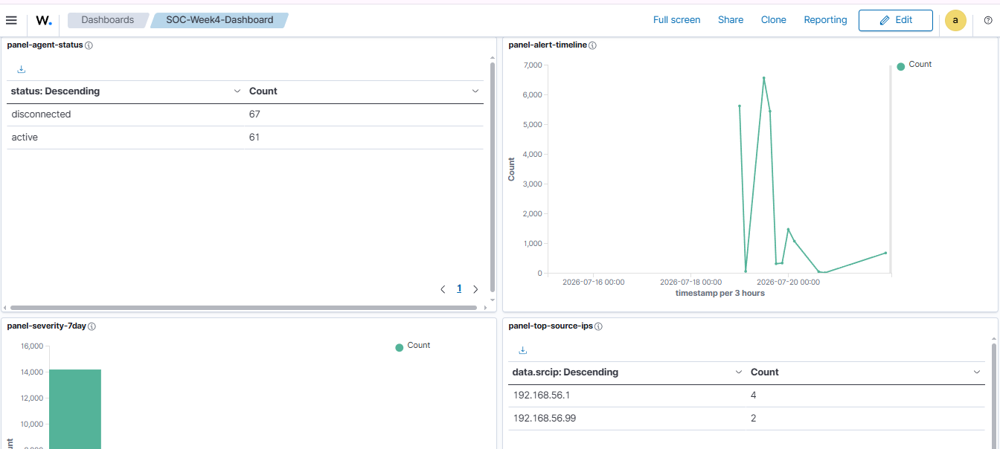
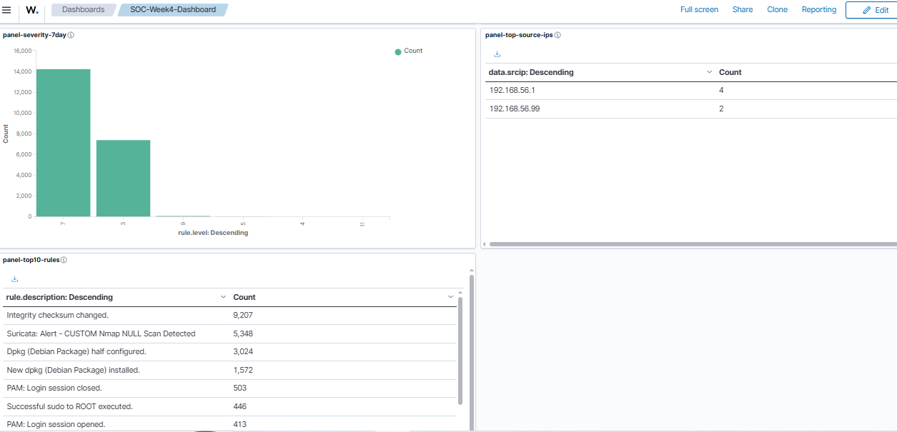

# 📊 Project 12 — Index
### Custom SOC Dashboard Design
**Project 12 of 29 — Advanced Cyber Projects**

**Quick guide to every panel and screenshot in this project.**

### [📖 Open the full README](README.md)

---

| 🧩 Modules | 🖼️ Screenshots | 📋 Panels | ❓ Questions Answered |
|:---:|:---:|:---:|:---:|
| **2** | **2** | **5** | **5** |

🧩 <b>Lab:</b> 5 pre-written questions ➜ 5 mapped panels ➜ <code>SOC-Week4-Dashboard</code> assembled in Wazuh / OpenSearch Dashboards

---

## 📑 Step Index

Both steps of the project, with the screenshot that proves each one.

| # | Step | Module | Result | Evidence |
|:---:|---|:---:|---|:---:|
| 1 | Write 5 questions, map each to one panel | 🔵 Module 1 | Panel-per-question design table (see README) | Table (see README) |
| 2 | Assemble and capture the final dashboard | 🟢 Module 2 | 5 panels live, 1 finding flagged for follow-up | [Exhibit 1](#ex1) · [Exhibit 2](#ex2) |

---

## 🔵 Module 1 — Panel-to-Question Map

<table>
<tr>
<td align="center" valign="top" width="20%">

**❓ How bad was this period?** 
<code>panel-severity-7day</code>

</td>
<td align="center" valign="top" width="20%">

**❓ Are all machines reporting?** 
<code>panel-agent-status</code>

</td>
<td align="center" valign="top" width="20%">

**❓ What is firing the most?** 
<code>panel-top10-rules</code>

</td>
<td align="center" valign="top" width="20%">

**❓ Where is traffic coming from?** 
<code>panel-top-source-ips</code>

</td>
<td align="center" valign="top" width="20%">

**❓ What happened over time?** 
<code>panel-alert-timeline</code>

</td>
</tr>
</table>

---

## 🟢 Module 2 — Assembled Dashboard

Exhibits 1 to 2. Click a screenshot to open it full size.

<table>
<tr>
<td align="center" valign="top" width="50%">

 <b>Exhibit 1 — Agent status & timeline</b>
 67 disconnected / 61 active, plus alert volume over time with two clear spikes
</td>
<td align="center" valign="top" width="50%">

 <b>Exhibit 2 — Severity, source IPs, top rules</b>
 Led by Integrity checksum changed (9,207) and Suricata NULL scan (5,348)
</td>
</tr>
</table>

---

## 🎯 Key Findings Summary

| Panel | Key Reading | Status |
|---|---|:---:|
| Agent Status | 61 active / **67 disconnected** | 🚩 Flagged for follow-up |
| Alert Timeline | Two clear volume spikes | ✅ Matches testing windows |
| Severity (7-day) | Majority at Level 7 | ✅ As expected |
| Top Source IPs | Concentrated on 2 internal IPs | ✅ Documented |
| Top 10 Rules | FIM checksum changes lead | ✅ Documented |

> [!NOTE]
> The disconnected-agent count is surfaced here deliberately, not filtered out — a dashboard that only shows good news isn't a monitoring tool.

---

[⬆️ Back to top](#top) &nbsp;·&nbsp; [📖 Full README](README.md)

📊 **[Wazuh](https://wazuh.com)** · 🔍 **[OpenSearch Dashboards](https://opensearch.org/docs/latest/dashboards/)** · 🧭 **[Dashboard Pipeline](README.md#dashboard-pipeline)**

