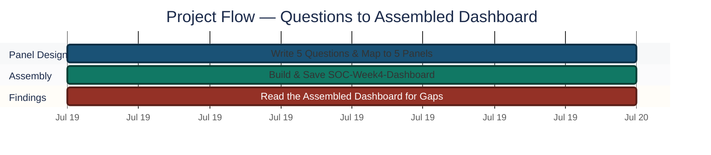
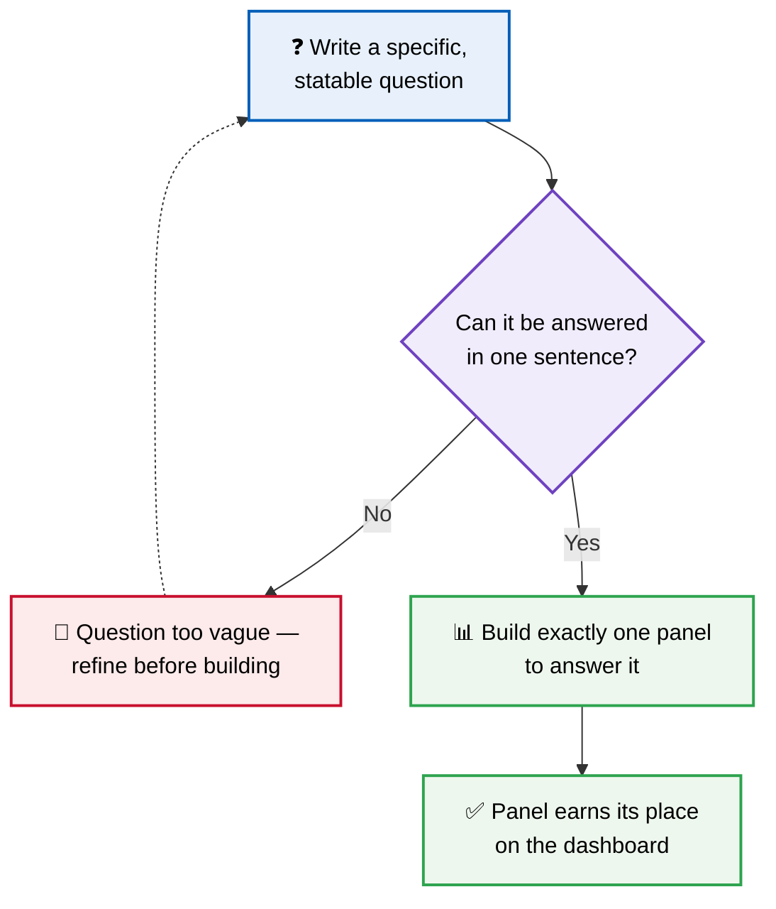
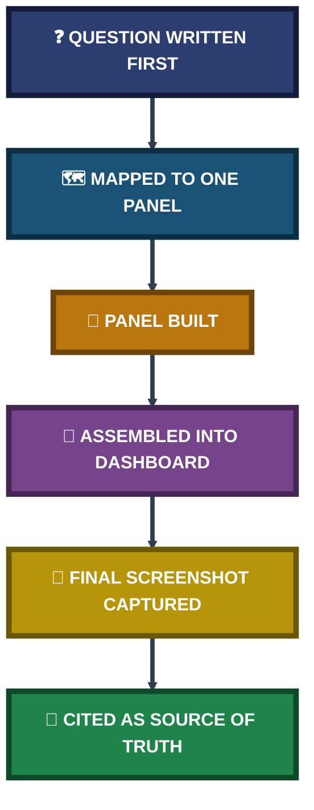

<div align="center">

# 📊 Custom SOC Dashboard Design

**Project 12 of 29 — Advanced Cyber Projects**

Panel-per-Question Dashboard Engineering (Wazuh)


A five-panel SOC dashboard built against five pre-written questions rather than assembled from whatever data happened to be available — and one panel that surfaced an uncomfortable number was kept in, not filtered out, because that is exactly what a dashboard is for.

### [📑 Open the visual index](INDEX.md)

</div>

---

## 📑 Table of Contents

1. [At a Glance](#at-a-glance)
2. [Project Background](#project-background)
3. [Environment](#environment)
4. [Project Flow](#project-flow)
5. [Module 1 — Panel Design Against Pre-Written Questions](#module-1)
6. [Coverage Snapshot](#coverage-snapshot)
7. [Dashboard Design Pipeline](#dashboard-pipeline)
8. [Module 2 — Assembled Dashboard & Findings](#module-2)
9. [Project Summary](#project-summary)
10. [Challenges & Fixes](#challenges-fixes)
11. [Scope & Limitations](#scope-limitations)
12. [What I Learned](#what-i-learned)
13. [Skills Demonstrated](#skills-demonstrated)
14. [Screenshot Index](#screenshot-index)
15. [Repo Structure](#repo-structure)

---

<a id="at-a-glance"></a>
## 📊 At a Glance

| 🧩 Modules | 🖼️ Screenshots | 📋 Panels | ❓ Questions Answered |
|:---:|:---:|:---:|:---:|
| **2** | **2** | **5** | **5** |

---

<a id="project-background"></a>
## 📖 Project Background

A dashboard assembled by adding every chart that happens to be available produces a wall of color with no clear purpose — a panel with no statable question communicates nothing to whoever reads it later. This project inverts that order: five specific, statable questions were written first, and each panel was built only to answer one of them.

- **Module 1 — Panel Design Against Pre-Written Questions:** Decide what needs to be known before building anything, then map each question to exactly one panel.
- **Module 2 — Assembled Dashboard & Findings:** Assemble the final dashboard, and treat every number it surfaces — including uncomfortable ones — as a finding worth reporting, not a defect to hide.

> [!NOTE]
> Agent status and rule-firing counts are live, constantly shifting figures. The final assembled dashboard screenshot — captured last — is treated as the single source of truth for every number cited here, not the individual panels built earlier during construction.

<div align="center">

### 🧩 Panel-to-Question Map

<table>
<tr>
<td align="center" valign="top" width="20%">

**❓ How bad<br>was this period?**<br>
<sub><code>panel-severity-7day</code></sub>

</td>
<td align="center" valign="top" width="20%">

**❓ Are all machines<br>reporting?**<br>
<sub><code>panel-agent-status</code></sub>

</td>
<td align="center" valign="top" width="20%">

**❓ What is firing<br>the most?**<br>
<sub><code>panel-top10-rules</code></sub>

</td>
<td align="center" valign="top" width="20%">

**❓ Where is traffic<br>coming from?**<br>
<sub><code>panel-top-source-ips</code></sub>

</td>
<td align="center" valign="top" width="20%">

**❓ What happened<br>over time?**<br>
<sub><code>panel-alert-timeline</code></sub>

</td>
</tr>
</table>

</div>

---

<a id="environment"></a>
## 🖧 Environment

| Item | Value |
|---|---|
| **Dashboard Platform** | Wazuh Dashboard (OpenSearch Dashboards) |
| **Dashboard Name** | `SOC-Week4-Dashboard` |
| **Panel Count** | 5 |
| **Data Sources** | FIM, PAM/sudo audit, Suricata alerts, package manager events |
| **Design Principle** | One panel = one pre-written, statable question |

---

<a id="project-flow"></a>
## ⏱️ Project Flow


<p align="center"><em>Colors distinguish each project stage — all stages complete.</em></p>

---

<a id="module-1"></a>
## 🔵 Module 1 — Panel Design Against Pre-Written Questions

**Objective:** Decide what a SOC analyst or engineer actually needs to know before building a single panel, then map each question to exactly one panel — rather than building panels first and justifying them afterward.

### Step 1 — Write the five questions first ✅

| Question | Panel | What It Shows |
|---|---|---|
| How bad was this period? | `panel-severity-7day` | Alert count by `rule.level`, last 7 days |
| Are all machines reporting? | `panel-agent-status` | Agent health: Active vs. Disconnected |
| What is firing the most? | `panel-top10-rules` | Top rules by alert count |
| Where is traffic coming from? | `panel-top-source-ips` | Top source IP addresses |
| What happened over time? | `panel-alert-timeline` | Alert volume timeline, 3-hour buckets |

### 🔍 Analyst Note — Why the Question Comes Before the Panel



A colourful chart with no clear label and no stated time range communicates nothing to whoever reads it later. Every panel in this dashboard was built against a question that could be stated in a single sentence before construction began — not added because the data happened to be available.

---

<a id="coverage-snapshot"></a>
## 🌟 Coverage Snapshot

| 🛡️ Layer | ✅ Status | 📌 Detail |
|---|---|---|
| Panel Design | Question-First | All 5 panels map to a pre-written, statable question |
| Dashboard Assembly | Saved | `SOC-Week4-Dashboard`, all panels live |
| Agent Health Finding | Surfaced, Not Hidden | 67 of 128 agents disconnected — flagged for follow-up |
| Source of Truth | Assembled Screenshot | Final dashboard capture used over earlier per-panel builds |

---

<a id="dashboard-pipeline"></a>
## 🧭 Dashboard Design Pipeline

From a raw question to a trustworthy, cited number



---

<a id="module-2"></a>
## 🟢 Module 2 — Assembled Dashboard & Findings

**Objective:** Assemble all five panels into a single saved dashboard, and read the result honestly — including the panel that surfaces a number nobody wants to see.

### Step 2 — Assemble and capture the dashboard ✅

<p align="center">
  <br>
  <em>Exhibit 1 — Assembled <code>SOC-Week4-Dashboard</code>, panels 1 of 2: agent status (67 disconnected / 61 active) and alert volume timeline showing two clear spikes corresponding to active testing periods</em>
</p>

<p align="center">
  <br>
  <em>Exhibit 2 — Assembled dashboard, panels 2 of 2: severity-by-level bar chart, top source IPs, and top 10 firing rules (Integrity checksum changed: 9,207; Suricata CUSTOM Nmap NULL Scan Detected: 5,348)</em>
</p>

### Step 3 — Read the agent health panel honestly ✅

67 of 128 monitored agents currently show as disconnected rather than active. This is flagged as an observation requiring follow-up, not treated as a dashboard artefact to ignore — **a dashboard that surfaces an uncomfortable number is doing its job.**

🎯 **Result:** Five panels, five answered questions, and one finding that would have been invisible in a dashboard designed to look complete rather than to be read honestly.

| Panel | Key Reading |
|---|---|
| `panel-agent-status` | 61 active / **67 disconnected** — flagged for IT follow-up |
| `panel-alert-timeline` | Two clear volume spikes, matching active testing windows |
| `panel-severity-7day` | Majority of alerts at Level 7 |
| `panel-top-source-ips` | Traffic concentrated on two internal IPs (`.1`, `.99`) |
| `panel-top10-rules` | Led by Integrity checksum changed (9,207), then Suricata NULL scan (5,348) |

---

<a id="project-summary"></a>
## 📝 Project Summary

| Module | Tooling | Key Finding |
|---|---|---|
| Panel Design Against Pre-Written Questions | Wazuh Dashboard, OpenSearch visualizations | 5 questions, each mapped to exactly one panel before building began |
| Assembled Dashboard & Findings | `SOC-Week4-Dashboard` | 67 of 128 agents disconnected — surfaced, not filtered out |

---

<a id="challenges-fixes"></a>
## ⚠️ Challenges & Fixes

| ❌ Challenge | ✅ Fix |
|---|---|
| Agent status and rule-firing counts shifted between when individual panels were first built and when the full dashboard was assembled | Standardised on the final assembled screenshot as the single source of truth for every number cited, rather than an earlier, already-stale per-panel capture |
| A dashboard could easily present only "good news" panels | Kept the disconnected-agent finding visible and reported it as a genuine follow-up item, not a number to quietly drop |

---

<a id="scope-limitations"></a>
## 🚧 Scope & Limitations

- **Snapshot in time:** All figures reflect the state at the moment the dashboard was assembled and captured — agent counts and rule totals are live and will have moved on since.
- **Five panels only:** This dashboard answers five specific questions; it is not a general-purpose, exhaustive SOC view.
- **Disconnected-agent root cause not investigated here:** The 67-disconnected finding is surfaced and flagged, not diagnosed — that follow-up sits outside this project's scope.

---

<a id="what-i-learned"></a>
## 🧠 What I Learned

- **A panel with no statable question doesn't belong on the dashboard.** Writing the question before building anything kept every panel purposeful rather than decorative.
- **Dashboard numbers are a snapshot, not a constant.** Citing the earliest per-panel screenshot instead of the final assembled view risks reporting a number that was already stale by the time it's written down.
- **A dashboard's job includes surfacing bad news.** A chart that only ever shows good numbers isn't a monitoring tool — it's decoration. The disconnected-agent count staying visible is what makes this dashboard trustworthy.

---

<a id="skills-demonstrated"></a>
## 🛠️ Skills Demonstrated

- Designing dashboard panels against explicit, pre-written questions rather than available data
- Building and saving a multi-panel SOC dashboard in OpenSearch Dashboards
- Treating live, shifting figures correctly by citing a single authoritative snapshot
- Reading a dashboard's own output honestly, including findings that require follow-up rather than praise

---

<a id="screenshot-index"></a>
## 🖼️ Screenshot Index

| # | File | Shows |
|:---:|---|---|
| 1 | `Exhibit1_dashboard_agent_status_timeline.png` | Agent status panel and alert volume timeline |
| 2 | `Exhibit2_dashboard_severity_sourceips_toprules.png` | Severity bar chart, top source IPs, top 10 firing rules |

---

<a id="repo-structure"></a>
## 📁 Repo Structure

```text
project-12-siem-dashboard/
|-- README.md
|-- INDEX.md
`-- screenshots/
    |-- Exhibit1_dashboard_agent_status_timeline.png
    `-- Exhibit2_dashboard_severity_sourceips_toprules.png
```

<div align="center">

📊 **[Wazuh](https://wazuh.com)** · 🔍 **[OpenSearch Dashboards](https://opensearch.org/docs/latest/dashboards/)** · 🧭 **[Dashboard Pipeline](#dashboard-pipeline)**

</div>
