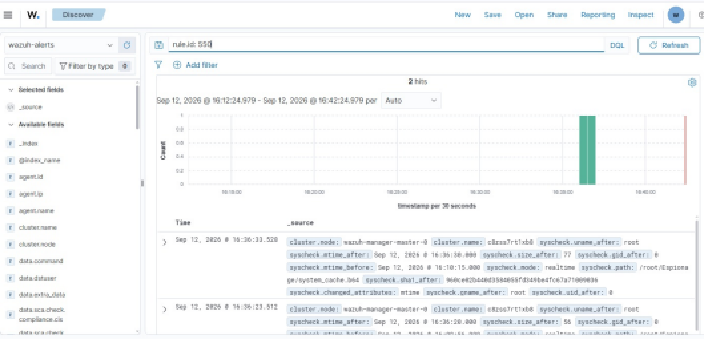
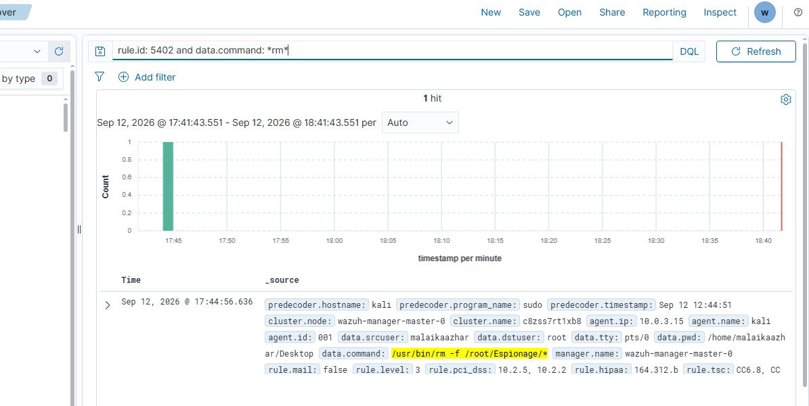
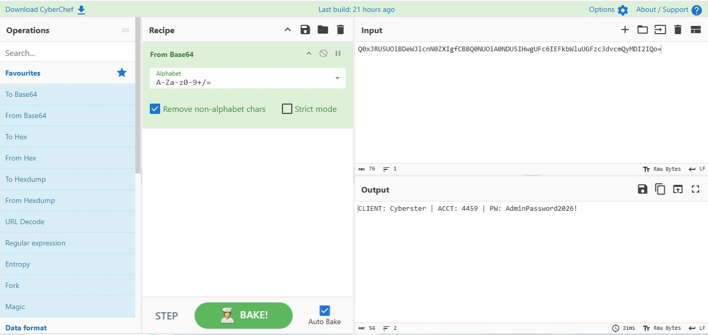
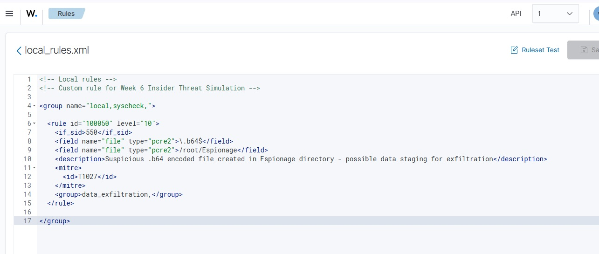
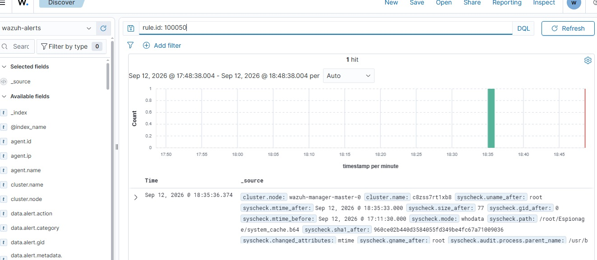

# ⚔️ Project 13 — Index
### SOC Red vs Blue Capstone
**Project 13 of 18 — Blue Team Internship Portfolio**

**Quick guide to every step and screenshot in this project.**

### [📖 Open the full README](README.md)

---

| 🧩 Attack Stages | 🖼️ Screenshots | 🎯 Custom Rules | 🔍 Detection Gaps |
|:---:|:---:|:---:|:---:|
| **4** | **5** | **1** | **1 (found + compensated)** |

🧩 <b>Scenario:</b> Kali Linux insider threat ➜ stage, obfuscate, exfiltrate, delete ➜ Wazuh FIM + custom rule 100050

---

## 📑 Step Index

All 9 steps of the project, with the screenshot that shows each one.

| # | Step | Module | Result | Evidence |
|:---:|---|:---:|---|:---:|
| 1 | Stage the confidential file | 🔴 Module 1 | `Client_Database.txt` written to `/root/Espionage` | 📝 Command only |
| 2 | Obfuscate via Base64 | 🔴 Module 1 | `system_cache.b64` created | 📝 Command only |
| 3 | Exfiltrate over HTTP POST | 🔴 Module 1 | Payload confirmed arriving at listener | 📝 Command only |
| 4 | Anti-forensics cleanup | 🔴 Module 1 | Files deleted with `rm -f` | 📝 Command only |
| 5 | Confirm file creation via Rule 550 | 🔵 Module 2 | Both staged files show FIM checksum alerts | [Exhibit 1](#ex1) |
| 6 | Investigate the deletion event | 🔵 Module 2 | Rule 553 silent; rule 5402 confirms deletion | [Exhibit 2](#ex2) |
| 7 | Decode the captured payload | 🟣 Module 3 | Exact client record recovered via CyberChef | [Exhibit 3](#ex3) |
| 8 | Author custom rule 100050 | 🟢 Module 4 | Rule chained on 550, Level 10, MITRE T1027 | [Exhibit 4](#ex4) |
| 9 | Verify the rule fires live | 🟢 Module 4 | Rule 100050 confirmed firing on re-test | [Exhibit 5](#ex5) |

---

## 🔵 Module 2 — FIM Threat Hunting

Exhibits 1 to 2. Click a screenshot to open it full size.

<table>
<tr>
<td align="center" valign="top" width="50%">

 <b>Exhibit 1 — FIM creation alerts</b>
 Rule 550: both staged files, SHA1 hash, mtime, MITRE T1565.001
</td>
<td align="center" valign="top" width="50%">

 <b>Exhibit 2 — Sudo audit deletion log</b>
 Rule 5402: <code>rm -f /root/Espionage/*</code> confirmed
</td>
</tr>
</table>

---

## 🟣 Module 3 — Decoding the Evidence

Exhibit 3.

<table>
<tr>
<td align="center" valign="top" width="50%">

 <b>Exhibit 3 — CyberChef decode</b>
 Exact exfiltrated client record recovered
</td>
<td></td>
</tr>
</table>

---

## 🟢 Module 4 — Detection Engineering

Exhibits 4 to 5.

<table>
<tr>
<td align="center" valign="top" width="50%">

 <b>Exhibit 4 — Rule 100050 source</b>
 Chained on rule 550, Level 10, MITRE T1027
</td>
<td align="center" valign="top" width="50%">

 <b>Exhibit 5 — Rule 100050 firing</b>
 Confirmed live against <code>system_cache.b64</code>
</td>
</tr>
</table>

---

## 🎯 Verification Checklist

| Check | Method | Module | Status |
|:---:|---|---|:---:|
| Full attack chain executed | Bash on Kali agent | Module 1 | ✅ Confirmed |
| File creation detected natively | Wazuh FIM, rule 550 | Module 2 | ✅ Confirmed |
| File deletion detected | Rule 553 | Module 2 | ❌ Did not fire |
| File deletion confirmed via compensating control | Sudo audit, rule 5402 | Module 2 | ✅ Confirmed |
| Exfiltrated content decoded | CyberChef | Module 3 | ✅ Confirmed |
| Custom rule written and deployed | `local_rules.xml`, rule 100050 | Module 4 | ✅ Confirmed |
| Custom rule fires on live re-test | Wazuh Discover | Module 4 | ✅ Confirmed |
| IR plan documented (NIST SP 800-61) | — | Module 5 | ✅ Confirmed |

> [!NOTE]
> Rule 553 (FIM deletion) not firing is reported exactly as observed — the compensating evidence source (rule 5402) is clearly identified as a substitute, not presented as if rule 553 had fired successfully.

---

[⬆️ Back to top](#top) &nbsp;·&nbsp; [📖 Full README](README.md)

🛡️ **[Wazuh](https://wazuh.com)** · 🧪 **[CyberChef](https://gchq.github.io/CyberChef/)** · 🧭 **[MITRE ATT&CK](https://attack.mitre.org)** · 🧭 **[Troubleshooting Pipeline](README.md#troubleshooting-pipeline)**

