<div align="center">

# 🔐 Project 14 — Windows Event Log Analysis

**Project 14 of 18 — Blue Team Internship Portfolio**

EvtxECmd Parsing · Logon Type Baseline · Privilege & Service-Account Noise


A live Security.evtx log, hashed before parsing and parsed twice — the second pass triggered deliberately after a screen-lock test came back with a genuine, documented absence rather than a fabricated result. Ends with a clean human-vs-background-noise authentication baseline.

### [📑 Open the visual index](INDEX.md)

</div>

---

## 📑 Table of Contents

1. [At a Glance](#at-a-glance)
2. [Project Background](#project-background)
3. [Environment](#environment)
4. [Logon Type Reference](#logon-type-reference)
5. [Project Flow](#project-flow)
6. [Module 1 — Evidence Integrity & Parsing](#module-1)
7. [Module 2 — Human Baseline & the Logon Type 7 Finding](#module-2)
8. [Module 3 — Failed Logon & Privilege Tracking](#module-3)
9. [Module 4 — Background Noise (Logon Type 5)](#module-4)
10. [Coverage Snapshot](#coverage-snapshot)
11. [Troubleshooting Pipeline](#troubleshooting-pipeline)
12. [Command Reference](#command-reference)
13. [Project Summary](#project-summary)
14. [Challenges & Fixes](#challenges-fixes)
15. [Scope & Limitations](#scope-limitations)
16. [What I Learned](#what-i-learned)
17. [Skills Demonstrated](#skills-demonstrated)
18. [Screenshot Index](#screenshot-index)
19. [Repo Structure](#repo-structure)

---

<a id="at-a-glance"></a>
## 📊 At a Glance

| 🧩 Parsing Passes | 🖼️ Screenshots | 🎯 Event IDs Analyzed | 📋 Records Parsed (Pass 2) | 💰 Cost |
|:---:|:---:|:---:|:---:|:---:|
| **2** | **8** | **3** | **33,127** | **$0** |

---

<a id="project-background"></a>
## 📖 Project Background

All work in this project was performed against my own live, personal Windows machine — not a pre-built evidence file. The goal: extract and analyze the Security.evtx log to build an authentication baseline covering physical logon/unlock activity, privilege elevation, and background service-account noise, using Eric Zimmerman's `EvtxECmd` to parse the raw log into a structured, filterable CSV.

| Task Block | Status | Note |
|---|:---:|---|
| Event Log Analysis (Days 53–55) | ✅ Complete | Human baseline, failed logon, privilege events, and service-account noise all documented |

> [!NOTE]
> This report records the practical friction encountered, including a Logon Type 7 event that did not appear even after a deliberate lock/unlock test — documented as a genuine finding rather than omitted or fabricated.

---

<a id="environment"></a>
## 🖧 Environment

| Item | Value |
|---|---|
| **Source Log** | `C:\Windows\System32\winevt\Logs\Security.evtx` (live, own machine) |
| **Working Copy** | `C:\Forensics\EventLogs\Security.evtx` |
| **Integrity Hash** | SHA256 `b84b2dc4…36b9463` |
| **Parsing Tool** | EvtxECmd (Eric Zimmerman's EZ Tools) |
| **Pass 1** | `output.csv` — 32,738 records, 0 errors, 0 dropped |
| **Pass 2** | `output2.csv` (post lock/unlock test) — 33,127 records |
| **Event IDs in Scope** | 4624 (logon), 4625 (failed logon), 4672 (special privileges) |

### 📊 Pass Comparison

| Parsing Pass | Total Records | Event 4624 | Event 4625 | Event 4672 |
|---|:---:|:---:|:---:|:---:|
| Pass 1 (`output.csv`) | 32,738 | 1,237 | 242 | 1,160 |
| Pass 2 (`output2.csv`, post lock/unlock) | 33,127 | 1,049 | 290 | 986 |

---

<a id="logon-type-reference"></a>
## 🔑 Logon Type Reference

| Type | Meaning | Human Present? |
|:---:|---|:---:|
| **2** | Interactive logon at the physical console (including cold boot) | ✅ Yes |
| **5** | Service logon — background Windows services authenticating for system tasks | ❌ No |
| **7** | Unlock of a previously locked session | ✅ Yes |
| **10** | RemoteInteractive (RDP) logon | ✅ Yes |

Distinguishing these is the foundation of every authentication investigation: Types 2, 7, and 10 represent points where a human was actually present at or connecting to the machine, while Type 5 is background noise that recurs constantly and independently of any user action.

---

<a id="project-flow"></a>
## ⏱️ Project Flow

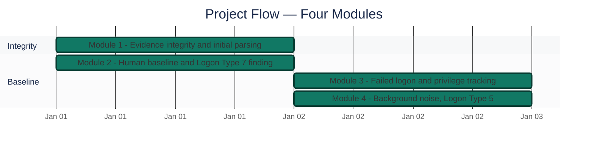

---

<a id="module-1"></a>
## 🔵 Module 1 — Evidence Integrity & Parsing

**Objective:** Copy the live Security log under an elevated terminal, hash it immediately for integrity, then parse it into a structured, filterable CSV.

### Step 1 — Copy the log and generate an integrity hash ✅

```
mkdir C:\Forensics\EventLogs
copy C:\Windows\System32\winevt\Logs\Security.evtx C:\Forensics\EventLogs\Security.evtx
certutil -hashfile C:\Forensics\EventLogs\Security.evtx SHA256
```

<p align="center">
  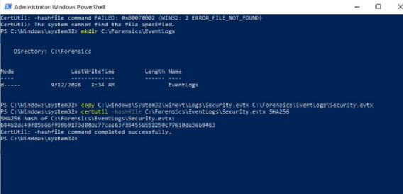<br>
  <em>Exhibit 1 (Figure 53.1) — <code>certutil</code> SHA256 output confirming the integrity hash of the copied Security.evtx file: <code>b84b2dc4…36b9463</code></em>
</p>

### Step 2 — Parse with EvtxECmd ✅

```
.\EvtxECmd.exe -f C:\Forensics\EventLogs\Security.evtx --csv C:\Forensics\EventLogs\ --csvf output.csv
```

<p align="center">
  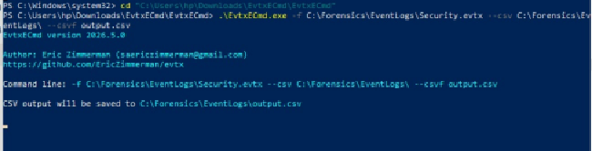<br>
  <em>Exhibit 2 (Figure 53.2) — EvtxECmd confirming CSV output will be saved to <code>C:\Forensics\EventLogs\output.csv</code></em>
</p>

<p align="center">
  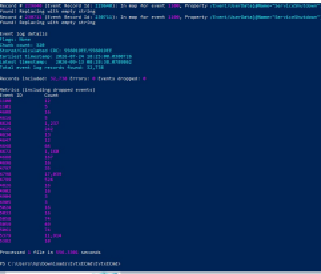<br>
  <em>Exhibit 3 (Figure 53.2b) — EvtxECmd Pass 1 completion log: 32,738 records included, 0 errors, 0 dropped events</em>
</p>

---

<a id="module-2"></a>
## 🟠 Module 2 — Human Baseline & the Logon Type 7 Finding

**Objective:** Establish the physical working-hours pattern via Logon Type 2, then attempt to capture a Logon Type 7 unlock event.

### Step 3 — Filter for Logon Type 2 (physical console logon) ✅

<p align="center">
  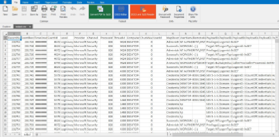<br>
  <em>Exhibit 4 (Figure 53.3) — Parsed <code>output.csv</code> opened in a spreadsheet, filtered on MapDescription and Logon Type columns ahead of the search</em>
</p>

<p align="center">
  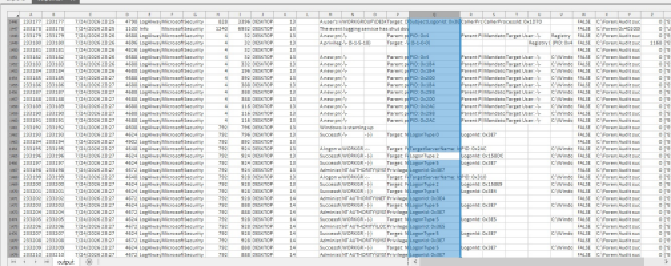<br>
  <em>Exhibit 5 (Figure 53.4) — First identified Logon Type 2 event: EventId 4624, TimeCreated 7/24/2026 23:27</em>
</p>

### Step 4 — Deliberately test for Logon Type 7 (screen unlock) ⚠️

No Logon Type 7 events were present in the initial export. Per the task brief's contingency instruction, the screen was **deliberately locked and re-unlocked** with the correct password to generate a fresh unlock event, the live log was re-copied, and EvtxECmd was re-run.

<p align="center">
  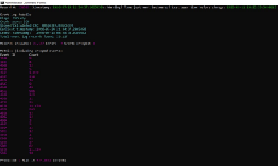<br>
  <em>Exhibit 6 (Figure 53.4b) — EvtxECmd Pass 2 completion log, run against the reparsed log following the deliberate lock/unlock test: 33,127 records, latest timestamp 2026-09-13 08:28:38</em>
</p>

🎯 **Finding:** Despite the deliberate test, **no "LogonType 7" string was found** on repeated search of the reparsed log. This absence is documented as a genuine finding, not omitted or fabricated — it suggests either that this authentication method doesn't register as Type 7 in the standard field position on this machine, or that the specific unlock mechanism (PIN/Windows Hello vs. password) is logged differently. Flagged as an item for further investigation, not asserted as resolved.

---

<a id="module-3"></a>
## 🟢 Module 3 — Failed Logon & Privilege Tracking

**Objective:** Locate the most recent failed logon and interpret privilege-elevation events in context.

### Step 5 — Locate Event ID 4625 (failed logon) ✅

<p align="center">
  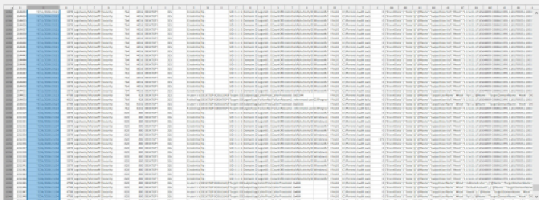<br>
  <em>Exhibit 7 (Figure 53.5) — Row containing EventId 4625 ("Failed logon"), TimeCreated 9/11/2026 23:23, with the FailureReason2 field referencing the account involved</em>
</p>

### Step 6 — Interpret Event ID 4672 (privilege assignment) 📝

Event ID 4672 entries were filtered and cross-referenced against known activity. The majority were tied to `NT AUTHORITY\SYSTEM`, clustered around 7/24/2026 22:02–22:08 — consistent with system boot and service initialization, not an interactively-triggered UAC prompt.

> [!NOTE]
> A screenshot for this step (Figure 54.1) was not yet supplied in the source report. Documented from the report's own text rather than omitted.

🎯 **Interpretation:** Privilege-assignment events generated by `NT AUTHORITY\SYSTEM` during a tight startup window are expected background behavior, not by themselves evidence of an interactively-triggered privilege escalation. This is the same distinction exercised in Module 4 for Logon Type 5 accounts — recognizing legitimate background activity so genuine anomalies stand out against it.

---

<a id="module-4"></a>
## 🟣 Module 4 — Background Noise (Logon Type 5)

**Objective:** Identify background service accounts to separate expected Windows noise from genuine human activity.

### Step 7 — Filter Event ID 4624 for Logon Type 5 (service logon) ✅

<p align="center">
  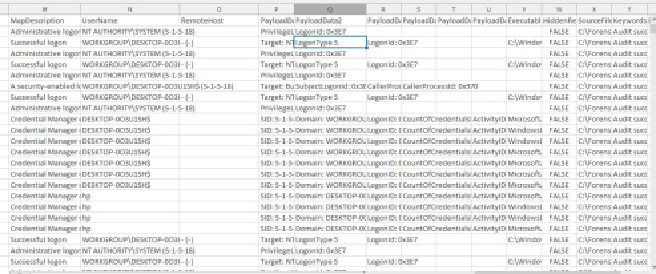<br>
  <em>Exhibit 8 (Figure 55.1) — Filtered Logon Type 5 entries showing UserName values including <code>DESKTOP-0O3U1SH$</code> and the local user account, tied to Event ID 5379 (Credential Manager) and related service-context events</em>
</p>

🎯 **Why these shouldn't be flagged as suspicious:** `DESKTOP-0O3U1SH$` is the machine's own computer account, used by Windows itself (Group Policy, domain/workgroup communication) rather than a human user — its recurring Logon Type 5 activity is expected on every Windows machine. The intern's own account appearing in a Type 5 context reflects Credential Manager and related background services operating on behalf of the logged-in session, not a second human logon. An analyst reviewing a compromised server should expect exactly this pattern and focus investigative attention on Logon Types 2, 3, and 10 instead.

---

<a id="coverage-snapshot"></a>
## 🌟 Coverage Snapshot

| 🛡️ Area | ✅ Status | 📌 Detail |
|---|---|---|
| Evidence Integrity | Complete | SHA256 hash generated immediately after copy |
| Human Baseline (Type 2) | Complete | First interactive logon identified with timestamp |
| Logon Type 7 (Unlock) | Investigated, absent | Deliberate lock/unlock test still returned no result — documented as a finding |
| Failed Logon (4625) | Complete | Most recent instance located with timestamp and failure reason |
| Privilege Tracking (4672) | Complete | Correctly attributed to SYSTEM startup behavior, not user-triggered UAC |
| Background Noise (Type 5) | Complete | Multiple service accounts identified and explained |

### 🧾 What the Evidence Proves

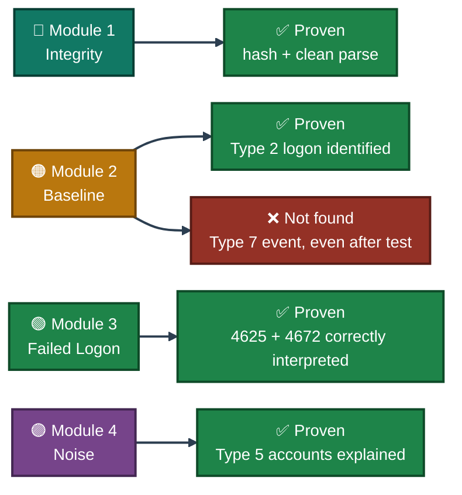

---

<a id="troubleshooting-pipeline"></a>
## 🧭 Troubleshooting Pipeline

How a missing expected event becomes a documented finding, not a fabricated one

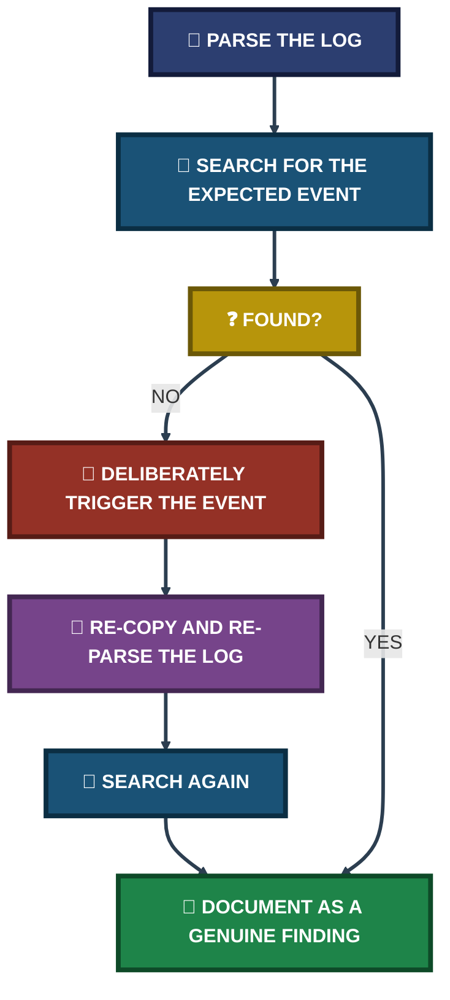

---

<a id="command-reference"></a>
## 🧰 Command Reference

| # | Command | Used In | Purpose |
|:---:|---|---|---|
| 1 | `mkdir C:\Forensics\EventLogs` | Module 1 | Create a dedicated working folder, separate from the live log location |
| 2 | `copy Security.evtx C:\Forensics\EventLogs\` | Module 1 | Copy the live log under an elevated terminal before any parsing |
| 3 | `certutil -hashfile ... SHA256` | Module 1 | Generate an integrity hash immediately after copying |
| 4 | `.\EvtxECmd.exe -f ... --csv ... --csvf output.csv` | Module 1 / 2 | Parse the EVTX log into a structured, filterable CSV |

---

<a id="project-summary"></a>
## 📝 Project Summary

| Module | Tooling | Key Outcome |
|---|---|---|
| Module 1 — Evidence Integrity & Parsing | `certutil`, EvtxECmd | 32,738-record CSV produced with a verified SHA256 source hash |
| Module 2 — Human Baseline & Type 7 | EvtxECmd (2nd pass), spreadsheet filtering | Type 2 baseline confirmed; Type 7 absence documented as a genuine finding |
| Module 3 — Failed Logon & Privilege | Spreadsheet filtering, Event IDs 4625/4672 | Failed logon located; SYSTEM-driven privilege events correctly distinguished from user-driven ones |
| Module 4 — Background Noise | Event ID 4624, Logon Type 5 | Multiple service accounts identified and explained as non-suspicious |

---

<a id="challenges-fixes"></a>
## ⚠️ Challenges & Fixes

| ❌ Challenge | ✅ Fix |
|---|---|
| No Logon Type 7 events in the initial export | Deliberately locked and re-unlocked the screen, re-copied the log, and re-parsed — still no result, documented as a genuine finding rather than hidden |
| Distinguishing SYSTEM-driven 4672 events from user-triggered UAC prompts | Cross-referenced the timestamp cluster (22:02–22:08) against a system-startup window rather than assuming escalation |
| Service accounts (Logon Type 5) could be mistaken for suspicious activity | Explained each account's actual role (machine account, Credential Manager) rather than flagging by pattern alone |

---

<a id="scope-limitations"></a>
## 🚧 Scope & Limitations

- **Own personal machine, not a compromised endpoint:** All findings reflect this machine's normal activity — there is no confirmed malicious event in this dataset.
- **Logon Type 7 remains unresolved:** Despite a deliberate test, no Type 7 event was found. This is flagged as an open item for further investigation, not treated as a resolved conclusion.
- **Figure 54.1 screenshot not yet supplied:** The privilege-tracking (4672) finding is documented from the report's text; the corresponding screenshot was not available in the source material.

---

<a id="what-i-learned"></a>
## 🧠 What I Learned

- **An expected event's absence is still a finding.** Not finding a Logon Type 7 event, even after deliberately triggering one, is worth documenting precisely because it's unexpected — not something to paper over.
- **Timestamp clustering reveals intent better than the event ID alone.** A 4672 privilege event during a 6-minute startup window reads very differently than the same event triggered by a live user action.
- **Background noise has to be actively identified, not just ignored.** Explaining what `DESKTOP-0O3U1SH$` and Logon Type 5 actually represent is what lets a real anomaly stand out later.
- **Two parsing passes can produce two different counts for the same event type.** Pass 1 and Pass 2 show different 4624/4625/4672 totals — the log is not static, and re-parsing after a deliberate action is a legitimate investigative step, not a mistake to reconcile away.

---

<a id="skills-demonstrated"></a>
## 🛠️ Skills Demonstrated

- Maintaining evidence integrity via SHA256 hashing before any analysis
- Parsing Windows EVTX logs into structured CSV with EvtxECmd (EZ Tools)
- Distinguishing Logon Types 2, 5, 7, and 10 and their investigative significance
- Interpreting Event IDs 4624, 4625, and 4672 in context, not just by ID number
- Designing and executing a deliberate test (lock/unlock) to validate a missing expected event
- Separating background service-account noise from genuine human activity
- Documenting an inconclusive or absent result honestly rather than fabricating a finding

---

<a id="screenshot-index"></a>
## 🖼️ Screenshot Index

| # | File | Shows |
|:---:|---|---|
| 1 | `ss-01-certutil-sha256-hash.PNG` | SHA256 integrity hash of the copied Security.evtx |
| 2 | `ss-02-evtxecmd-csv-output-confirm.PNG` | EvtxECmd confirming CSV output path |
| 3 | `ss-03-evtxecmd-pass1-completion.PNG` | Pass 1 completion: 32,738 records, 0 errors |
| 4 | `ss-04-output-csv-filtered-logontype.PNG` | output.csv filtered on Logon Type columns |
| 5 | `ss-05-logontype2-event-4624.PNG` | First Logon Type 2 event, EventId 4624 |
| 6 | `ss-06-evtxecmd-pass2-completion.PNG` | Pass 2 completion: 33,127 records, post lock/unlock test |
| 7 | `ss-07-event-4625-failed-logon.PNG` | Event 4625 failed logon row |
| 8 | `ss-08-logontype5-background-accounts.PNG` | Filtered Logon Type 5 background service accounts |

---

<a id="repo-structure"></a>
## 📁 Repo Structure

```text
project-14-windows-event-log-analysis/
|-- README.md
|-- INDEX.md
`-- screenshots/
    |-- ss-01-certutil-sha256-hash.PNG
    |-- ss-02-evtxecmd-csv-output-confirm.PNG
    |-- ss-03-evtxecmd-pass1-completion.PNG
    |-- ss-04-output-csv-filtered-logontype.PNG
    |-- ss-05-logontype2-event-4624.PNG
    |-- ss-06-evtxecmd-pass2-completion.PNG
    |-- ss-07-event-4625-failed-logon.PNG
    `-- ss-08-logontype5-background-accounts.PNG
```

<div align="center">

🪟 **[Windows Security Event IDs](https://learn.microsoft.com/en-us/windows/security/threat-protection/auditing/basic-audit-logon-events)** · 🧰 **[EZ Tools — EvtxECmd](https://ericzimmerman.github.io/)** · 🧭 **[Troubleshooting Pipeline](#troubleshooting-pipeline)**

</div>
