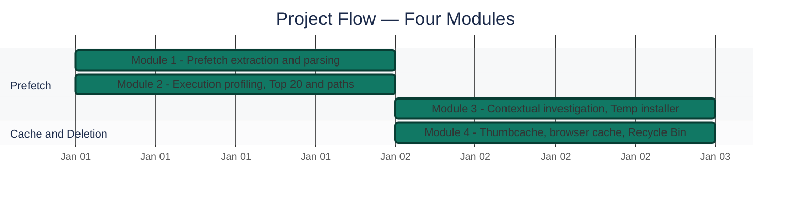
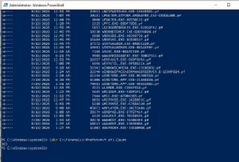
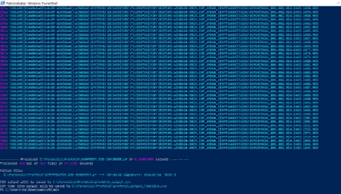
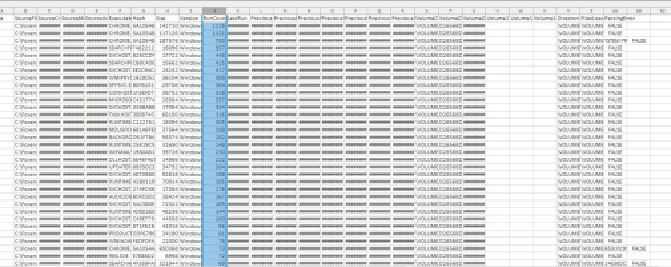
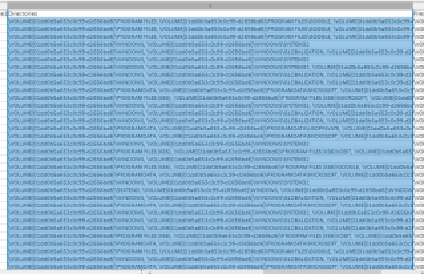
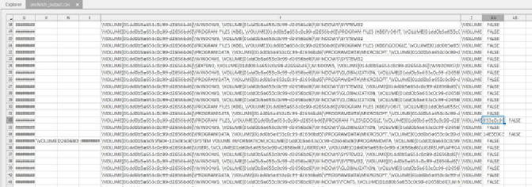
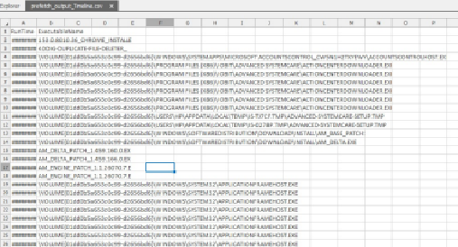
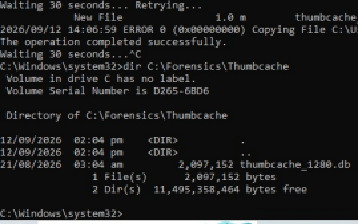
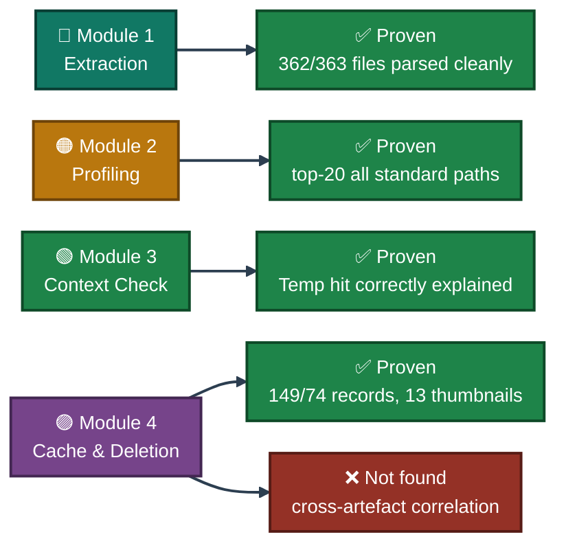
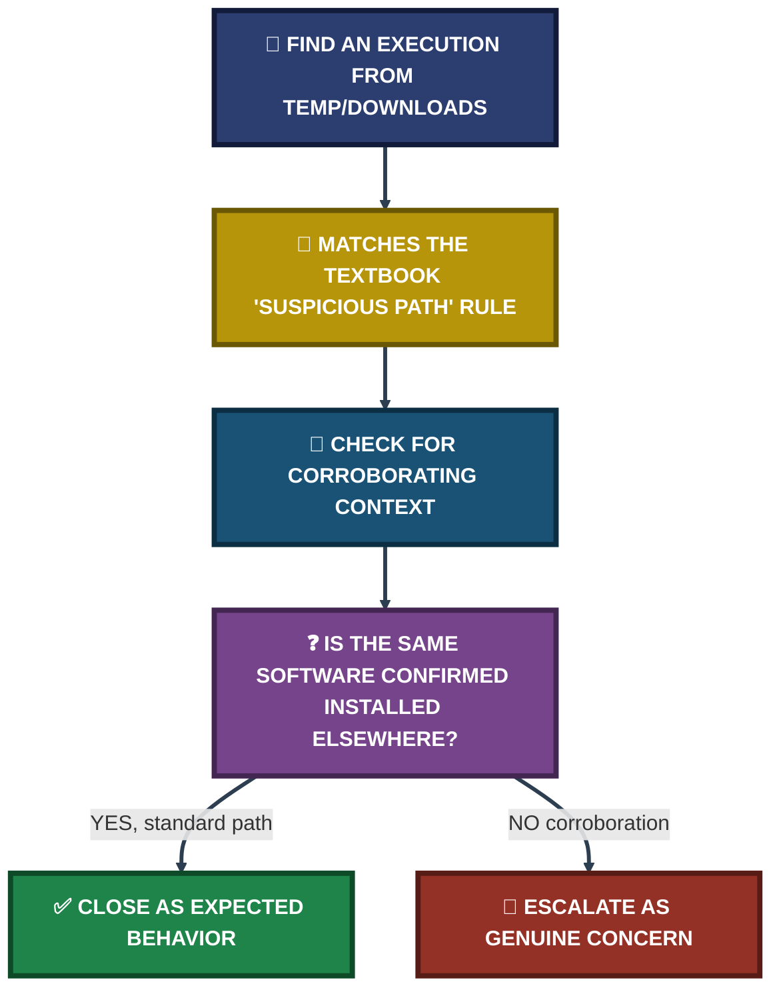

<div align="center">

# 🗂️ Windows Artifacts — Prefetch, Thumbcache & Recycle Bin

**Project 16 of 29 — Blue Team Internship Portfolio**

PECmd Execution Profiling · Context-Based Suspicion Review · Deletion-Record Recovery


363 Prefetch files parsed to profile every program that ran on a live machine — including one Temp-path execution that looked suspicious by the textbook rule, until context (a confirmed legitimate install) closed it correctly instead of flagging it. Locked thumbcache files, a Recycle Bin walked by SID, and one honest "no correlation found" finding round out the artefact set.

### [📑 Open the visual index](INDEX.md)

</div>

---

## 📑 Table of Contents

1. [At a Glance](#at-a-glance)
2. [Project Background](#project-background)
3. [Environment](#environment)
4. [Project Flow](#project-flow)
5. [Module 1 — Prefetch Extraction & Parsing](#module-1)
6. [Module 2 — Execution Profiling](#module-2)
7. [Module 3 — Contextual Investigation: the Temp-Path Installer](#module-3)
8. [Module 4 — Thumbcache, Browser Cache & Recycle Bin](#module-4)
9. [Coverage Snapshot](#coverage-snapshot)
10. [Troubleshooting Pipeline](#troubleshooting-pipeline)
11. [Command Reference](#command-reference)
12. [Project Summary](#project-summary)
13. [Challenges & Fixes](#challenges-fixes)
14. [Scope & Limitations](#scope-limitations)
15. [What I Learned](#what-i-learned)
16. [Skills Demonstrated](#skills-demonstrated)
17. [Screenshot Index](#screenshot-index)
18. [Repo Structure](#repo-structure)

---

<a id="at-a-glance"></a>
## 📊 At a Glance

| 🧩 .pf Files Parsed | 🖼️ Screenshots | 🗑️ Recycle Bin Records | 🖼️ Thumbnails Recovered | 💰 Cost |
|:---:|:---:|:---:|:---:|:---:|
| **362 / 363** | **7** | **149 $R / 74 $I** | **13** | **$0** |

---

<a id="project-background"></a>
## 📖 Project Background

All artefacts here were extracted live from my own personal Windows machine, continuing directly from the event-log baseline in [Project 22](../project-22-windows-event-log-analysis). This project covers program-execution history (Prefetch), thumbnail/browser cache, and Recycle Bin deletion records — three artefact categories that each persist independently of the files or sessions that generated them.

| Task Block | Status | Note |
|---|:---:|---|
| Prefetch Analysis (Days 56–57) | ✅ Complete | 363 files copied, 362 parsed, top-20 profiled, one Temp-path execution investigated and explained |
| Cache & Recycle Bin (Days 58–59) | ✅ Complete | Thumbcache, browser cache, and Recycle Bin all extracted and documented |

> [!NOTE]
> Five figures in the Days 58–59 section (Thumbcache Viewer listing, Chrome cache directory, BrowsingHistoryView folder, the 568-record history export, and both Recycle Bin listings) were **not captured as screenshots** in the source report — marked "pending screenshot" there. Those findings are documented from the report's own text below (📝), not fabricated or left out.

---

<a id="environment"></a>
## 🖧 Environment

| Item | Value |
|---|---|
| **Prefetch Source** | `C:\Windows\Prefetch` → copied to `C:\Forensics\Prefetch` |
| **Parsing Tool** | PECmd (Eric Zimmerman's EZ Tools) |
| **Files Copied** | 363 `.pf` files |
| **Files Parsed** | 362 of 363 (1 corrupted — `SYNTPHELPER.EXE`, invalid signature) |
| **Parse Time** | 87.26 seconds |
| **Thumbcache DB Recovered** | `thumbcache_1280.db` (2,097,152 bytes) via `robocopy /B` |
| **Thumbnails Recovered** | 13 entries (personal images withheld per privacy handling) |
| **Browser History Tool** | BrowsingHistoryView — 568 combined Chrome/Edge records (URLs redacted) |
| **Recycle Bin** | 149 `$R` (data) files, 74 `$I` (metadata) files |

---

<a id="project-flow"></a>
## ⏱️ Project Flow



---

<a id="module-1"></a>
## 🔵 Module 1 — Prefetch Extraction & Parsing

**Objective:** Copy the live Prefetch directory to a working folder before any parsing, per the task brief's warning against working directly from the live directory, then parse it into a structured CSV.

### Step 1 — Copy the Prefetch directory ✅

```
mkdir C:\Forensics\Prefetch
xcopy C:\Windows\Prefetch C:\Forensics\Prefetch /E /H /C /I
(dir C:\Forensics\Prefetch\*.pf).Count
```

<p align="center">
  <br>
  <em>Exhibit 1 (Figure 56.1) — Confirmed count of 363 <code>.pf</code> files successfully copied to the working directory</em>
</p>

### Step 2 — Parse with PECmd ✅

```
.\PECmd.exe -d C:\Forensics\Prefetch --csv C:\Forensics\Prefetch\ --csvf prefetch_output.csv
```

<p align="center">
  <br>
  <em>Exhibit 2 (Figure 56.2) — PECmd completion output: 362 of 363 files processed successfully in 87.26 seconds; <code>SYNTPHELPER.EXE</code> failed with an invalid-signature error, consistent with a corrupted or non-standard prefetch entry rather than a parsing fault</em>
</p>

---

<a id="module-2"></a>
## 🟠 Module 2 — Execution Profiling

**Objective:** Sort by run count to identify the most-executed programs, then check every top entry's execution path for anything outside a standard location.

### Step 3 — Build the Top 20 Most-Executed Programs table ✅

| Executable | Run Count | Last Run | Analyst Note |
|---|:---:|---|---|
| CHROME.EXE | 1,225 | 9/12/2026 7:50 | Expected — primary browser |
| CHROME.EXE | 1,121 | 9/12/2026 7:56 | Expected — secondary Chrome process path |
| CHROME.EXE | 703 | 9/12/2026 7:57 | Expected — browser helper/renderer path |
| SEARCHFILTERHOST.EXE | 557 | 9/12/2026 6:49 | Expected — Windows Search indexing |
| SVCHOST.EXE | 448 | 9/12/2026 7:55 | Expected — Windows service host |
| SVCHOST.EXE | 425 | 9/12/2026 1:05 | Expected — Windows service host |
| CONHOST.EXE | 338 | 9/12/2026 7:58 | Expected — console host |

<p align="center">
  <br>
  <em>Exhibit 3 (Figure 56.3) — RunCount-sorted table showing the top 20 executed programs, LastRun timestamps widened for readability</em>
</p>

### Step 4 — Check execution paths for suspicious locations ✅

Among the top 20 highest-run-count entries, all execution paths resolved to standard, expected locations: `WINDOWS\SYSTEM32`, `PROGRAM FILES\GOOGLE`, `PROGRAMDATA\MICROSOFT`, and `PROGRAM FILES (X86)\IOBIT` (a legitimately installed third-party utility). No Temp or Downloads execution was found among the highest-frequency entries.

<p align="center">
  <br>
  <em>Exhibit 4 (Figure 56.4) — Full Directories column extracted for the top-run entries, used as the working reference for the standard-path check</em>
</p>

<p align="center">
  <br>
  <em>Exhibit 5 (Figure 56.5) — Widened Directories column confirming top-run-count entries execute from standard locations, with a targeted search for "TEMP" returning no match among these entries</em>
</p>

---

<a id="module-3"></a>
## 🟢 Module 3 — Contextual Investigation: the Temp-Path Installer

**Objective:** When a genuine Temp-path execution does appear — just not in the top 20 — investigate it in context rather than either ignoring it or flagging it automatically.

### Step 5 — Review the full execution timeline for Temp-path activity ✅

A separate review of the PECmd-generated timeline (`prefetch_output_Timeline.csv`, distinct from the top-20 table) identified two entries executing from `\USERS\HP\APPDATA\LOCAL\TEMP\IS-TJ7CF.TMP\` and `\IS-0278P.TMP\`, both tied to `ADVANCED-SYSTEMCARE-SETUP.TMP`.

<p align="center">
  <br>
  <em>Exhibit 6 (Figure 56.6) — Timeline rows showing <code>ADVANCED-SYSTEMCARE-SETUP.TMP</code> executing from two AppData\Local\Temp installer extraction subfolders</em>
</p>

🎯 **Finding — investigated, not flagged:** The filename and path pattern (an InstallShield-style `.TMP` extraction folder) are consistent with expected installer self-extraction behavior, and this conclusion is corroborated by the same software (IObit Advanced SystemCare) already installed under `C:\Program Files (x86)\IOBIT\` — confirmed directly in Module 2's standard-path check. This is a worked example of correctly assessing execution-path suspicion in context, rather than flagging every Temp-path hit uniformly.

---

<a id="module-4"></a>
## 🟣 Module 4 — Thumbcache, Browser Cache & Recycle Bin

**Objective:** Recover thumbnail, browser history, and deletion-record artefacts — each of which persists independently of the files or sessions that produced it — and check whether any single indicator correlates across all three artefact categories.

### Step 6 — Bypass the Explorer lock on the thumbcache database ✅

Thumbcache database files are held open by a live-running Windows Explorer, preventing a normal file copy. A `robocopy` operation using backup mode (`/B`) was used to bypass the lock.

```
mkdir C:\Forensics\Thumbcache
robocopy "C:\Users\hp\AppData\Local\Microsoft\Windows\Explorer" C:\Forensics\Thumbcache thumbcache_*.db /B
```

<p align="center">
  <br>
  <em>Exhibit 7 (Figure 58.1) — robocopy output confirming <code>thumbcache_1280.db</code> (2,097,152 bytes) successfully copied to the working directory</em>
</p>

One database (`thumbcache_1280.db`) copied successfully on the first attempt; a second (`thumbcache_16.db`) remained locked and was not pursued further, since the first was sufficient for analysis. Opened in Thumbcache Viewer, it yielded **13 distinct thumbnail entries** — personal/identifying images withheld per the privacy handling standard, only metadata (filenames, source database, sizes) reported. 📝

### Step 7 — Extract combined browser history 📝

The Chrome cache directory was confirmed at `AppData\Local\Google\Chrome\User Data\Default\Cache`. Rather than parse the raw cache format directly, BrowsingHistoryView was used to export a **combined Chrome/Edge history of 568 records** (Visit Time, Visit Type, Web Browser) — visit types included Link, Form Submit, Reload, and Auto TopLevel navigation. All URLs are redacted per the privacy requirement; only structural metadata is reported.

### Step 8 — Walk the Recycle Bin by SID 📝

```
whoami /user
cd C:\$Recycle.Bin
dir /a
cd S-1-5-21-1718504809-3388621995-1181709251-1001
dir /a
dir /a $I*
type $IG3KCHS.PNG
```

$I and $R files are hidden from Explorer's normal view, so the current user's SID was used to navigate directly to the corresponding subdirectory. The listing returned **149 `$R` (deleted data) entries** and **74 `$I` (metadata) entries**. Reading a sample `$I` file (`$IG3KCHS.PNG`) confirmed the original deleted path: `C:\Users\hp\Downloads\[filename].PNG` (filename partially redacted).

🎯 **How $I and $R work together:** The `$I` file stores the metadata record — original full path and exact deletion timestamp. The `$R` file, sharing the same suffix, stores the actual deleted content. Neither file alone is a complete deletion record; together they persist a full deletion event even after the Recycle Bin has been emptied through Explorer, because that action doesn't immediately overwrite the underlying `$I`/`$R` data on disk.

### Step 9 — Check for cross-artefact correlation ✅

The Downloads-folder deletion found via the Recycle Bin `$I` file is consistent with the general activity pattern in the browser cache export from the same period — but **no single filename, hash, or timestamp was found to overlap precisely** across all three artefact categories (event logs, Prefetch, cache/Recycle Bin) in this investigation.

🎯 **Result:** This absence of a cross-artefact match is itself a valid, expected finding for a personal, non-incident machine — correlation exists to link genuinely suspicious activity across artefact types, and its absence here is consistent with the baseline nature of this exercise, not a failure of the methodology.

---

<a id="coverage-snapshot"></a>
## 🌟 Coverage Snapshot

| 🛡️ Artefact | ✅ Status | 📌 Detail |
|---|---|---|
| Prefetch Copy & Parse | Complete | 363 copied, 362 parsed (1 corrupted, explained) |
| Execution Profiling | Complete | Top 20 all resolve to standard paths |
| Temp-Path Investigation | Complete | Investigated and correctly closed as expected installer behavior |
| Thumbcache | Complete (📝 partial evidence) | DB recovered and analyzed; entry-listing screenshot not supplied in source |
| Browser Cache | Complete (📝 notes only) | 568-record export; no screenshot supplied in source |
| Recycle Bin | Complete (📝 notes only) | 149/74 records enumerated; no screenshot supplied in source |
| Cross-Artefact Correlation | Checked, none found | Documented as expected for a non-incident machine |

### 🧾 What the Evidence Proves



---

<a id="troubleshooting-pipeline"></a>
## 🧭 Troubleshooting Pipeline

How a textbook "suspicious path" gets correctly closed instead of falsely flagged



---

<a id="command-reference"></a>
## 🧰 Command Reference

| # | Command | Used In | Purpose |
|:---:|---|---|---|
| 1 | `xcopy C:\Windows\Prefetch ... /E /H /C /I` | Module 1 | Copy the live Prefetch directory before parsing |
| 2 | `.\PECmd.exe -d ... --csv ...` | Module 1 | Parse `.pf` files into a structured CSV |
| 3 | `robocopy ... thumbcache_*.db /B` | Module 4 | Bypass Explorer's file lock on the thumbcache database using backup mode |
| 4 | `whoami /user` | Module 4 | Retrieve the current user's SID to locate their Recycle Bin subfolder |
| 5 | `dir /a $I*` / `type $I...` | Module 4 | List and read `$I` metadata files to recover original deleted-file paths |

---

<a id="project-summary"></a>
## 📝 Project Summary

| Module | Tooling | Key Outcome |
|---|---|---|
| Module 1 — Prefetch Extraction | `xcopy`, PECmd | 362 of 363 `.pf` files parsed cleanly; 1 corrupted file explained |
| Module 2 — Execution Profiling | RunCount sort, Directories column | Top 20 programs all confirmed executing from standard paths |
| Module 3 — Contextual Investigation | Timeline export cross-reference | Temp-path installer execution investigated and correctly closed, not flagged |
| Module 4 — Cache & Recycle Bin | Robocopy `/B`, Thumbcache Viewer, BrowsingHistoryView, SID navigation | 13 thumbnails, 568 history records, 149/74 Recycle Bin records recovered; no cross-artefact correlation found |

---

<a id="challenges-fixes"></a>
## ⚠️ Challenges & Fixes

| ❌ Challenge | ✅ Fix |
|---|---|
| One `.pf` file (`SYNTPHELPER.EXE`) failed to parse with an invalid-signature error | Documented as a corrupted/non-standard prefetch entry rather than a parsing failure, and excluded from the 362-file analysis set |
| A Temp-path installer execution matched the textbook "suspicious location" pattern | Cross-referenced against the same software's confirmed legitimate install path before closing it as expected behavior |
| Thumbcache database files locked by a live Explorer process | Used `robocopy /B` (backup mode) to bypass the lock rather than skipping the artefact |
| A second thumbcache file (`thumbcache_16.db`) remained locked | Not pursued further, since the first successfully copied database was sufficient for the analysis |
| No single indicator correlated across all three artefact categories | Documented as the expected result for a clean, non-incident personal machine rather than a methodology gap |

---

<a id="scope-limitations"></a>
## 🚧 Scope & Limitations

- **Own personal machine, non-incident baseline:** No confirmed compromise indicator exists in this dataset; the absence of cross-artefact correlation reflects that baseline state, not a limitation of the method.
- **Five figures not captured as screenshots in the source report:** Thumbcache Viewer's entry listing, the Chrome cache directory confirmation, the BrowsingHistoryView folder, the 568-record history export, and both Recycle Bin listings are documented from the report's text (📝) — marked "pending screenshot" in the original appendix.
- **Personal content withheld:** Thumbnail images, browsing URLs, and full deleted filenames are redacted throughout per the privacy handling standard set in the task brief.
- **One corrupted prefetch file:** `SYNTPHELPER.EXE` could not be parsed (1 of 363) and is excluded from the execution-profile analysis.
- **Second thumbcache database not recovered:** `thumbcache_16.db` remained locked; not pursued since it wasn't necessary for the analysis.

---

<a id="what-i-learned"></a>
## 🧠 What I Learned

- **A suspicious-path rule is a starting point, not a verdict.** The Advanced SystemCare Temp execution matched the textbook definition of suspicious, but corroborating it against the same software's confirmed install path turned a potential false positive into a correctly closed finding.
- **A locked file needs a documented workaround, not a skipped step.** `robocopy /B` bypassing Explorer's lock is only useful if the method itself is recorded — so another analyst could replicate it exactly.
- **Absence of correlation is itself informative.** On a genuinely compromised system, cross-artefact correlation is what turns three separate, arguable clues into a hard-to-dispute case. Finding none here confirms a clean baseline rather than indicating the technique failed.
- **$I and $R are two halves of one record.** Neither file alone proves a complete deletion event — the metadata (what/when) and the content (the data itself) only together reconstruct what actually happened.
- **Reporting standards apply even to missing screenshots.** Marking five figures "pending" rather than silently omitting the underlying finding kept the report's account of what was actually observed intact.

---

<a id="skills-demonstrated"></a>
## 🛠️ Skills Demonstrated

- Parsing Windows Prefetch (`.pf`) files with PECmd (EZ Tools) to build an execution profile
- Distinguishing standard execution paths from genuinely suspicious ones using corroborating context
- Bypassing a locked live file (thumbcache database) with a documented, replicable workaround
- Extracting and interpreting browser history metadata while redacting personally identifying content
- Navigating the Windows Recycle Bin by SID and interpreting `$I`/`$R` file pairs
- Performing cross-artefact correlation and correctly documenting a negative result
- Applying a consistent privacy-redaction standard across thumbnails, URLs, and filenames

---

<a id="screenshot-index"></a>
## 🖼️ Screenshot Index

| # | File | Shows |
|:---:|---|---|
| 1 | `ss-01-prefetch-copy-confirmation-363files.PNG` | 363 `.pf` files copied to the working directory |
| 2 | `ss-02-pecmd-parsing-completion.PNG` | PECmd: 362/363 parsed successfully, 87.26 seconds |
| 3 | `ss-03-top20-runcount-table.PNG` | Top 20 RunCount-sorted programs table |
| 4 | `ss-04-directories-column-reference.PNG` | Full Directories column for top-run entries |
| 5 | `ss-05-directories-widened-temp-check.PNG` | Widened Directories column, TEMP search: no match |
| 6 | `ss-06-installer-temppath-timeline.PNG` | Advanced SystemCare Temp-path installer timeline rows |
| 7 | `ss-07-thumbcache-robocopy-confirmation.PNG` | `thumbcache_1280.db` successfully copied via robocopy `/B` |

---

<a id="repo-structure"></a>
## 📁 Repo Structure

```text
project-25-windows-artifacts-prefetch/
|-- README.md
|-- INDEX.md
`-- screenshots/
    |-- ss-01-prefetch-copy-confirmation-363files.PNG
    |-- ss-02-pecmd-parsing-completion.PNG
    |-- ss-03-top20-runcount-table.PNG
    |-- ss-04-directories-column-reference.PNG
    |-- ss-05-directories-widened-temp-check.PNG
    |-- ss-06-installer-temppath-timeline.PNG
    `-- ss-07-thumbcache-robocopy-confirmation.PNG
```

<div align="center">

🧰 **[EZ Tools — PECmd](https://ericzimmerman.github.io/)** · 🪟 **[Windows Prefetch](https://learn.microsoft.com/en-us/windows/win32/w8cookbook/-order-prelaunch-optimization)** · 🗑️ **[Recycle Bin Forensics](https://learn.microsoft.com/en-us/windows/win32/shell/recycle-bin)** · 🧭 **[Troubleshooting Pipeline](#troubleshooting-pipeline)**

</div>
