

# 🕵️ Project 18 — Index
### Mantooth Investigation — Autopsy Triage & Windows Artefact Analysis
**Project 18 of 18 — Advanced Cyber Projects**

-brightgreen?style=for-the-badge)

**Quick guide to every step and screenshot in this project.**

### [📖 Open the full README](README.md)

---

| 🧩 Modules | 🖼️ Screenshots | 🗂️ Deleted Files Found | 🎯 Questions Covered |
|:---:|:---:|:---:|:---:|
| **3** | **17** | **276** | **9 (Q1–Q7, Q10, Q11)** |

🧩 <b>Case:</b> Mantooth.E01 ➜ Autopsy ingest ➜ Triage (encryption, deleted files, EXIF, web, email) ➜ Windows artefacts (Recycle Bin, Prefetch, USB)

---

## 📑 Step Index

All 12 steps of the project, with the screenshot that proves each one.

| # | Step | Module | Result | Evidence |
|:---:|---|:---:|---|:---:|
| 1 | Create the case and configure ingest | 🔵 Module 1 | Mantooth.E01 added, ingest modules selected | [Exhibit 1](#ex1), [2](#ex2) |
| 2 | Verify the image MD5 hash | 🔵 Module 1 | MD5 `31217210a1a69f272079a3bde3d9d8fc` confirmed | [Exhibit 3](#ex3) |
| 3 | Document the partition layout | 🔵 Module 1 | Four volumes; vol2 holds the Windows installation | [Exhibit 4](#ex4) |
| 4 | Find encrypted files | 🟠 Module 2 | 2 password-protected files flagged Notable | [Exhibit 5](#ex5) |
| 5 | Review deleted files | 🟠 Module 2 | 261 file-system / 276 total deleted files | [Exhibit 6](#ex6), [7](#ex7) |
| 6 | Read photo EXIF metadata | 🟠 Module 2 | 8 photographs, Sony / Kodak / Olympus models seen | [Exhibit 8](#ex8) |
| 7 | Review web search history | 🟠 Module 2 | "check washing", "making meth", "atm card stealing" | [Exhibit 9](#ex9) |
| 8 | Recover email addresses | 🟠 Module 2 | 61 entries from Outlook.pst and .eml files | [Exhibit 10](#ex10) |
| 9 | Identify the operating system | 🟢 Module 3 | WESMANTOOTH-PC, Windows Vista Ultimate (x86) | [Exhibit 11](#ex11) |
| 10 | Recover the Recycle Bin cleanup | 🟢 Module 3 | CameraShy.exe deleted 2007-07-14 22:55:57 | [Exhibit 12](#ex12) |
| 11 | Check Xcopy in Prefetch | 🟢 Module 3 | Run count 15, last run 2007-08-24 17:47:33 | [Exhibit 13](#ex13), [14](#ex14), [15](#ex15) |
| 12 | Review USB device history | 🟢 Module 3 | Canon IXUS 700 and two flash drives identified | [Exhibit 16](#ex16), [17](#ex17) |

---

## 🔵 Module 1 — Case Setup & Image Verification

Exhibits 1 to 4. Click a screenshot to open it full size.

<table>
<tr>
<td align="center" valign="top" width="50%">

<a href="screenshots/ss-01-add-data-source-wizard.PNG">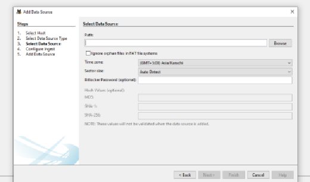</a>
 <b>Exhibit 1 — Add Data Source wizard</b>
 Select Data Source step, before browsing to Mantooth.E01
</td>
<td align="center" valign="top" width="50%">

<a href="screenshots/ss-02-configure-ingest-modules.PNG">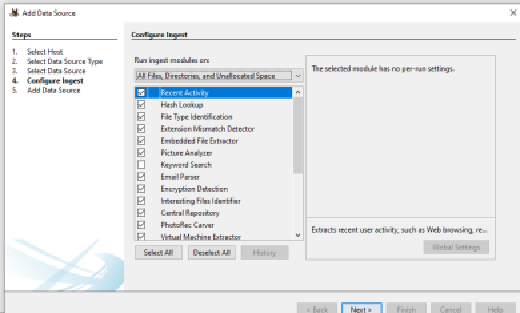</a>
 <b>Exhibit 2 — Ingest modules</b>
 Modules selected for the run (Keyword Search deselected)
</td>
</tr>
<tr>
<td align="center" valign="top" width="50%">

<a href="screenshots/ss-03-md5-hash-container-tab.PNG">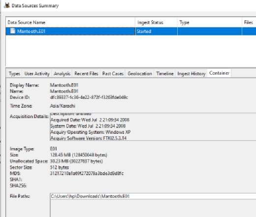</a>
 <b>Exhibit 3 — MD5 hash</b>
 Container tab with MD5 and acquisition metadata from the E01 header
</td>
<td align="center" valign="top" width="50%">

<a href="screenshots/ss-04-partition-layout-4volumes.PNG">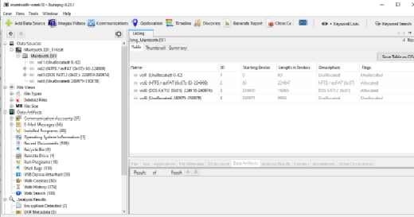</a>
 <b>Exhibit 4 — Partition layout</b>
 Four volumes; vol2 (NTFS/exFAT) is the Windows installation
</td>
</tr>
</table>

---

## 🟠 Module 2 — Targeted Triage Findings

Exhibits 5 to 10.

<table>
<tr>
<td align="center" valign="top" width="33%">

<a href="screenshots/ss-05-encryption-detected-2files.PNG">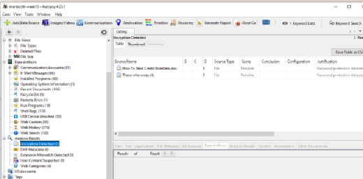</a>
 <b>Exhibit 5 — Encrypted files</b>
 Two password-protected documents flagged Notable
</td>
<td align="center" valign="top" width="33%">

<a href="screenshots/ss-06-deleted-files-overview.PNG">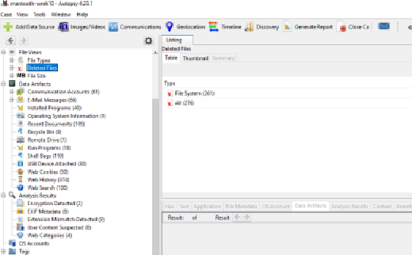</a>
 <b>Exhibit 6 — Deleted files overview</b>
 File System (261) and All (276)
</td>
<td align="center" valign="top" width="33%">

<a href="screenshots/ss-07-deleted-files-full-listing.PNG">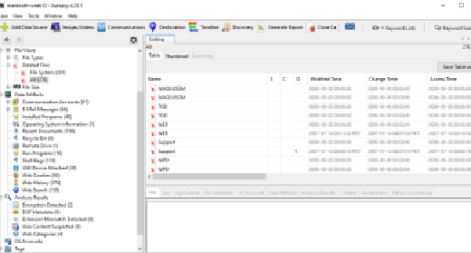</a>
 <b>Exhibit 7 — Deleted files listing</b>
 Full 276-entry listing, sorted by name
</td>
</tr>
<tr>
<td align="center" valign="top" width="33%">

<a href="screenshots/ss-08-exif-metadata-8photos.PNG">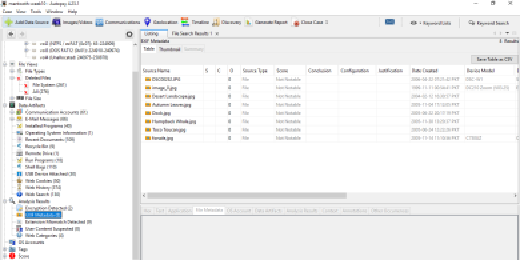</a>
 <b>Exhibit 8 — EXIF metadata</b>
 8 photographs with Date Created and Device Model
</td>
<td align="center" valign="top" width="33%">

<a href="screenshots/ss-09-web-search-results.PNG">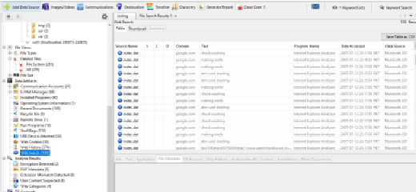</a>
 <b>Exhibit 9 — Web search history</b>
 Repeated fraud-related searches via google.com
</td>
<td align="center" valign="top" width="33%">

<a href="screenshots/ss-10-email-addresses-recovered.PNG">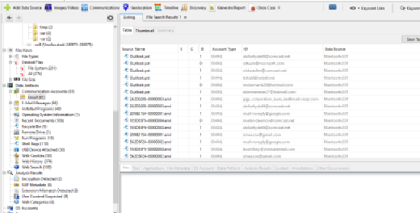</a>
 <b>Exhibit 10 — Email addresses</b>
 61 entries from Outlook.pst and .eml files
</td>
</tr>
</table>

---

## 🟢 Module 3 — Windows Artefact Hunting

Exhibits 11 to 17.

<table>
<tr>
<td align="center" valign="top" width="33%">

<a href="screenshots/ss-11-os-information-wesmantoothpc.PNG">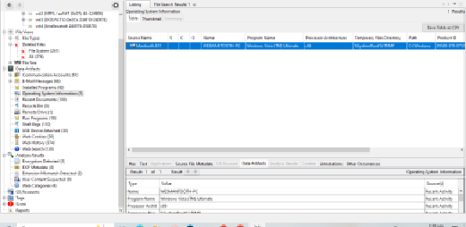</a>
 <b>Exhibit 11 — OS information</b>
 WESMANTOOTH-PC, Windows Vista Ultimate, x86
</td>
<td align="center" valign="top" width="33%">

<a href="screenshots/ss-12-recyclebin-camerashy-exe.PNG">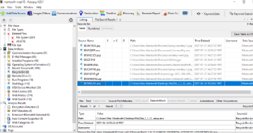</a>
 <b>Exhibit 12 — Recycle Bin</b>
 CameraShy.exe deletion record with the Hacker Stuff DLL and ValidateCreditCa zip
</td>
<td align="center" valign="top" width="33%">

<a href="screenshots/ss-13-prefetch-runprograms-listing.PNG">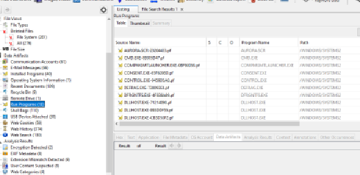</a>
 <b>Exhibit 13 — Prefetch listing</b>
 Run Programs, 18 entries including XCOPY.EXE
</td>
</tr>
<tr>
<td align="center" valign="top" width="33%">

<a href="screenshots/ss-14-xcopy-selected-in-list.PNG">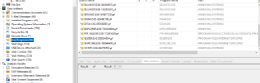</a>
 <b>Exhibit 14 — Xcopy selected</b>
 XCOPY.EXE-8E0707F2.pf among system prefetch entries
</td>
<td align="center" valign="top" width="33%">

<a href="screenshots/ss-15-xcopy-prefetch-detail.PNG">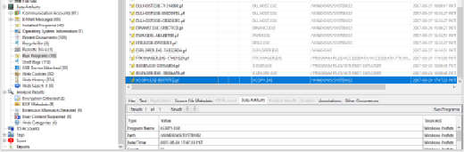</a>
 <b>Exhibit 15 — Xcopy detail</b>
 Run count 15, last run 2007-08-24 17:47:33
</td>
<td align="center" valign="top" width="33%">

 <b>Exhibit 16 — USB devices</b>
 30 entries: flash drives, mice, Canon camera
</td>
</tr>
<tr>
<td align="center" valign="top" width="33%">

 <b>Exhibit 17 — USB Device IDs</b>
 Distinct IDs for the Canon camera and both flash drives
</td>
<td></td>
<td></td>
</tr>
</table>

---

## 🎯 Key Findings

| Artefact | Finding | Exhibit |
|---|---|---|
| Encryption Detection | `How To Steal Credit Numbers.doc` and `Those who owes.xls` password-protected | [5](#ex5) |
| Web Search | "check washing", "making meth", "atm card stealing" searched repeatedly on 2007-07-12 | [9](#ex9) |
| Recycle Bin | CameraShy.exe, a "Hacker Stuff" DLL and `ValidateCreditCa....zip` deleted within ~70 seconds | [12](#ex12) |
| Prefetch | XCOPY.EXE run 15 times, last on 2007-08-24 | [15](#ex15) |
| USB Device Attached | Canon Digital IXUS 700 and two Silicon Integrated Systems flash drives | [16](#ex16), [17](#ex17) |

> [!NOTE]
> All timestamps are shown as recorded in Autopsy with the case time zone Asia/Karachi (GMT+5:00); apply −12 hours for Mountain Time. The 30 USB entries share one timestamp, which most likely reflects a single driver-database enumeration, not 30 connections. Items without a screenshot are listed under Scope & Limitations in the README.

---

[⬆️ Back to top](#top) &nbsp;·&nbsp; [📖 Full README](README.md)

🔍 **[Autopsy](https://www.autopsy.com)** · 🧭 **[README Troubleshooting Pipeline](README.md#troubleshooting-pipeline)**

