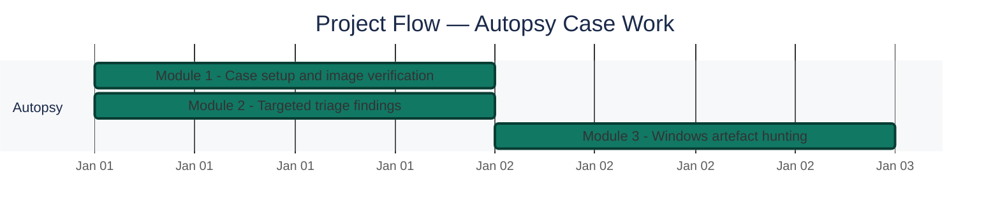
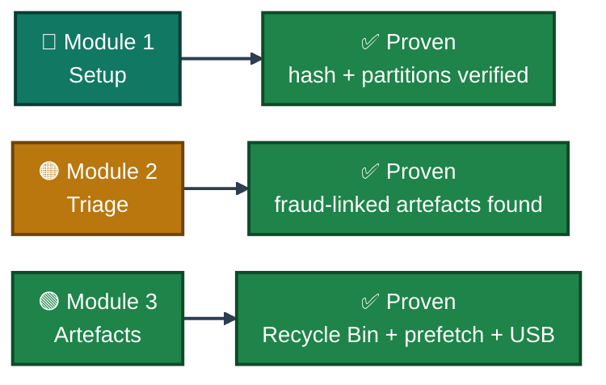
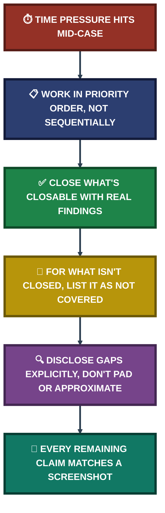

<div align="center">

# 🕵️ Mantooth Investigation — Autopsy Triage & Windows Artefact Analysis

**Project 18 of 18 — Blue Team Internship Portfolio**

Autopsy Case Work · Fraud-Case Artefact Triage · Windows Artefact Hunting


-2EA043?style=for-the-badge)

**Scope:** This case comes from the Week 10 report and examines a single evidence image, `Mantooth.E01`, in Autopsy. Every finding below is backed by a screenshot taken directly from the case; Week 10 items that have no screenshot are listed under Scope & Limitations and are not claimed anywhere else in this write-up.

### [📑 Open the visual index](INDEX.md)

</div>

---

## 📑 Table of Contents

1. [At a Glance](#at-a-glance)
2. [Project Background](#project-background)
3. [Environment](#environment)
4. [Project Flow](#project-flow)
5. [Module 1 — Case Setup & Image Verification](#module-1)
6. [Module 2 — Targeted Triage Findings](#module-2)
7. [Module 3 — Windows Artefact Hunting](#module-3)
8. [Module 4 — Investigative Commentary](#module-4)
9. [Coverage Snapshot](#coverage-snapshot)
10. [Troubleshooting Pipeline](#troubleshooting-pipeline)
11. [Project Summary](#project-summary)
12. [Challenges & Fixes](#challenges-fixes)
13. [Scope & Limitations](#scope-limitations)
14. [What I Learned](#what-i-learned)
15. [Skills Demonstrated](#skills-demonstrated)
16. [Screenshot Index](#screenshot-index)
17. [Repo Structure](#repo-structure)

---

<a id="at-a-glance"></a>
## 📊 At a Glance

| 🧩 Evidence Image | 🖼️ Screenshots | 🎯 Questions Covered | 🗂️ Deleted Files Found | 💰 Cost |
|:---:|:---:|:---:|:---:|:---:|
| **Mantooth.E01** | **17** | **9 (Q1–Q7, Q10, Q11)** | **276** | **$0** |

---

<a id="project-background"></a>
## 📖 Project Background

This report examines `Mantooth.E01` — a forensic image taken from the laptop of Wes Mantooth, a suspect in a fraudulent cheque case. Access was delayed by a shared-drive permission error (see Module 4), but once a working copy was confirmed, a genuine examination was carried out directly against the image.

| Task Block | Status | Note |
|---|:---:|---|
| Case Setup & Image Verification (Q1–Q2) | ✅ Complete — real findings | MD5 hash and 4-partition layout confirmed |
| Targeted Triage (Q3–Q7) | ✅ Complete — real findings | EXIF device models, 276 deleted files, encrypted files, web searches and recovered emails documented |
| Windows Artefact Hunting (Q10, Q11 + OS & USB history) | ✅ Complete — real findings | CameraShy.exe, Xcopy prefetch, OS information and USB device history confirmed |

> [!IMPORTANT]
> One limitation is disclosed directly: the case's time zone was set to **Asia/Karachi (GMT+5:00)** instead of the brief's Mountain Time (Phoenix), so every timestamp below is recorded as observed with a noted **−12 hour** adjustment needed for Mountain Time equivalence. Week 10 items without a screenshot are not claimed in this write-up — see Scope & Limitations.

---

<a id="environment"></a>
## 🖧 Environment

| Item | Value |
|---|---|
| **Case Name** | `mantooth-week10` |
| **Evidence Image** | `Mantooth.E01` (EWF/EnCase format) |
| **Forensic Tool** | Autopsy 4.23.1 |
| **MD5 Hash** | `31217210a1a69f272079a3bde3d9d8fc` |
| **Image Size** | 128.45 MB (30.23 MB unallocated) |
| **Acquisition Tool** | FTK Imager 2.5.3.14 |
| **Case Time Zone (as set)** | Asia/Karachi, GMT+5:00 (brief called for Mountain Time, GMT−7:00) |
| **Suspect Machine** | `WESMANTOOTH-PC`, Windows Vista Ultimate (x86) — see discrepancy note in Module 3 |

---

<a id="project-flow"></a>
## ⏱️ Project Flow


---

<a id="module-1"></a>
## 🔵 Module 1 — Case Setup & Image Verification (Q1–Q2)

**Objective:** Create the case correctly, verify image integrity, and document the partition layout before any artefact review begins.

### Step 1 — Create the case and configure ingest ✅

<p align="center">
  <br>
  <em>Exhibit 1 (Figure 3.1) — Add Data Source wizard, prior to browsing to Mantooth.E01</em>
</p>

<p align="center">
  <br>
  <em>Exhibit 2 (Figure 3.2) — Ingest modules selected (Keyword Search deselected to reduce processing time)</em>
</p>

### Step 2 — Q1: Verify the MD5 hash ✅

<p align="center">
  <br>
  <em>Exhibit 3 (Figure 3.3) — Data Sources Summary, Container tab: MD5 <code>31217210a1a69f272079a3bde3d9d8fc</code>, acquisition metadata from the E01 header</em>
</p>

### Step 3 — Q2: Document the partition layout ✅

<p align="center">
  <br>
  <em>Exhibit 4 (Figure 3.4) — Four volumes: vol2 (NTFS/exFAT, allocated, Windows installation) is the primary focus of the rest of the examination</em>
</p>

---

<a id="module-2"></a>
## 🟠 Module 2 — Targeted Triage Findings (Q3–Q7)

**Objective:** Extract and interpret encrypted files, deleted files, EXIF metadata, web search history, and email artefacts.

### Q4 — Encrypted files ✅

<p align="center">
  <br>
  <em>Exhibit 5 (Figure 4.1) — Two files flagged Notable: <code>How To Steal Credit Numbers.doc</code> and <code>Those who owes.xls</code></em>
</p>

### Q5 — Deleted files ✅

<p align="center">
  <br>
  <em>Exhibit 6 (Figure 4.2) — 261 file-system deleted files, 276 total including carved/orphan sources</em>
</p>

<p align="center">
  <br>
  <em>Exhibit 7 (Figure 4.3) — Full 276-entry deleted files listing, sorted by name</em>
</p>

### Q3 — EXIF metadata ✅

<p align="center">
  <br>
  <em>Exhibit 8 (Figure 4.4) — 8 photographs with Date Created and Device Model fields</em>
</p>

Device Model values visible in the results: `DSC00252.JPG` — DSC-W1 (Sony), `image_0.jpg` — DC210 Zoom (Kodak), `forsale.jpg` — C730UZ (Olympus Camedia C-730 Ultra Zoom). The other five photographs show no device model.

### Q6 — Web search history ✅

<p align="center">
  <br>
  <em>Exhibit 9 (Figure 4.5) — Repeated searches for "check washing", "making meth", and "atm card stealing", all via google.com, 12 July 2007</em>
</p>

"Check washing" (altering a physical cheque's payee/amount) directly matches this investigation's fraud premise.

### Q7 — Email addresses ✅

<p align="center">
  <br>
  <em>Exhibit 10 (Figure 4.6) — 61 email entries from Outlook.pst and .eml files; <code>chkwasher@comcast.net</code> and <code>skimmerman27@hotmail.com</code> both echo the fraud narrative</em>
</p>

---

<a id="module-3"></a>
## 🟢 Module 3 — Windows Artefact Hunting (Q10–Q11, OS & USB)

**Objective:** Correlate prefetch execution, Recycle Bin entries, and system information with the suspect's likely actions.

### Operating System Information (bonus finding) ✅

<p align="center">
  <br>
  <em>Exhibit 11 (Figure 5.1) — Computer name <code>WESMANTOOTH-PC</code>, Windows Vista Ultimate, x86</em>
</p>

> [!NOTE]
> **Discrepancy noted, not resolved:** the E01 acquisition metadata records "Windows XP" while the live file system reports "Windows Vista Ultimate." Documented as an observed discrepancy — possibly a default value from the acquisition tool — rather than forced to agree.

### Q10 — Recycle Bin: CameraShy.exe ✅

<p align="center">
  <br>
  <em>Exhibit 12 (Figure 5.2) — CameraShy.exe deleted 2007-07-14 22:55:57 from <code>C:\Users\Wes Mantooth\Documents\</code></em>
</p>

Two further entries deleted within ~90 seconds of CameraShy.exe: a DLL from a folder named "Hacker Stuff", and `ValidateCreditCa....zip` — suggesting a single cleanup action rather than three unrelated deletions.

### Q11 — Prefetch: Xcopy ✅

<p align="center">
  <br>
  <em>Exhibit 13 (Figure 5.3) — Run Programs (Prefetch) listing, 18 entries including XCOPY.EXE-8E0707F2.pf</em>
</p>

<p align="center">
  <br>
  <em>Exhibit 14 (Figure 5.4) — XCOPY.EXE-8E0707F2.pf selected among system prefetch entries</em>
</p>

<p align="center">
  <br>
  <em>Exhibit 15 (Figure 5.5) — Run count: <b>15</b>, last run 2007-08-24 17:47:33</em>
</p>

🎯 **Interpretation:** A run count of 15 for a built-in utility is unusually high for incidental use and is consistent with repeated bulk file-copying, for example to the removable drives shown in the USB history below. The last recorded run (2007-08-24) is later than the 14 July Recycle Bin cleanup, so these artefacts alone do not tie the copying to that cleanup.

### USB Device History ✅

<p align="center">
  <br>
  <em>Exhibit 16 (Figure 5.6) — USB Device Attached (30 entries): Silicon Integrated Systems Corp. flash drives, Microsoft and Logitech mice, and a Canon Inc. camera, all dated 2007-07-14 22:56:41 (as recorded)</em>
</p>

<p align="center">
  <br>
  <em>Exhibit 17 (Figure 5.7) — Device ID column: Canon camera and both flash drives with their distinct identifiers</em>
</p>

| Device | Details |
|---|---|
| Canon Digital IXUS 700 | Normal-mode and PTP-mode entries; Device ID `5&1ec84238&0&4` |
| Flash Drive 1 | Silicon Integrated Systems Corp., Super Flash 1GB / GXT 64MB; Device ID `0000000000C80F` |
| Flash Drive 2 | Silicon Integrated Systems Corp., Super Flash 1GB / GXT 64MB; Device ID `0000000000C9BA` |

> [!NOTE]
> All 30 entries share the identical timestamp 2007-07-14 22:56:41, which most likely reflects a single driver-database enumeration rather than 30 separate physical connections. The timestamp is recorded as observed and is not treated as a connection time.

### Suspicious files identified ✅

Five suspicious files are identified, each tied to a specific artefact: `CameraShy.exe` (Recycle Bin, Documents folder), an unnamed DLL deleted from a folder named "Hacker Stuff" (Recycle Bin), `ValidateCreditCa....zip` (Recycle Bin, Documents folder), and the two password-protected documents `How To Steal Credit Numbers.doc` and `Those who owes.xls` (Encryption Detection).

---

<a id="module-4"></a>
## 🟣 Module 4 — Investigative Commentary

The findings form a coherent picture. The web search history shows deliberate research into three fraud techniques within a narrow window on 12 July 2007. The two password-protected documents sit squarely alongside that research. The Recycle Bin shows a tight ~90-second cleanup cluster the same evening. Xcopy's 15 executions plus two USB flash drives are consistent with files being copied to removable media at some point; Xcopy's last recorded run (2007-08-24) falls after the 14 July cleanup, so the two are not shown to be linked in time.

The camera evidence is the one area that does not reinforce the narrative: the camera connected to this machine (Canon Digital IXUS 700, Exhibits 16–17) is a different model from the Olympus device indicated by `forsale.jpg`'s EXIF data (Exhibit 8), and a Sony and a Kodak model also appear in the EXIF results. More than one distinct camera appears across the evidence, and this is recorded as an observation, not reconciled.

### Technical Issues & Troubleshooting Log

| Issue | What Happened | Resolution |
|---|---|---|
| Evidence file access | `Mantooth.E01` failed to download in usable form on more than one attempt | Traced to the download itself, not the file format; a complete verified copy opened in Autopsy without issue |
| Case time zone | Case created at Asia/Karachi instead of Mountain Time; couldn't be edited after the fact in this Autopsy version | Proceeded with times as recorded, applying a documented −12 hour manual adjustment note wherever it matters |
| Time constraints | Same-day deadline, ~half the week lost to the access issue | Lab 1 worked in priority order; items without a screenshot are left out of this write-up (see Scope & Limitations) |

---

<a id="coverage-snapshot"></a>
## 🌟 Coverage Snapshot

| 🛡️ Module | ✅ Status | 📌 Detail |
|---|---|---|
| Case Setup & Verification | Complete | MD5 + partition layout confirmed |
| Targeted Triage | Complete | Encrypted files, deleted files, EXIF models, web searches, emails documented |
| Windows Artefact Hunting | Complete | OS info, Recycle Bin, prefetch, USB history confirmed |
| Investigative Commentary | Complete | Cross-artefact narrative built from confirmed findings |

### 🧾 What the Evidence Proves



---

<a id="troubleshooting-pipeline"></a>
## 🧭 Troubleshooting Pipeline

How Lab 1 items without evidence are scoped out honestly instead of padded



---

<a id="project-summary"></a>
## 📝 Project Summary

| Module | Tooling | Key Outcome |
|---|---|---|
| Module 1 — Case Setup | Autopsy 4.23.1 | MD5 hash and 4-partition layout confirmed |
| Module 2 — Targeted Triage | Encryption Detection, Web Search, Communication Accounts | Fraud-linked documents, searches, and emails recovered |
| Module 3 — Artefact Hunting | Recycle Bin, Run Programs (Prefetch), OS Information, USB Device Attached | CameraShy.exe cleanup cluster, Xcopy pattern, and USB device history identified |
| Module 4 — Commentary | Cross-artefact correlation | Coherent fraud narrative built; multiple-camera observation recorded |

---

<a id="challenges-fixes"></a>
## ⚠️ Challenges & Fixes

| ❌ Challenge | ✅ Fix |
|---|---|
| `Mantooth.E01` failed to download usable on first attempts | Re-downloaded a complete, verified copy — confirmed as a valid EWF/EnCase image |
| Case time zone set to Asia/Karachi, uneditable after creation | Proceeded with times as recorded, applied a documented −12 hour Mountain Time adjustment note |
| Same-day deadline with ~half the week lost to access issues | Worked Lab 1 in priority order; left out anything without a screenshot rather than padding or approximating |

---

<a id="scope-limitations"></a>
## 🚧 Scope & Limitations

- **Time zone offset:** all timestamps are Asia/Karachi as recorded; apply −12 hours for Mountain Time equivalence.
- **Not covered in this write-up (no screenshot):** individual isolation of `HARDCORE.jpg` and `pfah603.jpg` within the 276 deleted files; the EXIF Device Make field; IP addresses; additional suspicious files beyond the five listed; thumbcache, LNK shortcut, print spool and Security event log analysis; and registry analysis.
- **Camera observation:** more than one distinct camera appears across the evidence (Canon, Olympus, Sony, Kodak models); this is recorded as an observation and is not reconciled.

---

<a id="what-i-learned"></a>
## 🧠 What I Learned

- **A wrong case setting doesn't have to corrupt the findings.** The incorrect time zone couldn't be fixed after the fact, but recording times as observed with an explicit adjustment note kept every finding accurate rather than silently wrong.
- **A shared timestamp across many artefacts is a caveat, not a finding.** 30 USB entries sharing one timestamp likely reflects a single driver-database re-enumeration, not 30 independent connections — the registry is the correct source for genuine per-device timing.
- **Five well-justified findings beat ten padded ones.** Meeting a numeric requirement by including weakly-justified entries would have made the report less defensible, not more complete.
- **An unresolved discrepancy is a legitimate result.** The camera-model mismatch across sources doesn't need to be forced into agreement — recording it as an observation is more honest than picking one and moving on.

---

<a id="skills-demonstrated"></a>
## 🛠️ Skills Demonstrated

- Autopsy case creation, ingest module selection, and E01 image verification (MD5, partition layout)
- Interpreting Encryption Detection, Web Search, Communication Accounts, and Recycle Bin artefact categories
- Correlating Prefetch execution counts with USB device history to infer likely file movement
- Recognizing when a technical limitation (case time zone) requires a documented workaround rather than a redo
- Distinguishing artefact-level timing precision from what only the registry can confirm
- Scoping a forensic write-up to what the screenshots prove, rather than padding or approximating

---

<a id="screenshot-index"></a>
## 🖼️ Screenshot Index

| # | File | Shows |
|:---:|---|---|
| 1 | `ss-01-add-data-source-wizard.PNG` | Add Data Source wizard |
| 2 | `ss-02-configure-ingest-modules.PNG` | Ingest modules configuration |
| 3 | `ss-03-md5-hash-container-tab.PNG` | MD5 hash and acquisition metadata |
| 4 | `ss-04-partition-layout-4volumes.PNG` | 4-volume partition listing |
| 5 | `ss-05-encryption-detected-2files.PNG` | 2 password-protected files flagged |
| 6 | `ss-06-deleted-files-overview.PNG` | Deleted Files category overview (261/276) |
| 7 | `ss-07-deleted-files-full-listing.PNG` | Full 276-entry deleted files listing |
| 8 | `ss-08-exif-metadata-8photos.PNG` | EXIF metadata for 8 photographs |
| 9 | `ss-09-web-search-results.PNG` | Web search results: fraud-related queries |
| 10 | `ss-10-email-addresses-recovered.PNG` | 61 recovered email addresses |
| 11 | `ss-11-os-information-wesmantoothpc.PNG` | OS Information: WESMANTOOTH-PC, Vista Ultimate |
| 12 | `ss-12-recyclebin-camerashy-exe.PNG` | Recycle Bin: CameraShy.exe deletion record |
| 13 | `ss-13-prefetch-runprograms-listing.PNG` | Run Programs (Prefetch) listing, 18 entries |
| 14 | `ss-14-xcopy-selected-in-list.PNG` | XCOPY.EXE selected in prefetch list |
| 15 | `ss-15-xcopy-prefetch-detail.PNG` | XCOPY.EXE prefetch detail: run count 15 |
| 16 | `ss-16-usb-device-attached-listing.PNG` | USB Device Attached listing (30 entries) |
| 17 | `ss-17-usb-device-id-column.PNG` | USB Device Attached, Device ID column |

---

<a id="repo-structure"></a>
## 📁 Repo Structure

```text
project-18-mantooth-investigation-registry-analysis/
|-- README.md
|-- INDEX.md
`-- screenshots/
    |-- ss-01-add-data-source-wizard.PNG
    |-- ss-02-configure-ingest-modules.PNG
    |-- ss-03-md5-hash-container-tab.PNG
    |-- ss-04-partition-layout-4volumes.PNG
    |-- ss-05-encryption-detected-2files.PNG
    |-- ss-06-deleted-files-overview.PNG
    |-- ss-07-deleted-files-full-listing.PNG
    |-- ss-08-exif-metadata-8photos.PNG
    |-- ss-09-web-search-results.PNG
    |-- ss-10-email-addresses-recovered.PNG
    |-- ss-11-os-information-wesmantoothpc.PNG
    |-- ss-12-recyclebin-camerashy-exe.PNG
    |-- ss-13-prefetch-runprograms-listing.PNG
    |-- ss-14-xcopy-selected-in-list.PNG
    |-- ss-15-xcopy-prefetch-detail.PNG
    |-- ss-16-usb-device-attached-listing.PNG
    `-- ss-17-usb-device-id-column.PNG
```

<div align="center">

🔍 **[Autopsy](https://www.autopsy.com)** · 🧭 **[Troubleshooting Pipeline](#troubleshooting-pipeline)**

</div>
