<div align="center">

# 🕵️ DFIR Foundations — Disk Imaging & File Systems

**Project 24 of 29 — Advanced Cyber Projects**

Forensic Acquisition, NTFS Internals & Sleuth Kit Triage


A 500 MB controlled evidence source forensically imaged, hash-verified, and triaged end-to-end — E01 acquisition, NTFS Alternate Data Streams, MACB timestamp analysis, and deleted-file recovery from an orphaned MFT record — using open-source Linux tooling in place of Windows-only utilities, with every substitution disclosed at the point it was made.

### [📑 Open the visual index](INDEX.md)

</div>

---

## 📑 Table of Contents

1. [At a Glance](#at-a-glance)
2. [Project Background](#project-background)
3. [Environment](#environment)
4. [Project Flow](#project-flow)
5. [Module 1 — Acquisition & Hash Verification](#module-1)
6. [Coverage Snapshot](#coverage-snapshot)
7. [Forensic Integrity Pipeline](#forensic-pipeline)
8. [Module 2 — NTFS Internals & Sleuth Kit Triage](#module-2)
9. [Project Summary](#project-summary)
10. [Challenges & Fixes](#challenges-fixes)
11. [Scope & Limitations](#scope-limitations)
12. [What I Learned](#what-i-learned)
13. [Skills Demonstrated](#skills-demonstrated)
14. [Screenshot Index](#screenshot-index)
15. [Repo Structure](#repo-structure)

---

<a id="at-a-glance"></a>
## 📊 At a Glance

| 🧩 Modules | 🖼️ Screenshots | 🛠️ Tool Substitutions | 💰 Cost |
|:---:|:---:|:---:|:---:|
| **2** | **11** | **5, all disclosed** | **$0** |

---

<a id="project-background"></a>
## 📖 Project Background

Standard forensic training assumes a Windows workstation running FTK Imager, Arsenal Image Mounter, MFT Explorer, and Autopsy. On a Linux-only host, every one of those tools needed a working substitute — this project builds and documents that substitution chain rather than skipping the exercise.

- **Module 1 — Acquisition & Hash Verification:** Build a controlled evidence source, image it forensically in EnCase E01 format, and prove the copy is bit-for-bit identical through independent verification.
- **Module 2 — NTFS Internals & Sleuth Kit Triage:** Demonstrate Alternate Data Streams as a real data-hiding mechanism, extract MACB timestamps, and recover deleted content from an orphaned MFT record using command-line tooling in place of the Autopsy GUI.

> [!NOTE]
> Every Windows-only tool call in the original brief was resolved the same way: substitute the closest open-source Linux equivalent, and document the substitution at first use — never silently presented as the original tool.

<div align="center">

### 🧩 Tool Substitution Map

<table>
<tr>
<td align="center" valign="top" width="25%">

**Windows Tool**<br>
<sub>FTK Imager</sub>

</td>
<td align="center" valign="middle" width="10%">**➜**</td>
<td align="center" valign="top" width="25%">

**Linux Substitute**<br>
<sub><code>ewfacquire</code> / <code>ewfverify</code></sub>

</td>
</tr>
<tr>
<td align="center" valign="top" width="25%">

**Arsenal Image Mounter**

</td>
<td align="center" valign="middle" width="10%">**➜**</td>
<td align="center" valign="top" width="25%">

<sub>Read-only loop mount</sub>

</td>
</tr>
<tr>
<td align="center" valign="top" width="25%">

**MFT Explorer**

</td>
<td align="center" valign="middle" width="10%">**➜**</td>
<td align="center" valign="top" width="25%">

<sub><code>stat</code> against the mounted file</sub>

</td>
</tr>
<tr>
<td align="center" valign="top" width="25%">

**Autopsy GUI**

</td>
<td align="center" valign="middle" width="10%">**➜**</td>
<td align="center" valign="top" width="25%">

<sub>The Sleuth Kit CLI — <code>fsstat</code>, <code>fls</code>, <code>icat</code></sub>

</td>
</tr>
</table>

</div>

---

<a id="environment"></a>
## 🖧 Environment

| Item | Value |
|---|---|
| **Host OS** | Kali Linux (VirtualBox VM, 4 GB RAM) |
| **Evidence Source** | 500 MB loopback file, formatted NTFS (`test_drive.img`) |
| **Image Format** | EnCase 6 (`.E01`) |
| **Case / Evidence No.** | `CASE001` / `EV001` |

---

<a id="project-flow"></a>
## ⏱️ Project Flow

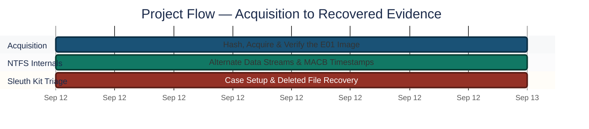
<p align="center"><em>Colors distinguish each project stage — all stages complete.</em></p>

---

<a id="module-1"></a>
## 🔵 Module 1 — Acquisition & Hash Verification

**Objective:** Create a forensically sound, bit-for-bit image of a source device in EnCase E01 format, verify it via hash comparison at every stage, and mount it read-only.

### Step 1 — Hash the source before acquisition ✅

```bash
sha256sum ~/test_drive.img
md5sum ~/test_drive.img
```

<p align="center">
  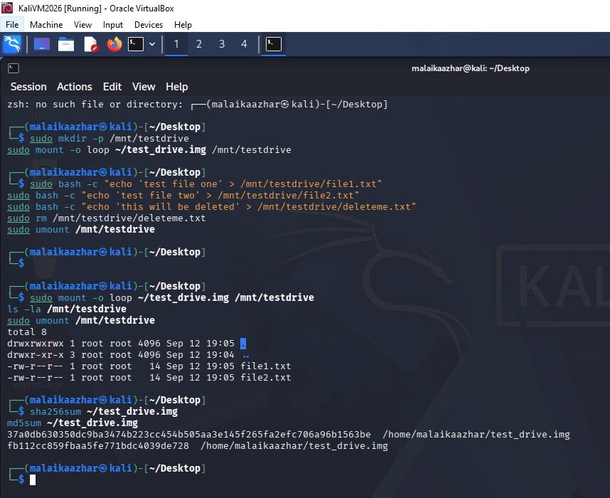<br>
  <em>Exhibit 1 — Source evidence file hashed before acquisition begins, establishing the baseline for every later comparison</em>
</p>

### Step 2 — Acquire the E01 image ✅

```bash
sudo ewfacquire test_drive.img
```

Full chain-of-custody metadata (case number, evidence number, examiner) is embedded at acquisition time.

<p align="center">
  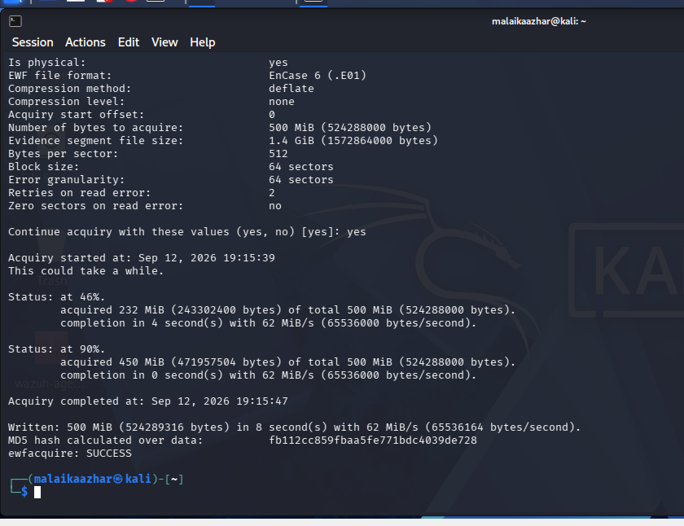<br>
  <em>Exhibit 2 — <code>ewfacquire</code> completing acquisition, with the MD5 hash calculated over the acquired data matching the source</em>
</p>

### Step 3 — Independently re-verify the hash ✅

```bash
sudo ewfverify test_drive.E01
```

<p align="center">
  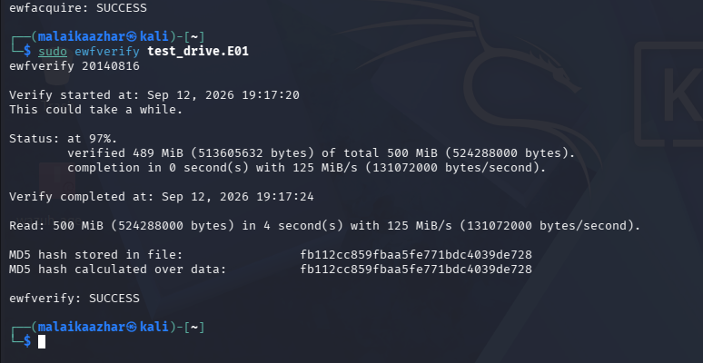<br>
  <em>Exhibit 3 — <code>ewfverify</code> re-reading the completed image and independently confirming the MD5 matches the value stored at acquisition time</em>
</p>

### Step 4 — Mount read-only and confirm integrity ✅

```bash
sudo mount -o loop,ro ~/test_drive.img /mnt/verified
```

<p align="center">
  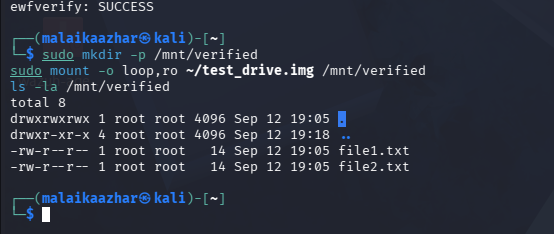<br>
  <em>Exhibit 4 — Evidence mounted read-only, confirming both original files are present and unmodified after the full acquisition cycle</em>
</p>

🎯 **Result:** Source, acquisition, and independent re-verification MD5 all matched exactly.

| Item | MD5 |
|---|---|
| Source (pre-image) | `fb112cc859fbaa5fe771bdc4039de728` |
| Acquired image | `fb112cc859fbaa5fe771bdc4039de728` |
| `ewfverify` recheck | `fb112cc859fbaa5fe771bdc4039de728` |

---

<a id="coverage-snapshot"></a>
## 🌟 Coverage Snapshot

| 🛡️ Layer | ✅ Status | 📌 Detail |
|---|---|---|
| Forensic Acquisition | Verified | Source/image/recheck MD5 identical across all three stages |
| Alternate Data Streams | Demonstrated | Hidden stream recoverable, default stream unchanged |
| MACB Timestamps | Extracted | Birth time confirmed as the most reliable timestomping indicator |
| Deleted File Recovery | Confirmed | Exact original content recovered from an orphaned MFT record |

---

<a id="forensic-pipeline"></a>
## 🧭 Forensic Integrity Pipeline

How a raw evidence source becomes a court-defensible, verified image

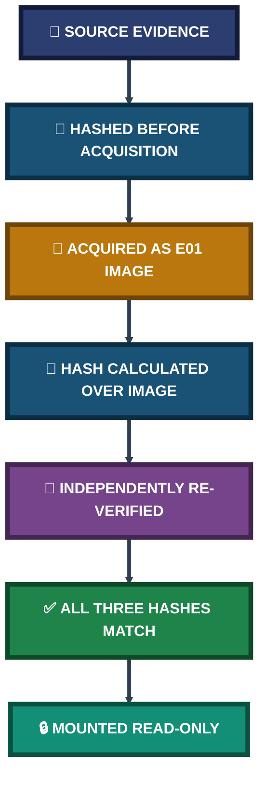

---

<a id="module-2"></a>
## 🟢 Module 2 — NTFS Internals & Sleuth Kit Triage

**Objective:** Demonstrate NTFS Alternate Data Streams end-to-end, extract MACB timestamps as an MFT Explorer substitute, and run a first-pass forensic triage using The Sleuth Kit CLI in place of the Autopsy GUI.

### Step 5 — Mount with stream support and create a hidden stream ✅

```bash
sudo mount -t ntfs-3g -o loop,streams_interface=windows ~/test_drive.img /mnt/testdrive
echo "This is hidden secret data" | sudo tee /mnt/testdrive/file1.txt:hidden.txt
```

The default kernel-native `ntfs3` driver doesn't support `streams_interface` — switched to FUSE-based `ntfs-3g`. `file1.txt` stayed at 14 bytes with unchanged default content — the stream is invisible to `ls` and `cat`.

<p align="center">
  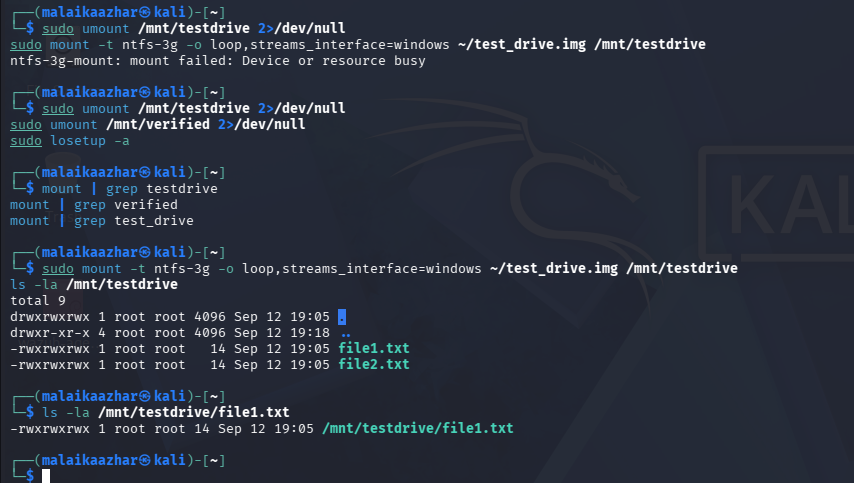<br>
  <em>Exhibit 5 — Stream-aware mount confirmed, hidden stream visible to <code>getfattr</code> while the default stream's listed size stays unchanged</em>
</p>

### Step 6 — Recover the hidden stream by name ✅

```bash
sudo cat /mnt/testdrive/file1.txt:hidden.txt
```

<p align="center">
  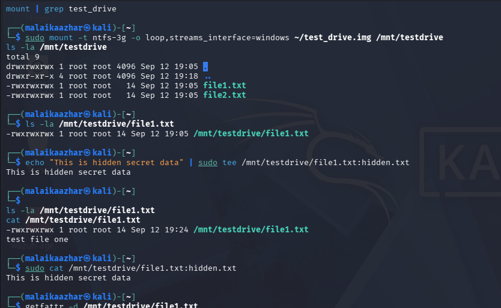<br>
  <em>Exhibit 6 — Hidden stream content fully recovered by name — a 27-byte payload completely invisible to a standard directory listing</em>
</p>

<p align="center">
  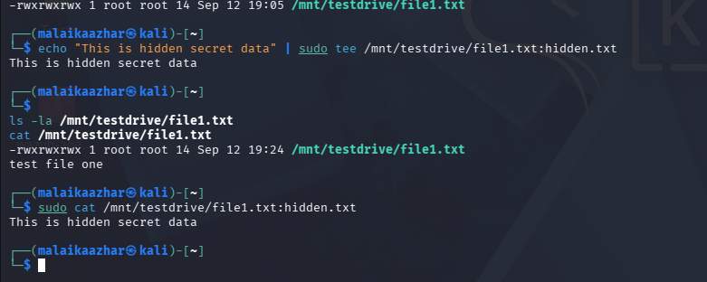<br>
  <em>Exhibit 7 — Full end-to-end sequence: default stream unchanged (14 bytes, "test file one"), hidden stream recovered separately ("This is hidden secret data")</em>
</p>

### 🔍 Analyst Note — Why This Matters Operationally

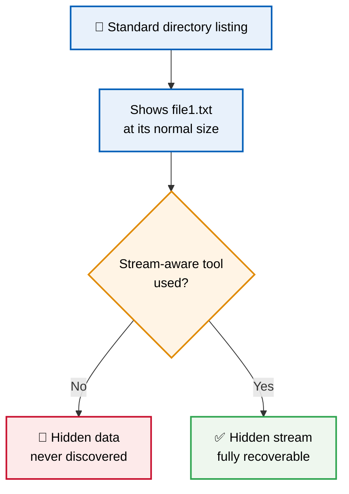

A 27-byte hidden stream held fully recoverable content while the default stream's size and content never changed — proving ADS as a real data-hiding mechanism, not a filing quirk. Standard tooling that isn't stream-aware would report this file as completely unremarkable.

### Step 7 — Extract MACB timestamps ✅

```bash
stat /mnt/testdrive/file1.txt
```

`analyzeMFT` only resolved NTFS system-file entries, not user files — `stat` was used as the working substitute.

<p align="center">
  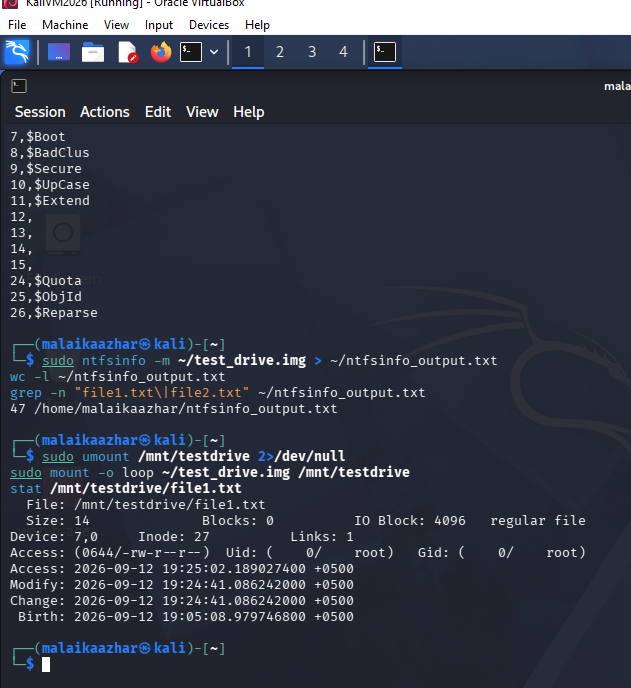<br>
  <em>Exhibit 8 — MACB timestamps extracted via <code>stat</code>: Modify, Access, Change, and Birth times all captured, with Birth fixed at creation as the most reliable timestomping indicator</em>
</p>

### Step 8 — Verify file system structure ✅

```bash
fsstat ~/test_drive.E01
```

<p align="center">
  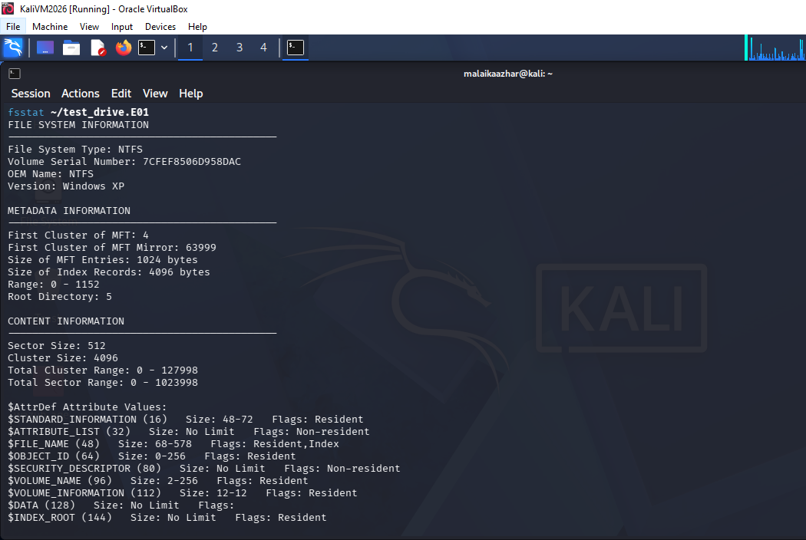<br>
  <em>Exhibit 9 — <code>fsstat</code> confirming NTFS file system structure, volume serial number, and MFT metadata — consistent with a clean, uncorrupted acquisition</em>
</p>

### Step 9 — Enumerate and recover deleted files ✅

```bash
fls -rd ~/test_drive.E01
icat ~/test_drive.E01 29
```

Recovered orphaned MFT records; original filenames unresolved because the parent directory link was removed before MFT reallocation — an expected NTFS artefact, not a tool failure.

<p align="center">
  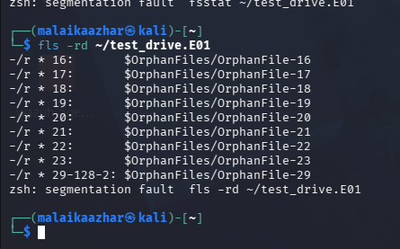<br>
  <em>Exhibit 10 — <code>fls -rd</code> enumerating orphaned MFT records (<code>OrphanFile-16</code> through <code>OrphanFile-29</code>) left behind after deletion</em>
</p>

<p align="center">
  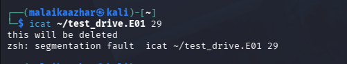<br>
  <em>Exhibit 11 — <code>icat</code> recovering the exact original content, "this will be deleted," from orphaned MFT record 29</em>
</p>

🎯 **Result:** `icat` recovered the exact original content from an orphaned MFT record, confirming NTFS deletion removes the directory entry, not the underlying data.

| Category | Finding |
|---|---|
| File System | NTFS — structure intact, consistent with acquisition |
| Active Files | `file1.txt`, `file2.txt` |
| Deleted Files Recovered | 1 (`deleteme.txt`) — full content match |
| Anomaly | Orphaned filename unresolved (expected NTFS behaviour) |

---

<a id="project-summary"></a>
## 📝 Project Summary

| Module | Tooling | Key Finding |
|---|---|---|
| Acquisition & Hash Verification | `ewfacquire`, `ewfverify` | Source/image/recheck MD5 identical — verified forensic copy |
| NTFS Internals & Sleuth Kit Triage | `ntfs-3g`, `stat`, `fsstat`, `fls`, `icat` | Hidden ADS content and deleted file both fully recovered |

---

<a id="challenges-fixes"></a>
## ⚠️ Challenges & Fixes

| ❌ Challenge | ✅ Fix |
|---|---|
| `mkfs.ntfs` refused to format a loopback file | Used the `-F` (force) flag |
| Kernel-native `ntfs3` driver doesn't support Alternate Data Streams | Switched to FUSE-based `ntfs-3g` with `streams_interface=windows` |
| `analyzeMFT` only resolved NTFS system-file entries, not user files | Used `stat` directly against the mounted file as a working substitute |
| `fsstat` and `fls` both crashed with a segmentation fault on exit | Verified the crash occurred only after complete, valid output was printed — data retained, not discarded |
| No Windows host available for FTK Imager, Arsenal Image Mounter, MFT Explorer, Autopsy GUI | Substituted `ewfacquire`/`ewfverify`, a read-only loop mount, `stat`, and the Sleuth Kit CLI — each documented at first use |

---

<a id="scope-limitations"></a>
## 🚧 Scope & Limitations

- **Controlled evidence source:** The 500 MB image was purpose-built for this exercise, not a real seized device — the acquisition and analysis workflow is representative, not a live case.
- **Tool crashes on exit:** Both `fsstat` and `fls` segfaulted after completing output — treated as a known quirk of this build, not investigated further as its own root cause.
- **Single deleted file recovered:** Only one deleted file (`deleteme.txt`) was targeted for recovery in this exercise; broader file carving across the full unallocated space was out of scope.

---

<a id="what-i-learned"></a>
## 🧠 What I Learned

- **A hash match proves integrity, not process.** Write-blocking and chain-of-custody documentation still have to stand on their own — a matching hash alone doesn't establish how the evidence was handled.
- **Tool substitution only holds up when stated plainly at the point of substitution**, not silently presented as the real thing — every Windows-only tool in this project has a documented Linux equivalent.
- **A tool crashing on exit doesn't automatically invalidate the data it already produced.** Both `fsstat` and `fls` segfaulted, but only after printing complete, valid output.
- **NTFS deletion removes the map, not the territory.** This is the core fact that later timeline reconstruction and MFT residue analysis build on.

---

<a id="skills-demonstrated"></a>
## 🛠️ Skills Demonstrated

- Forensic disk imaging in EnCase E01 format with `ewfacquire`/`ewfverify`
- Multi-stage hash verification (source, image, independent recheck)
- Demonstrating and recovering NTFS Alternate Data Streams
- Extracting MACB timestamps as a forensic timeline substitute
- Using The Sleuth Kit CLI (`fsstat`, `fls`, `icat`) for filesystem triage and deleted-file recovery
- Documenting tool substitutions transparently in a resource-constrained environment

---

<a id="screenshot-index"></a>
## 🖼️ Screenshot Index

| # | File | Shows |
|:---:|---|---|
| 1 | `Exhibit01_source_hash.png` | Source file hashed before acquisition |
| 2 | `Exhibit02_e01_acquisition.png` | `ewfacquire` completing, hash calculated |
| 3 | `Exhibit03_ewfverify.png` | Independent hash re-verification, SUCCESS |
| 4 | `Exhibit04_readonly_mount.png` | Evidence mounted read-only, files confirmed |
| 5 | `Exhibit05_ads_mount_streams.png` | Stream-aware mount, hidden stream visible to `getfattr` |
| 6 | `Exhibit06_ads_hidden_content.png` | Hidden stream content recovered by name |
| 7 | `Exhibit07_ads_verification.png` | Full ADS sequence — default vs. hidden stream |
| 8 | `Exhibit08_macb_timestamps.png` | MACB timestamps via `stat` |
| 9 | `Exhibit09_fsstat_filesystem_info.png` | NTFS file system structure via `fsstat` |
| 10 | `Exhibit10_fls_deleted_files.png` | Orphaned MFT records enumerated via `fls -rd` |
| 11 | `Exhibit11_icat_recovered_content.png` | Deleted file content recovered via `icat` |

---

<a id="repo-structure"></a>
## 📁 Repo Structure

```text
project-24-dfir-disk-imaging/
|-- README.md
|-- INDEX.md
`-- screenshots/
    |-- Exhibit01_source_hash.png
    |-- Exhibit02_e01_acquisition.png
    |-- Exhibit03_ewfverify.png
    |-- Exhibit04_readonly_mount.png
    |-- Exhibit05_ads_mount_streams.png
    |-- Exhibit06_ads_hidden_content.png
    |-- Exhibit07_ads_verification.png
    |-- Exhibit08_macb_timestamps.png
    |-- Exhibit09_fsstat_filesystem_info.png
    |-- Exhibit10_fls_deleted_files.png
    `-- Exhibit11_icat_recovered_content.png
```

<div align="center">

🕵️ **[The Sleuth Kit](https://www.sleuthkit.org)** · 💾 **[libewf](https://github.com/libyal/libewf)** · 🐧 **[ntfs-3g](https://github.com/tuxera/ntfs-3g)** · 🔍 **[Forensic Pipeline](#forensic-pipeline)**

</div>
