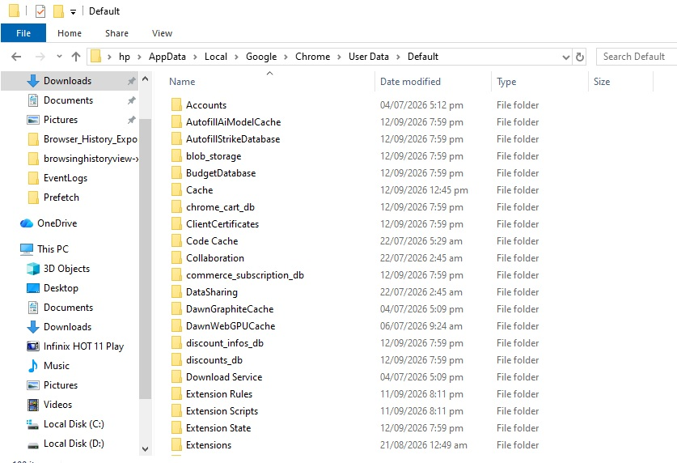
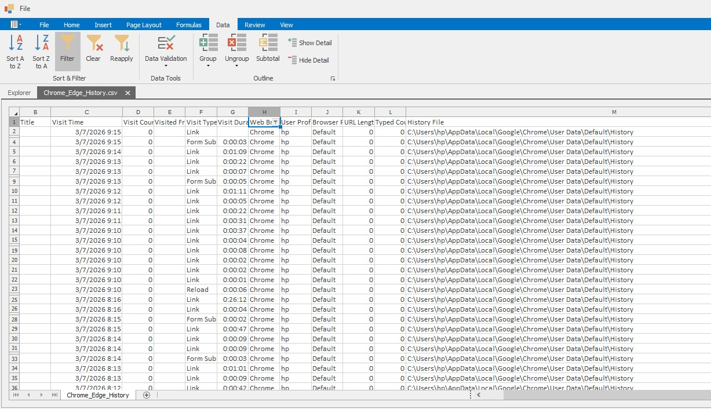
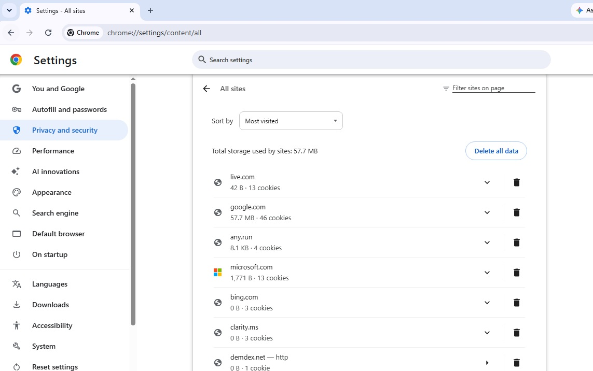
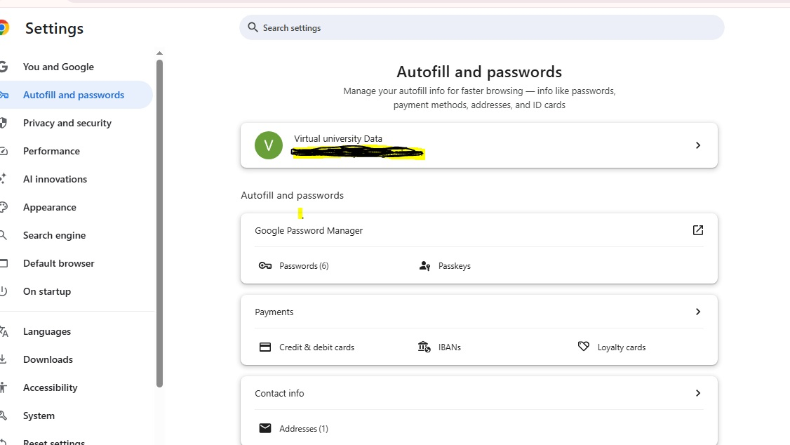
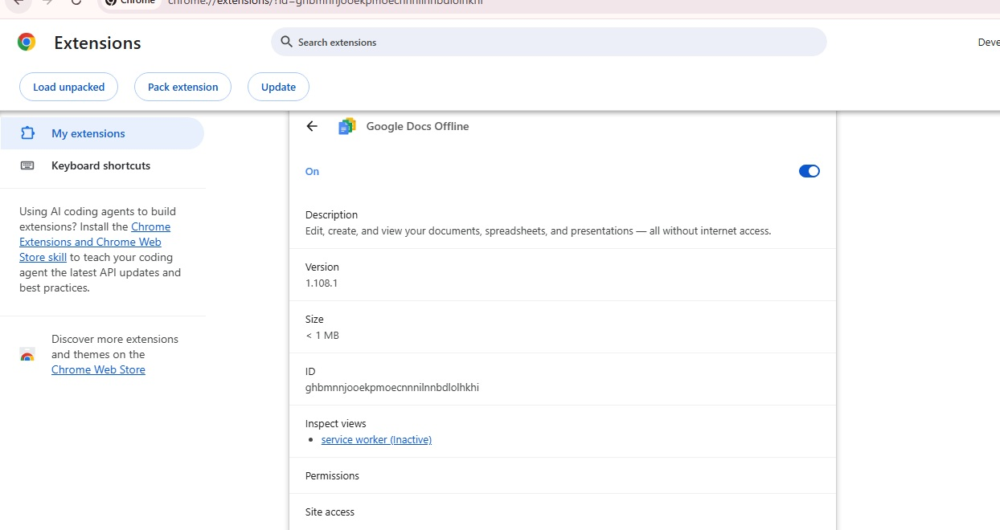
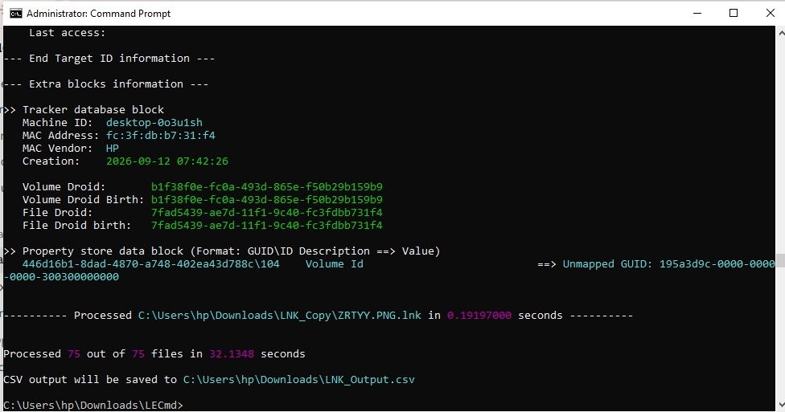
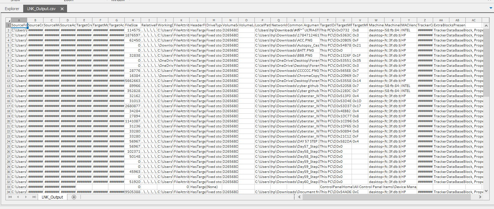
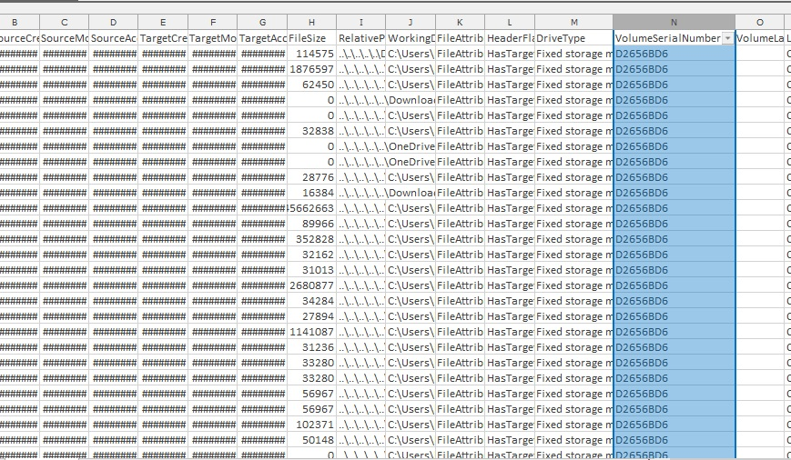
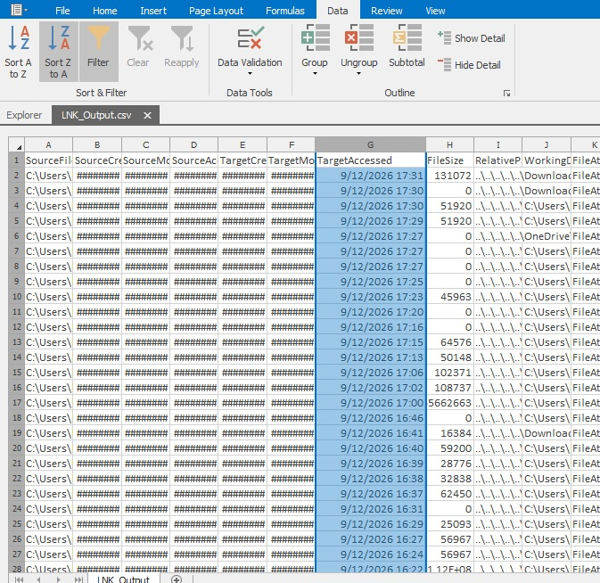

# 🌐 Project 26 — Index
### Browser Forensics & LNK Analysis
**Project 26 of 29 — Advanced Cyber Projects**

**Quick guide to every step and screenshot in this project.**

### [📖 Open the full README](README.md)

---

| 🧩 Modules | 🖼️ Screenshots | 🔗 LNK Files Parsed | ❌ Parse Errors |
|:---:|:---:|:---:|:---:|
| **2** | **10** | **75 / 75** | **0** |

🧩 <b>Lab:</b> Chrome full artifact set ➜ BrowsingHistoryView export ➜ 75 LNK files ➜ LECmd ➜ Chronological Timeline

---

## 📑 Step Index

All 10 steps of the project, with the screenshot that proves each one.

| # | Step | Module | Result | Evidence |
|:---:|---|:---:|---|:---:|
| 1 | Locate and copy the Chrome profile | 🔵 Module 1 | Full artifact set identified before analysis | [Exhibit 1](#ex1) |
| 2 | Export and review browsing history | 🔵 Module 1 | Multi-profile history captured | [Exhibit 2](#ex2) |
| 3 | Review download history | 🔵 Module 1 | Task briefs, reports, archive tool identified | [Exhibit 3](#ex3) |
| 4 | Review cookies and site data | 🔵 Module 1 | Storage concentrated on a few frequent domains | [Exhibit 4](#ex4) |
| 5 | Review autofill and stored credentials | 🔵 Module 1 | 6 passwords, 1 address stored | [Exhibit 5](#ex5) |
| 6 | Review installed extensions | 🔵 Module 1 | Google Docs Offline installed and active | [Exhibit 6](#ex6) |
| 7 | Parse all LNK files with LECmd | 🟢 Module 2 | 75/75 processed, zero errors | [Exhibit 7](#ex7) |
| 8 | Review the full parsed output | 🟢 Module 2 | Complete metadata for every shortcut | [Exhibit 8](#ex8) |
| 9 | Confirm no external device via volume serial | 🟢 Module 2 | Single serial across all 75 entries | [Exhibit 9](#ex9) |
| 10 | Build the chronological access timeline | 🟢 Module 2 | Minute-by-minute sorted sequence | [Exhibit 10](#ex10) |

---

## 🔵 Module 1 — Chrome Artifact Review

Exhibits 1 to 6. Click a screenshot to open it full size.

<table>
<tr>
<td align="center" valign="top" width="33%">

 <b>Exhibit 1 — User Data folder</b>
 Full artifact set before any file is queried
</td>
<td align="center" valign="top" width="33%">

 <b>Exhibit 2 — History export</b>
 Visit time, count, type, and source file
</td>
<td align="center" valign="top" width="33%">

 <b>Exhibit 3 — Download history</b>
 Documents, archives, and PDFs
</td>
</tr>
<tr>
<td align="center" valign="top" width="33%">

 <b>Exhibit 4 — Cookies & site data</b>
 Storage and cookie count per domain
</td>
<td align="center" valign="top" width="33%">

 <b>Exhibit 5 — Autofill & passwords</b>
 Stored credentials and payment data
</td>
<td align="center" valign="top" width="33%">

 <b>Exhibit 6 — Extensions</b>
 Version, size, ID, and permissions
</td>
</tr>
</table>

---

## 🟢 Module 2 — LNK Parsing & Timeline Correlation

Exhibits 7 to 10.

<table>
<tr>
<td align="center" valign="top" width="50%">

 <b>Exhibit 7 — LECmd processing</b>
 75/75 files in 32.13 seconds, zero errors
</td>
<td align="center" valign="top" width="50%">

 <b>Exhibit 8 — Full CSV output</b>
 Timestamps, target paths, machine/MAC IDs
</td>
</tr>
<tr>
<td align="center" valign="top" width="50%">

 <b>Exhibit 9 — Volume serial check</b>
 Single serial across all entries — no USB
</td>
<td align="center" valign="top" width="50%">

 <b>Exhibit 10 — Chronological timeline</b>
 Sorted by TargetAccessed, minute by minute
</td>
</tr>
</table>

---

## 🎯 Key Findings Summary

| Finding | Evidence | Status |
|---|---|:---:|
| Edge / Firefox presence | Host check prior to analysis | ❌ Confirmed absent |
| LNK parse success rate | LECmd batch run | ✅ 75 / 75, 0 errors |
| External storage device used | Volume Serial Number comparison | ❌ None found |
| Chronological timeline | `TargetAccessed` sort | ✅ Built, complete |

> [!NOTE]
> A negative finding — no external device ever referenced — is exactly as reportable as a positive one. It directly answers a real investigative question rather than leaving it open.

---

[⬆️ Back to top](#top) &nbsp;·&nbsp; [📖 Full README](README.md)

🌐 **[Chrome](https://www.google.com/chrome/)** · 🔗 **[LECmd](https://ericzimmerman.github.io/#!index.md)** · 🕘 **[BrowsingHistoryView](https://www.nirsoft.net/utils/browsing_history_view.html)** · 🧭 **[Correlation Pipeline](README.md#correlation-pipeline)**

