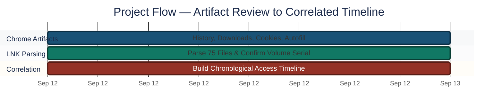
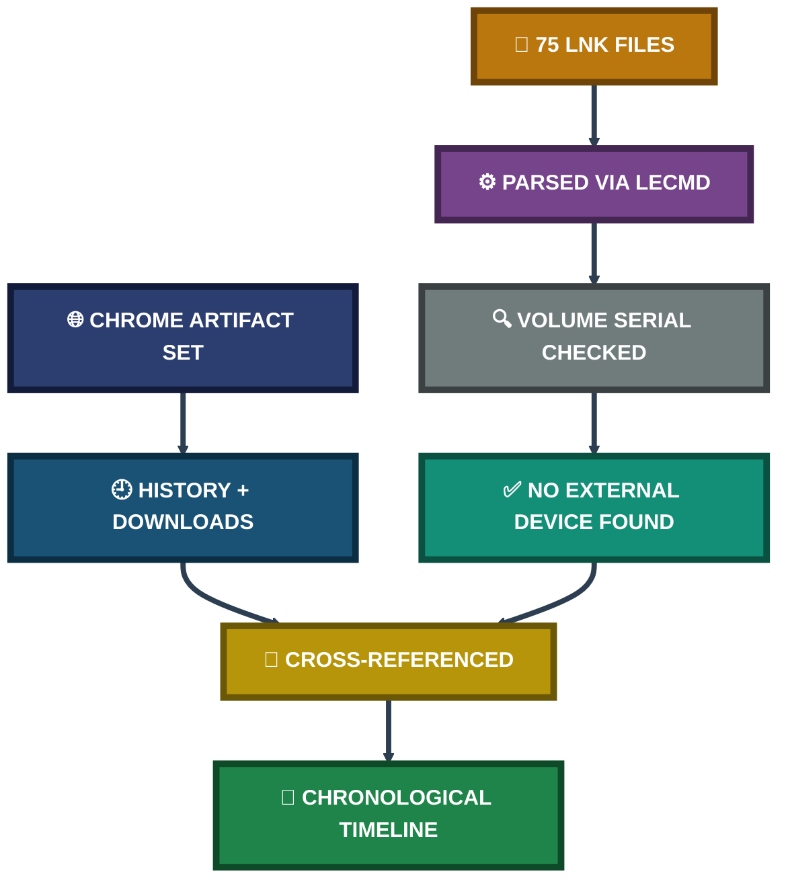

<div align="center">

# 🌐 Browser Forensics & LNK Analysis

**Project 26 of 29 — Advanced Cyber Projects**

Chrome Artifact Review & Windows Shortcut Forensics (LECmd)


Chrome's full artifact set reviewed end-to-end — history, downloads, cookies, autofill, and extensions — cross-referenced against a complete Windows Shortcut (LNK) parse of 75 files with zero errors, resolving into a single chronological file-access timeline.

### [📑 Open the visual index](INDEX.md)

</div>

---

## 📑 Table of Contents

1. [At a Glance](#at-a-glance)
2. [Project Background](#project-background)
3. [Environment](#environment)
4. [Project Flow](#project-flow)
5. [Module 1 — Chrome Artifact Review](#module-1)
6. [Coverage Snapshot](#coverage-snapshot)
7. [Cross-Artifact Correlation Pipeline](#correlation-pipeline)
8. [Module 2 — LNK Parsing & Timeline Correlation](#module-2)
9. [Project Summary](#project-summary)
10. [Challenges & Fixes](#challenges-fixes)
11. [Scope & Limitations](#scope-limitations)
12. [What I Learned](#what-i-learned)
13. [Skills Demonstrated](#skills-demonstrated)
14. [Screenshot Index](#screenshot-index)
15. [Repo Structure](#repo-structure)

---

<a id="at-a-glance"></a>
## 📊 At a Glance

| 🧩 Modules | 🖼️ Screenshots | 🔗 LNK Files Parsed | ❌ Parse Errors |
|:---:|:---:|:---:|:---:|
| **2** | **10** | **75 / 75** | **0** |

---

<a id="project-background"></a>
## 📖 Project Background

A browser's on-disk artifacts and a system's Windows Shortcut (LNK) files tell overlapping but different stories — one shows what a user looked at, the other shows what they actually opened. This project reviews both independently, then cross-references them into a single timeline.

- **Module 1 — Chrome Artifact Review:** Confirm Edge and Firefox are genuinely absent (not skipped), then extract and review Chrome's full artifact set — history, downloads, cache, cookies, autofill, and extensions.
- **Module 2 — LNK Parsing & Timeline Correlation:** Parse every LNK file with LECmd, confirm no external storage device is present via volume serial number, and build a chronological file-access timeline.

> [!NOTE]
> Every browsing artifact was copied to a working folder before analysis, rather than queried against the live profile — avoiding file locks and keeping the original data untouched throughout review.

<div align="center">

### 🧩 Artifact Coverage at a Glance

<table>
<tr>
<td align="center" valign="top" width="20%">

**🕘 History**<br>
<sub>BrowsingHistoryView<br>export</sub>

</td>
<td align="center" valign="top" width="20%">

**⬇️ Downloads**<br>
<sub>Chrome download<br>history</sub>

</td>
<td align="center" valign="top" width="20%">

**🍪 Cookies**<br>
<sub>Per-site storage<br>and cookie counts</sub>

</td>
<td align="center" valign="top" width="20%">

**🔑 Autofill**<br>
<sub>Passwords, payment<br>and address data</sub>

</td>
<td align="center" valign="top" width="20%">

**🧩 Extensions**<br>
<sub>Installed extension<br>inventory</sub>

</td>
</tr>
</table>

</div>

---

<a id="environment"></a>
## 🖧 Environment

| Item | Value |
|---|---|
| **Target Browser** | Google Chrome (Edge and Firefox confirmed absent) |
| **History Tool** | BrowsingHistoryView |
| **LNK Parsing Tool** | LECmd |
| **LNK Files Analyzed** | 75 (from Recent Items and Downloads) |
| **Working Method** | Artifacts copied to a working folder before analysis |

---

<a id="project-flow"></a>
## ⏱️ Project Flow


<p align="center"><em>Colors distinguish each project stage — all stages complete.</em></p>

---

<a id="module-1"></a>
## 🔵 Module 1 — Chrome Artifact Review

**Objective:** Confirm which browsers are genuinely present on the host, then extract and review Chrome's full artifact set without touching the live profile.

### Step 1 — Locate the Chrome profile and copy it for analysis ✅

<p align="center">
  <br>
  <em>Exhibit 1 — Chrome's <code>User Data\Default</code> folder, showing the full artifact set (Cache, Extensions, autofill databases) before any file was queried directly</em>
</p>

### Step 2 — Export and review browsing history ✅

<p align="center">
  <br>
  <em>Exhibit 2 — BrowsingHistoryView export showing visit time, visit count, visit type, and the exact source History file for each entry</em>
</p>

### Step 3 — Review download history ✅

<p align="center">
  <br>
  <em>Exhibit 3 — Chrome's Download history showing document, archive, and PDF downloads with direct links back to their source</em>
</p>

### Step 4 — Review cookies and per-site storage ✅

<p align="center">
  <br>
  <em>Exhibit 4 — Privacy and Security → All Sites, showing storage usage and cookie counts per domain, sorted by most visited</em>
</p>

### Step 5 — Review autofill and stored credentials ✅

<p align="center">
  <br>
  <em>Exhibit 5 — Autofill and passwords panel, confirming stored passwords, payment methods, and address data present in the profile</em>
</p>

### Step 6 — Review installed extensions ✅

<p align="center">
  <br>
  <em>Exhibit 6 — Installed extension detail view, showing version, size, extension ID, and granted permissions</em>
</p>

🎯 **Result:** Chrome's full artifact set was reviewed — history, downloads, cache, cookies, autofill, and extensions — with Edge and Firefox confirmed genuinely absent rather than silently skipped.

| Artifact | Reviewed | Key Finding |
|---|:---:|---|
| Browsing History | ✅ | Multi-profile history captured across sessions |
| Downloads | ✅ | Task briefs, reports, and one archive tool download |
| Cookies / Site Data | ✅ | Storage concentrated on a small set of frequently visited domains |
| Autofill / Passwords | ✅ | 6 stored passwords, 1 stored address |
| Extensions | ✅ | Google Docs Offline installed and active |

---

<a id="coverage-snapshot"></a>
## 🌟 Coverage Snapshot

| 🛡️ Layer | ✅ Status | 📌 Detail |
|---|---|---|
| Browser Presence | Confirmed | Edge/Firefox genuinely absent; Chrome-only analysis |
| Chrome Artifacts | Complete | History, downloads, cache, cookies, autofill, extensions |
| LNK Parsing | Complete | 75 / 75 files, zero parse errors |
| External Storage Check | Confirmed | Single volume serial number across all LNK targets — no USB |
| Timeline Correlation | Built | Chronological `TargetAccessed` sequence across all files |

---

<a id="correlation-pipeline"></a>
## 🧭 Cross-Artifact Correlation Pipeline

From two independent artifact sets to one timeline



---

<a id="module-2"></a>
## 🟢 Module 2 — LNK Parsing & Timeline Correlation

**Objective:** Parse every Windows Shortcut file with LECmd, confirm whether an external storage device was ever involved via volume serial number, and build a single chronological timeline of file access.

### Step 7 — Parse all LNK files with LECmd ✅

```powershell
LECmd.exe -d "C:\Users\hp\Downloads\LNK_Copy" --csv "C:\Users\hp\Downloads"
```

<p align="center">
  <br>
  <em>Exhibit 7 — LECmd confirming all 75 files processed in 32.13 seconds with zero errors, including Tracker Database block metadata (Machine ID, MAC address) from the final file</em>
</p>

### Step 8 — Review the full parsed output ✅

<p align="center">
  <br>
  <em>Exhibit 8 — Full LECmd CSV output: source/target timestamps, file size, target path, volume information, and machine/MAC identifiers for every parsed shortcut</em>
</p>

### Step 9 — Confirm no external storage device via volume serial ✅

<p align="center">
  <br>
  <em>Exhibit 9 — Volume Serial Number column isolated across all 75 entries — every single shortcut resolves to the same fixed-drive serial, confirming no external device is referenced</em>
</p>

### Step 10 — Build the chronological access timeline ✅

<p align="center">
  <br>
  <em>Exhibit 10 — LNK output sorted by <code>TargetAccessed</code>, producing a minute-by-minute chronological sequence of file access across the session</em>
</p>

🎯 **Result:** A complete, zero-error LNK dataset was reduced to two forensically meaningful findings: no external storage device was ever accessed, and every file-access event now sits on a single, sortable timeline.

| Check | Method | Outcome |
|---|---|---|
| All LNK files parsed | LECmd batch run | ✅ 75 / 75, 0 errors |
| External device present? | Volume Serial Number comparison | ❌ None — single fixed-drive serial throughout |
| Timeline built | Sort by `TargetAccessed` | ✅ Complete, chronological |

---

<a id="project-summary"></a>
## 📝 Project Summary

| Module | Tooling | Key Finding |
|---|---|---|
| Chrome Artifact Review | BrowsingHistoryView, Chrome settings pages | Full artifact set reviewed; Edge/Firefox confirmed genuinely absent |
| LNK Parsing & Timeline Correlation | LECmd | 75/75 files parsed with zero errors; no external device found; timeline built |

---

<a id="challenges-fixes"></a>
## ⚠️ Challenges & Fixes

| ❌ Challenge | ✅ Fix |
|---|---|
| Querying the live Chrome profile directly risks file locks and altering access timestamps | Copied the full profile (`ChromeCopy`) and all target LNK files to a working folder before any analysis began |
| 75 individual LNK files would be impractical to review by hand | Batch-processed with LECmd into a single CSV, then sorted/filtered in a spreadsheet |

---

<a id="scope-limitations"></a>
## 🚧 Scope & Limitations

- **Chrome only:** Edge and Firefox were confirmed absent on this host — this analysis does not generalize to a multi-browser environment.
- **LNK targets only, not full filesystem:** Timeline correlation is built from LNK access metadata, not a full filesystem timeline (MFT, event logs, etc.).
- **Volume serial confirms absence, not history:** A single serial across all entries confirms no device is *currently* referenced — it does not rule out a device that was used and later had all its shortcuts cleared.

---

<a id="what-i-learned"></a>
## 🧠 What I Learned

- **A browser artifact review is only as trustworthy as its handling.** Copying the profile before analysis, rather than querying it live, is what keeps the evidence itself unaltered.
- **LNK files carry more than a path.** Machine ID, MAC address, and volume serial number turn a simple shortcut into a forensic artifact that can place a file access to a specific machine and drive.
- **A negative finding is still a finding.** Confirming no external device was ever referenced is exactly as reportable as finding one would have been — it directly answers a real investigative question.
- **Cross-referencing two independent artifact sets is more convincing than either alone.** Browser history shows intent; LNK data shows actual file interaction — together they corroborate each other.

---

<a id="skills-demonstrated"></a>
## 🛠️ Skills Demonstrated

- Reviewing a browser's complete on-disk artifact set (history, downloads, cache, cookies, autofill, extensions)
- Confirming browser presence/absence as a documented finding rather than an assumption
- Batch-parsing Windows Shortcut (LNK) files with LECmd
- Using volume serial number as evidence of external device presence or absence
- Building a cross-artifact chronological timeline from parsed forensic data
- Working from copied artifacts to preserve original evidence integrity

---

<a id="screenshot-index"></a>
## 🖼️ Screenshot Index

| # | File | Shows |
|:---:|---|---|
| 1 | `Exhibit01_chrome_userdata_folder.png` | Chrome's User Data folder structure |
| 2 | `Exhibit02_browsing_history_export.png` | BrowsingHistoryView export of Chrome history |
| 3 | `Exhibit03_download_history.png` | Chrome download history |
| 4 | `Exhibit04_cookies_site_data.png` | Cookies and per-site storage usage |
| 5 | `Exhibit05_autofill_passwords.png` | Autofill, passwords, and payment data |
| 6 | `Exhibit06_extensions_listing.png` | Installed extension detail view |
| 7 | `Exhibit07_lecmd_processing_confirmation.png` | LECmd — 75/75 files, zero errors |
| 8 | `Exhibit08_lecmd_csv_output.png` | Full LECmd CSV output |
| 9 | `Exhibit09_volume_serial_number.png` | Volume Serial Number confirming no external device |
| 10 | `Exhibit10_chronological_timeline.png` | Chronological `TargetAccessed` timeline |

---

<a id="repo-structure"></a>
## 📁 Repo Structure

```text
project-26-browser-forensics-lnk-analysis/
|-- README.md
|-- INDEX.md
`-- screenshots/
    |-- Exhibit01_chrome_userdata_folder.png
    |-- Exhibit02_browsing_history_export.png
    |-- Exhibit03_download_history.png
    |-- Exhibit04_cookies_site_data.png
    |-- Exhibit05_autofill_passwords.png
    |-- Exhibit06_extensions_listing.png
    |-- Exhibit07_lecmd_processing_confirmation.png
    |-- Exhibit08_lecmd_csv_output.png
    |-- Exhibit09_volume_serial_number.png
    `-- Exhibit10_chronological_timeline.png
```

<div align="center">

🌐 **[Chrome](https://www.google.com/chrome/)** · 🔗 **[LECmd](https://ericzimmerman.github.io/#!index.md)** · 🕘 **[BrowsingHistoryView](https://www.nirsoft.net/utils/browsing_history_view.html)** · 🧭 **[Correlation Pipeline](#correlation-pipeline)**

</div>
