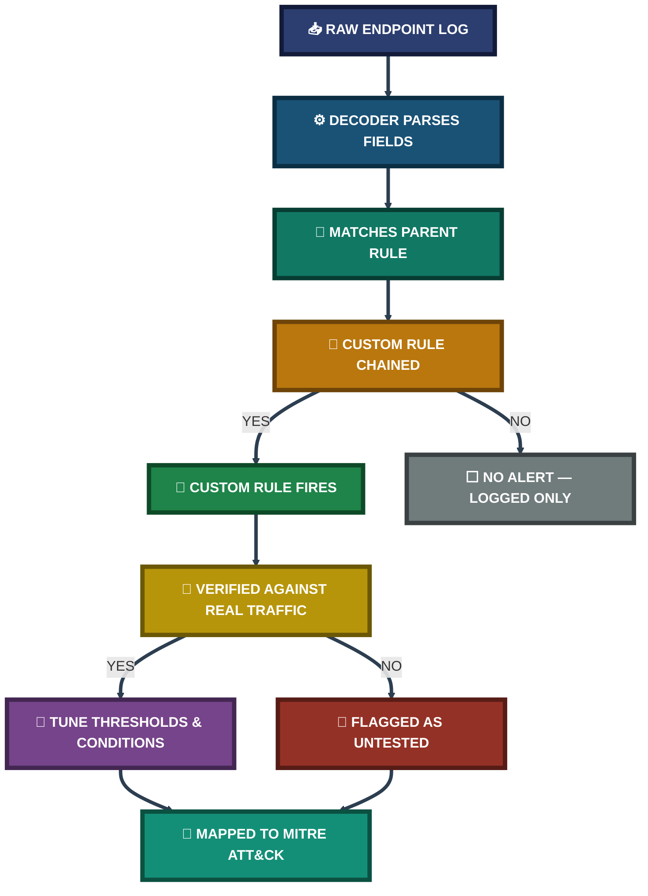
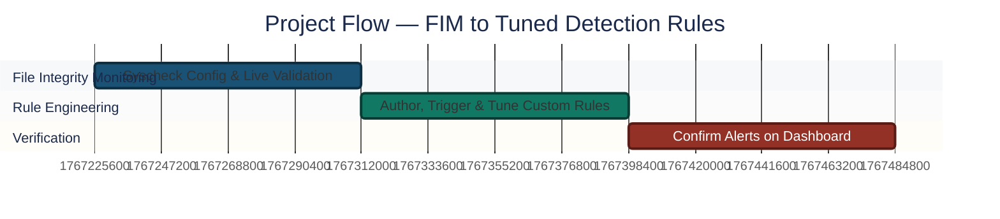

<div align="center">

# 🛡️ Project 4
### File Integrity Monitoring & Custom Detection Rule Engineering
**SIEM Detection Engineering (Wazuh)**


**Real-time File Integrity Monitoring configured on a live Linux endpoint, validated end-to-end against actual create/modify/delete events, and extended with two custom Wazuh detection rules — local account creation and SSH brute-force — each engineered, tuned against real triggered traffic, and mapped to MITRE ATT&CK.**

</div>

<br>

<div align="center">

## 📊 At a Glance

| 🧩 Modules | 🖼️ Screenshots | 📜 Custom Rules Written | 🎯 MITRE Techniques Mapped |
|:---:|:---:|:---:|:---:|
| **2** | **8** | **2 tested + 1 drafted** | **2** |

</div>

<br>

## 🖧 Environment

| Item | Value |
|---|---|
| SIEM Platform | Wazuh Manager / Indexer / Dashboard |
| Monitored Endpoint | Ubuntu Server (Wazuh Agent) |
| Config File | `/var/ossec/etc/ossec.conf` |
| Custom Rules File | `/var/ossec/etc/rules/local_rules.xml` |
| Tuning Tool | `wazuh-logtest` |

<br>

---

<div align="center">

## 🧭 Detection Engineering Pipeline

*How a raw endpoint event becomes a tuned, MITRE-tagged alert*

</div>



<br>

<div align="center">

## ⏱️ Project Flow

</div>


<p align="center"><em>Colors distinguish each project stage — all stages complete.</em></p>

<br>

<p align="center"></p>

<br>

---

## 🔵 Module 1 — File Integrity Monitoring (FIM)

**Objective:** Configure Wazuh's `syscheck` module for real-time monitoring on a core system directory, generate live file-system events on the monitored endpoint, and validate that added/modified/deleted events are correctly captured, decoded, and surfaced on the dashboard.

**Step 1 — Enable real-time syscheck on the target directory** ✅
```xml
<syscheck>
  <disabled>no</disabled>
  <frequency>300</frequency>
  <scan_on_start>yes</scan_on_start>
  <directories realtime="yes" report_changes="yes">/etc</directories>
  <directories realtime="yes" report_changes="no">/var/log</directories>
</syscheck>
```
`report_changes="yes"` was enabled on the high-value config directory so content-level diffs are captured, while the high-volume, low-signal log directory was left as notification-only to avoid excessive diff storage.

<p align="center"></p>

**Step 2 — Restart the agent and confirm it comes back Active** ✅
<p align="center"></p>

**Step 3 — Generate a full file lifecycle on the monitored path** ✅
```bash
touch /etc/test_file.txt      # create
echo "edit" >> /etc/test_file.txt   # modify
rm /etc/test_file.txt         # delete
```

**Step 4 — Confirm all three lifecycle events on the dashboard** ✅
<p align="center"></p>

🎯 **Result:** All three lifecycle events landed in the File Integrity Monitoring view with correct rule IDs and matching timestamps.

| Change | Rule ID | Rule Description |
|---|:---:|---|
| Added | `554` | File added to the system |
| Modified | `550` | Integrity checksum changed |
| Deleted | `553` | File deleted |

<br>

<div align="center">

### 🌟 Coverage Snapshot

| 🛡️ Layer | ✅ Status | 📌 Detail |
|:---:|:---:|:---|
| File Integrity Monitoring | Live | Real-time on `/etc`, notification-only on `/var/log` |
| Detection Rules | 2 Firing | New-user creation + SSH brute-force |
| MITRE Coverage | 2 Techniques | T1136.001 · T1110.001 |
| Untested Rule | 1 Drafted | External storage insertion — ready, no matching endpoint yet |

</div>

<br>

---


## 🟢 Module 2 — Custom Detection Rule Engineering

**Objective:** Move beyond default, generic SIEM rules and author detection logic tailored to specific threat scenarios, chaining onto parent rules rather than parsing raw logs from scratch, and validate each rule against real triggered traffic before trusting it.

```
[Raw Endpoint Log] → [Decoder Parses Fields] → [Parent Rule Matches] → [Custom Rule Chains & Fires]
```

**Step 5 — Author the custom rule set** ✅
```xml
<group name="syslog,sshd,windows,">

  <!-- Rule 1: Local user account creation -->
  <rule id="100001" level="10">
    <if_sid>5501</if_sid>
    <match>new user</match>
    <description>New local user account has been created on Linux system.</description>
    <mitre><id>T1136.001</id></mitre>
  </rule>

  <!-- Rule 2: SSH brute-force detection -->
  <rule id="100002" level="12" frequency="5" timeframe="120">
    <if_matched_sid>5710</if_matched_sid>
    <same_source_ip />
    <description>SSH Brute Force attack detected from source IP.</description>
    <mitre><id>T1110.001</id></mitre>
  </rule>

  <!-- Rule 3: External storage device insertion (drafted, pending a matching endpoint) -->
  <rule id="100003" level="7">
    <if_sid>60001</if_sid>
    <field name="win.system.eventID">^2003$|^1006$</field>
    <description>External storage device insertion detected on host.</description>
    <mitre><id>T1200</id></mitre>
  </rule>

</group>
```
<p align="center"></p>

**Step 6 — Trigger Rule 100001 with a real account-creation event** ✅
```bash
sudo adduser test_user
```
<p align="center"></p>

**Step 7 — Confirm Rule 100001 fires on the dashboard** ✅
<p align="center"></p>

**Step 8 — Trigger Rule 100002 with a real SSH brute-force burst** ✅
```bash
for i in {1..10}; do ssh -o ConnectTimeout=2 -o PubkeyAuthentication=no wronguser@localhost; done
```
<p align="center"></p>

**Step 9 — Confirm Rule 100002 fires on the dashboard** ✅
<p align="center"></p>

🎯 **Result:** Both rules fired correctly against real triggered traffic, each mapped to a MITRE ATT&CK technique.

| Rule ID | Description | MITRE Technique | Status |
|:---:|---|---|:---:|
| `100001` | Local user account creation | T1136.001 — Create Account: Local Account | ✅ Tested & Firing |
| `100002` | SSH brute-force detection | T1110.001 — Brute Force: Password Guessing | ✅ Tested & Firing |
| `100003` | External storage insertion | T1200 — Hardware Additions | ⏳ Drafted, pending endpoint |

**Tuning note:** `wazuh-logtest` showed the SSH auth-failure baseline actually matched parent rule `5710` (invalid user), not `5716` as first assumed — Rule 100002 was corrected accordingly. `<same_source_ip />` combined with `frequency="5"` and `timeframe="120"` restricts the match to a genuine burst from one source within a 2-minute window, separating automated brute force from ordinary mistyped passwords.

<br>

---

## 📝 Project Summary

| Module | Tooling | Key Finding |
|---|---|---|
| File Integrity Monitoring | `syscheck`, Wazuh Dashboard | Full add/modify/delete lifecycle captured with correct rule IDs |
| Custom Rule Engineering | `local_rules.xml`, `wazuh-logtest` | Two rules authored, tuned against real traffic, and MITRE-mapped |

## ⚠️ Challenges & Fixes

| ❌ Challenge | ✅ Fix |
|---|---|
| SSH brute-force rule assumed parent `5716` but never fired | Used `wazuh-logtest` to trace the real parent rule (`5710`) and corrected the chain |
| Loose brute-force matching risked false positives from simultaneous unrelated logins | Added `<same_source_ip />` alongside `frequency`/`timeframe` to isolate genuine bursts |
| USB-insertion rule had no matching endpoint to validate against | Rule left syntactically integrated and clearly marked as untested rather than falsely presented as verified |

## 🧠 What I Learned
Raw logs can't be evaluated directly — the decoder has to parse them into structured fields before any rule logic can run, and parent-rule chaining (`if_sid` / `if_matched_sid`) means new detection logic inherits already-parsed fields instead of being built from scratch. `frequency` alone, without a bounded `timeframe`, can fire on events that are days apart — the two have to work together to encode a genuine rate-based condition. And a rule that *looks* syntactically correct is not the same as a rule that fires correctly: the only way to know is to generate the real traffic and check the log every time.

## 📁 Repo Structure
```
project-04-fim-custom-detection-rules/
├── README.md
└── screenshots/
    ├── 01_fim_syscheck_config.png
    ├── 02_agent_active_status.png
    ├── 03_fim_alerts_timeline.png
    ├── 04_custom_rules_xml.png
    ├── 05_adduser_trigger.png
    ├── 06_ssh_bruteforce_trigger.png
    ├── 07_rule100001_alert.png
    └── 08_rule100002_alert.png
```
