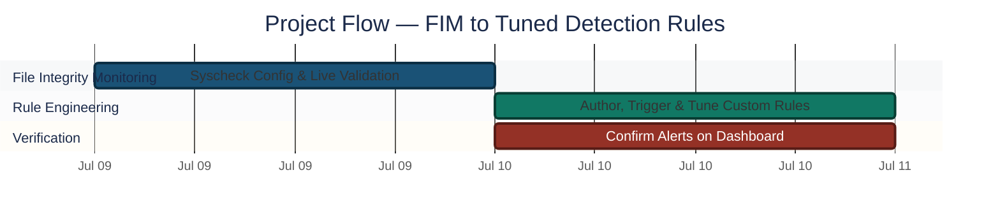
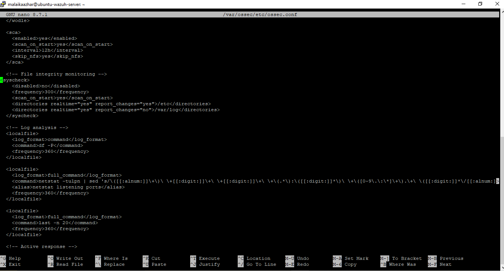
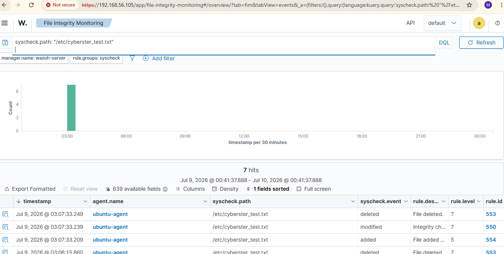
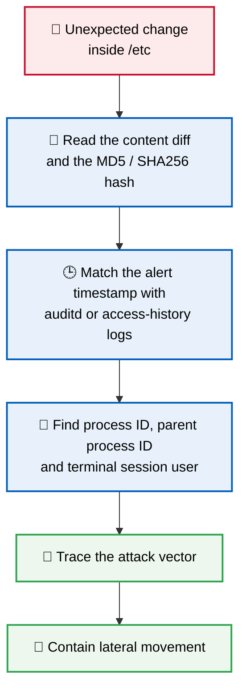
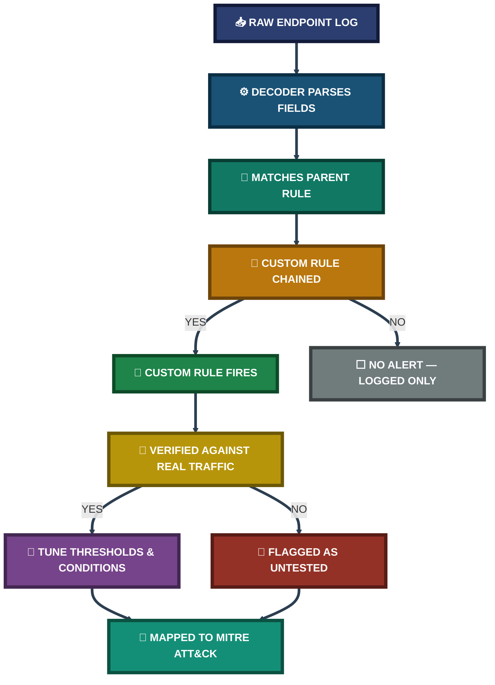
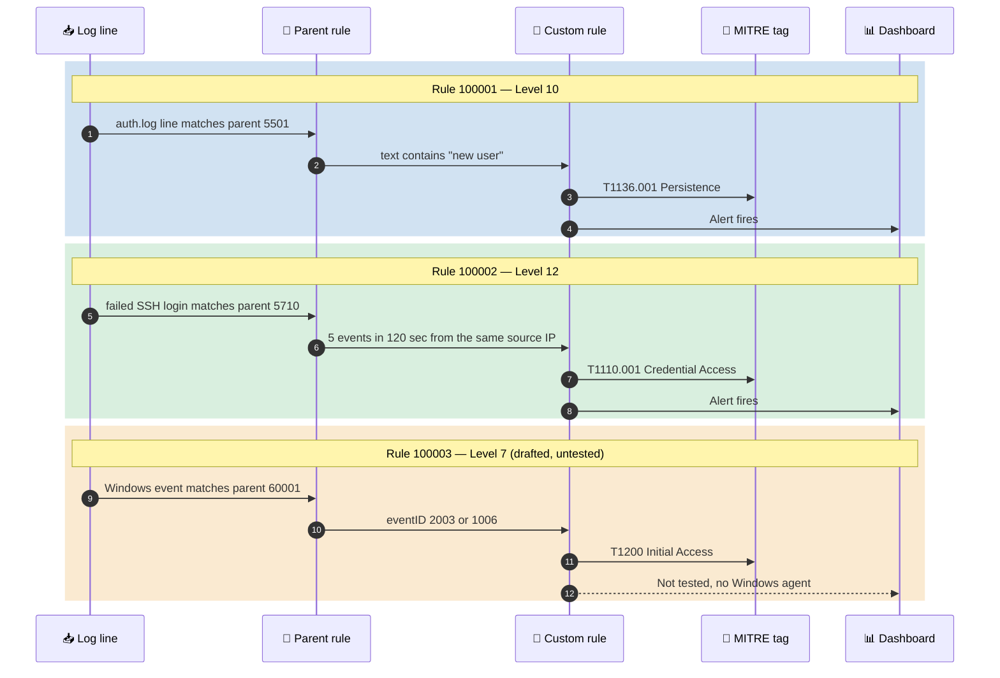
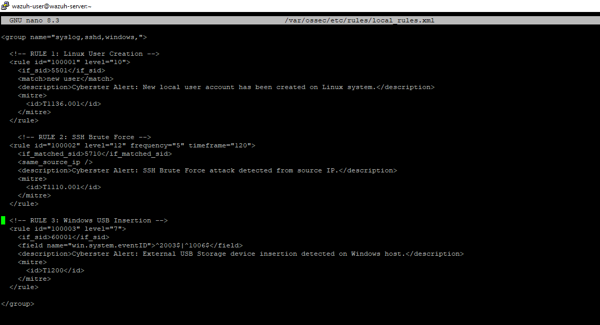
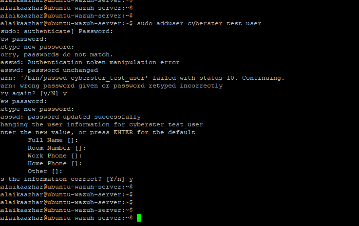
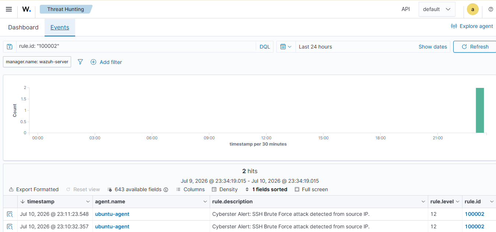
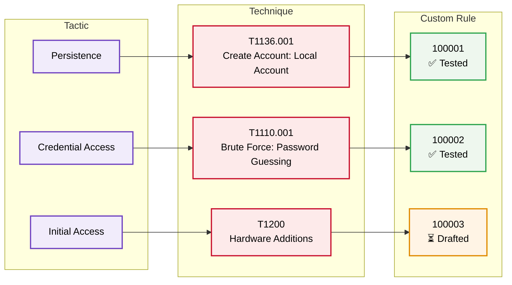

<div align="center">

# 🛡️ Wazuh File Integrity Monitoring & Custom Detection Rules

**Project 04 of 29 — Advanced Cyber Projects**

SIEM Detection Engineering (Wazuh)


Real-time File Integrity Monitoring configured on a live Linux endpoint, validated end-to-end against actual create/modify/delete events, and extended with two custom Wazuh detection rules — local account creation and SSH brute-force — each engineered, tuned against real triggered traffic, and mapped to MITRE ATT&CK.

### [📑 Open the visual index](INDEX.md)

</div>

---

## 📑 Table of Contents

1. [At a Glance](#at-a-glance)
2. [Project Background](#project-background)
3. [Environment](#environment)
4. [Project Flow](#project-flow)
5. [Module 1 — File Integrity Monitoring](#module-1)
6. [Coverage Snapshot](#coverage-snapshot)
7. [Detection Engineering Pipeline](#detection-pipeline)
8. [Module 2 — Custom Detection Rule Engineering](#module-2)
9. [MITRE ATT&CK Mapping](#mitre-mapping)
10. [Project Summary](#project-summary)
11. [Challenges & Fixes](#challenges-fixes)
12. [Scope & Limitations](#scope-limitations)
13. [What I Learned](#what-i-learned)
14. [Skills Demonstrated](#skills-demonstrated)
15. [Screenshot Index](#screenshot-index)
16. [Repo Structure](#repo-structure)

---

<a id="at-a-glance"></a>
## 📊 At a Glance

| 🧩 Modules | 🖼️ Screenshots | 📜 Custom Rules Written | 🎯 MITRE Techniques Mapped |
|:---:|:---:|:---:|:---:|
| **2** | **8** | **2 tested + 1 drafted** | **2** |

---

<a id="project-background"></a>
## 📖 Project Background

Default SIEM installations only watch generic activity, while a real SOC needs detections built for its own environment. This project builds a small but complete detection setup on **Wazuh**, an open-source SIEM, using a lab of one **Wazuh Manager** and one **Ubuntu Server** agent running in **VirtualBox**. It covers two jobs that a SOC analyst does every day.

The first is **File Integrity Monitoring**: watching `/etc` in real time, then creating, editing and deleting a test file to prove that every change shows up on the dashboard with the correct rule ID.

The second is **custom detection engineering**: writing new rules for **local account creation** and **SSH brute-force**, testing each one with **real traffic**, correcting the SSH rule after `wazuh-logtest` showed the wrong parent rule, and mapping every rule to a **MITRE ATT&CK** technique.

A third rule, for **USB storage insertion**, is written but clearly marked **untested**, because the lab had no Windows machine. Every test result shown here comes with a screenshot as evidence. The project has two goals:

- **Module 1 — File Integrity Monitoring:** Watch core system directories in real time and prove that every add, modify and delete event is captured and shown on the dashboard.
- **Module 2 — Custom Detection Rules:** Write new Wazuh rules for specific threats, test each one with real traffic, and tag each one with a MITRE ATT&CK technique.

<div align="center">

### 🧩 Lab Setup at a Glance

<table>
<tr>
<td align="center" valign="top" width="42%">


**Monitored Endpoint**<br>
<sub>Wazuh Agent v4.14.6<br>Watches <code>/etc</code> and <code>/var/log</code></sub>

</td>
<td align="center" valign="middle" width="16%">

**➜**<br>
<sub>events</sub>

</td>
<td align="center" valign="top" width="42%">


**Detection Engine**<br>
<sub>Manager · Indexer · Dashboard<br>Custom rules in <code>local_rules.xml</code></sub>

</td>
</tr>
<tr>
<td colspan="3" align="center">

<br>
<sub>Both machines run inside Oracle VirtualBox (Bridged Adapter)</sub>

</td>
</tr>
</table>

</div>

---

<a id="environment"></a>
## 🖧 Environment

| Item | Value |
|---|---|
| **SIEM Platform** | Wazuh Manager / Indexer / Dashboard |
| **Monitored Endpoint** | Ubuntu Server (Wazuh Agent v4.14.6) |
| **Hypervisor** | Oracle VirtualBox (Bridged Adapter) |
| **Config File** | `/var/ossec/etc/ossec.conf` |
| **Custom Rules File** | `/var/ossec/etc/rules/local_rules.xml` |
| **Tuning Tool** | `wazuh-logtest` |

---

<a id="project-flow"></a>
## ⏱️ Project Flow


<p align="center"><em>Colors distinguish each project stage — all stages complete.</em></p>

---

<a id="module-1"></a>
## 🔵 Module 1 — File Integrity Monitoring (FIM)

**Objective:** Configure Wazuh's syscheck module for real-time monitoring on a core system directory, generate live file-system events on the monitored endpoint, and validate that added/modified/deleted events are correctly captured, decoded, and surfaced on the dashboard.

### Step 1 — Enable real-time syscheck on the target directory ✅

```xml
<syscheck>
  <disabled>no</disabled>
  <frequency>300</frequency>
  <scan_on_start>yes</scan_on_start>
  <directories realtime="yes" report_changes="yes">/etc</directories>
  <directories realtime="yes" report_changes="no">/var/log</directories>
</syscheck>
```

`report_changes="yes"` was enabled on the high-value config directory so content-level diffs are captured. The high-volume, low-signal log directory was left as notification-only to avoid excessive diff storage.

<p align="center">
  <br>
  <em>Exhibit 1 — Active syscheck block inside <code>ossec.conf</code> on the Linux agent</em>
</p>

### Step 2 — Restart the agent and confirm it comes back Active ✅

<p align="center">
  <br>
  <em>Exhibit 2 — <code>ubuntu-agent</code> reporting Active status on the Wazuh Dashboard after the service restart</em>
</p>

### Step 3 — Generate a full file lifecycle on the monitored path ✅

```bash
touch /etc/cyberster_test.txt                # create
echo "edit" >> /etc/cyberster_test.txt       # modify
rm /etc/cyberster_test.txt                   # delete
```

### Step 4 — Confirm all three lifecycle events on the dashboard ✅

<p align="center">
  <br>
  <em>Exhibit 3 — File Integrity Monitoring view filtered on <code>syscheck.path</code>, showing added / modified / deleted alerts for <code>/etc/cyberster_test.txt</code></em>
</p>

🎯 **Result:** All three lifecycle events landed in the File Integrity Monitoring view with correct rule IDs and matching timestamps.

| Change | Rule ID | Rule Level | Rule Description |
|:---:|:---:|:---:|---|
| Added | 554 | 5 | File added to the system |
| Modified | 550 | 7 | Integrity checksum changed |
| Deleted | 553 | 7 | File deleted |

### 🕒 FIM Event Timeline

Timeline of the test run on the Ubuntu agent (all events by user `root`):

| Timestamp | Agent | File Path | Change | Rule ID |
|---|---|---|:---:|:---:|
| Jul 9, 2026 @ 03:07:33.209 | ubuntu-agent | `/etc/cyberster_test.txt` | added | 554 |
| Jul 9, 2026 @ 03:07:33.239 | ubuntu-agent | `/etc/cyberster_test.txt` | modified | 550 |
| Jul 9, 2026 @ 03:07:33.249 | ubuntu-agent | `/etc/cyberster_test.txt` | deleted | 553 |

### 🔍 Analyst Note — How This Alert Would Be Handled in Production

An unexpected change inside `/etc` should be treated as a potential Indicator of Compromise. Files such as `/etc/passwd`, `/etc/ssh/sshd_config` and `/etc/sudoers` are common targets for persistence or privilege escalation.



- **Step 1:** Open the alert and read the exact content diff and the file hash. This is available because `report_changes="yes"` is on for `/etc`.
- **Step 2:** Match the alert timestamp against `auditd` or access-history logs to find the process ID, parent process ID and terminal session user.
- **Step 3:** Use that trail to trace the attack vector and contain lateral movement.

---

<a id="coverage-snapshot"></a>
## 🌟 Coverage Snapshot

| 🛡️ Layer | ✅ Status | 📌 Detail |
|---|---|---|
| File Integrity Monitoring | Live | Real-time on `/etc`, notification-only on `/var/log` |
| Detection Rules | 2 Firing | New-user creation + SSH brute-force |
| MITRE Coverage | 2 Techniques | T1136.001 · T1110.001 |
| Untested Rule | 1 Drafted | External storage insertion — ready, no matching endpoint yet |

---

<a id="detection-pipeline"></a>
## 🧭 Detection Engineering Pipeline

How a raw endpoint event becomes a tuned, MITRE-tagged alert



---

<a id="module-2"></a>
## 🟢 Module 2 — Custom Detection Rule Engineering

**Objective:** Move beyond default, generic SIEM rules and author detection logic tailored to specific threat scenarios, chaining onto parent rules rather than parsing raw logs from scratch, and validate each rule against real triggered traffic before trusting it.

```text
[Raw Endpoint Log] → [Decoder Parses Fields] → [Parent Rule Matches] → [Custom Rule Chains & Fires]
```

- **Decoder stage:** Raw text from the endpoint is turned into structured fields such as `srcip` or `dstuser`.
- **Rules stage:** Parsed fields are checked against layered logic. A new rule inherits from a parent with `if_sid` or `if_matched_sid`, sets a severity level (0–15) and adds MITRE ATT&CK tags.

### 🗺️ Rule Chaining Map

How each custom rule hangs off a Wazuh parent rule:



### Step 5 — Author the custom rule set ✅

All custom rules live in `local_rules.xml` on the Wazuh Manager. This file is kept safe during Wazuh software updates.

```xml
<group name="syslog,sshd,windows,">

  <!-- RULE 1: Linux User Creation -->
  <rule id="100001" level="10">
    <if_sid>5501</if_sid>
    <match>new user</match>
    <description>Cyberster Alert: New local user account has been created on Linux system.</description>
    <mitre><id>T1136.001</id></mitre>
  </rule>

  <!-- RULE 2: SSH Brute Force -->
  <rule id="100002" level="12" frequency="5" timeframe="120">
    <if_matched_sid>5710</if_matched_sid>
    <same_source_ip />
    <description>Cyberster Alert: SSH Brute Force attack detected from source IP.</description>
    <mitre><id>T1110.001</id></mitre>
  </rule>

  <!-- RULE 3: Windows USB Insertion (drafted, pending a matching endpoint) -->
  <rule id="100003" level="7">
    <if_sid>60001</if_sid>
    <field name="win.system.eventID">^2003$|^1006$</field>
    <description>Cyberster Alert: External USB Storage device insertion detected on Windows host.</description>
    <mitre><id>T1200</id></mitre>
  </rule>

</group>
```

<p align="center">
  <br>
  <em>Exhibit 4 — Custom rule block saved in <code>local_rules.xml</code> on the Wazuh Manager</em>
</p>

### Step 6 — Trigger Rule 100001 with a real account-creation event ✅

```bash
sudo adduser cyberster_test_user
```

<p align="center">
  <br>
  <em>Exhibit 5 — <code>adduser cyberster_test_user</code> executed on the Ubuntu endpoint</em>
</p>

### Step 7 — Confirm Rule 100001 fires on the dashboard ✅

<p align="center">
  <br>
  <em>Exhibit 7 — Threat Hunting panel: Rule <code>100001</code> (Level 10) firing on the new-user event</em><br>
  <sub>Alerts recorded under agent <code>wazuh-server</code></sub>
</p>

### Step 8 — Trigger Rule 100002 with a real SSH brute-force burst ✅

```bash
for i in {1..7}; do ssh -o ConnectTimeout=2 -o PubkeyAuthentication=no wronguser@localhost; done
```

<p align="center">
  <br>
  <em>Exhibit 6 — SSH brute-force loop producing repeated "Permission denied" failures</em>
</p>

### Step 9 — Confirm Rule 100002 fires on the dashboard ✅

<p align="center">
  <br>
  <em>Exhibit 8 — Threat Hunting panel: Rule <code>100002</code> (Level 12) firing on the SSH brute-force burst</em>
</p>

🎯 **Result:** Both rules fired correctly against real triggered traffic, each mapped to a MITRE ATT&CK technique.

| Rule ID | Description | MITRE Technique | Level | Status |
|:---:|---|---|:---:|:---:|
| 100001 | Local user account creation | T1136.001 — Create Account: Local Account | 10 | ✅ Tested & Firing |
| 100002 | SSH brute-force detection | T1110.001 — Brute Force: Password Guessing | 12 | ✅ Tested & Firing |
| 100003 | External storage insertion | T1200 — Hardware Additions | 7 | ⏳ Drafted, pending endpoint |

### 🔧 Rule Tuning Notes

**Rule 100001 — Linux user creation**

- **Detects:** Unauthorized local user creation on Linux endpoints through `/var/log/auth.log`.
- **Tested with:** Creating a temporary system account (`sudo adduser`).
- **Built on:** Parent rule `5501`, filtered with `<match>new user</match>`.

**Rule 100002 — SSH brute-force**

- **Detects:** Rapid password-guessing against SSH from a single source address.
- **Tested with:** An automated loop that generates fast login failures.
- **Tuning:** `wazuh-logtest` showed the SSH auth-failure baseline actually matched parent rule `5710` (invalid user), not `5716` as first assumed. Rule 100002 was corrected.
- **False-positive control:** `<same_source_ip />` combined with `frequency="5"` and `timeframe="120"` restricts the match to a genuine burst from one source within a 2-minute window. This separates automated brute force from ordinary mistyped passwords.

**Rule 100003 — USB storage insertion (not tested)**

- Written and added to `local_rules.xml`, but never simulated. The lab had no Windows agent.
- It stays marked as untested until a Windows host is attached.

---

<a id="mitre-mapping"></a>
## 🎯 MITRE ATT&CK Mapping

Every custom rule was mapped to a technique when it was created, so each alert answers "what is the attacker trying to do?" and not only "which log line fired?"



| Rule ID | Technique | Tactic |
|:---:|---|---|
| 100001 | [T1136.001](https://attack.mitre.org/techniques/T1136/001/) — Create Account: Local Account | Persistence |
| 100002 | [T1110.001](https://attack.mitre.org/techniques/T1110/001/) — Brute Force: Password Guessing | Credential Access |
| 100003 | [T1200](https://attack.mitre.org/techniques/T1200/) — Hardware Additions *(untested)* | Initial Access |

Mapping every rule this way also lets a SOC build a technique-coverage heatmap later, to see which parts of the ATT&CK matrix are covered and which are blind spots.

---

<a id="project-summary"></a>
## 📝 Project Summary

| Module | Tooling | Key Finding |
|---|---|---|
| File Integrity Monitoring | syscheck, Wazuh Dashboard | Full add/modify/delete lifecycle captured with correct rule IDs |
| Custom Rule Engineering | local_rules.xml, wazuh-logtest | Two rules authored, tuned against real traffic, and MITRE-mapped |

---

<a id="challenges-fixes"></a>
## ⚠️ Challenges & Fixes

| ❌ Challenge | ✅ Fix |
|---|---|
| SSH brute-force rule assumed parent 5716 but never fired | Used `wazuh-logtest` to trace the real parent rule (5710) and corrected the chain |
| Loose brute-force matching risked false positives from simultaneous unrelated logins | Added `<same_source_ip />` alongside frequency/timeframe to isolate genuine bursts |
| USB-insertion rule had no matching endpoint to validate against | Rule left syntactically integrated and clearly marked as untested rather than falsely presented as verified |

---

<a id="scope-limitations"></a>
## 🚧 Scope & Limitations

- **No Windows agent:** The lab never had a Windows endpoint. Rule 100003 is written but untested.
- **Windows FIM not deployed:** A Windows syscheck block for `C:\Windows\System32` was written as a plan only. It was never deployed or checked on a live endpoint, so it is not part of the results above.
- **Lab size:** Two VMs only — one Wazuh Manager and one Ubuntu agent.

These gaps are marked in the project instead of being hidden, so the results show what was actually tested.

---

<a id="what-i-learned"></a>
## 🧠 What I Learned

- **Decoders come first.** Raw logs can't be evaluated directly. The decoder has to parse them into structured fields before any rule logic can run. Parent-rule chaining (`if_sid` / `if_matched_sid`) lets new detection logic reuse fields that are already parsed.
- **`frequency` needs `timeframe`.** On its own, `frequency` can fire on events that are days apart. The two must work together to describe a real rate-based condition.
- **False positives vs. false negatives.** Thresholds that are too sensitive cause alert fatigue. Thresholds that are too loose let real threats through silently. Tuning is a repeated process, not a one-time step.
- **Correct syntax is not proof.** A rule that looks right is not the same as a rule that fires. The only way to know is to generate the real traffic and check the log every time.

---

<a id="skills-demonstrated"></a>
## 🛠️ Skills Demonstrated

- Editing `ossec.conf` and `local_rules.xml` by hand over SSH, without relying on the dashboard
- Configuring real-time File Integrity Monitoring with content-diff tracking
- Writing custom Wazuh rules with parent-rule chaining
- Debugging rules with `wazuh-logtest` instead of guessing syntax
- Mapping detections to MITRE ATT&CK techniques and tactics
- Separating tested results from untested drafts in project documentation

---

<a id="screenshot-index"></a>
## 🖼️ Screenshot Index

| # | File | Shows |
|:---:|---|---|
| 1 | `Exhibit1_FIM_syscheck_config.png` | Active syscheck block in `ossec.conf` |
| 2 | `Exhibit2_agent_active_status.png` | `ubuntu-agent` Active on the dashboard |
| 3 | `Exhibit3_FIM_all_alerts.png` | Added / modified / deleted FIM alerts |
| 4 | `Exhibit4_custom_rules_xml.png` | Custom rule block in `local_rules.xml` |
| 5 | `Exhibit5_adduser_command.png` | `adduser` command on the Ubuntu endpoint |
| 6 | `Exhibit6_ssh_bruteforce_trigger.png` | SSH brute-force loop output |
| 7 | `Exhibit7_rule100001_alert.png` | Rule 100001 alert on the dashboard |
| 8 | `Exhibit8_rule100002_alert.png` | Rule 100002 alert on the dashboard |

---

<a id="repo-structure"></a>
## 📁 Repo Structure

```text
project-04-fim-custom-detection-rules/
|-- README.md
`-- screenshots/
    |-- Exhibit1_FIM_syscheck_config.png
    |-- Exhibit2_agent_active_status.png
    |-- Exhibit3_FIM_all_alerts.png
    |-- Exhibit4_custom_rules_xml.png
    |-- Exhibit5_adduser_command.png
    |-- Exhibit6_ssh_bruteforce_trigger.png
    |-- Exhibit7_rule100001_alert.png
    `-- Exhibit8_rule100002_alert.png
```

<div align="center">

🛡️ **[Wazuh](https://wazuh.com)** · 🐧 **[Ubuntu](https://ubuntu.com)** · 🎯 **[MITRE ATT&CK](https://attack.mitre.org)** · 🔍 **[Detection Engineering](#detection-pipeline)**

</div>
