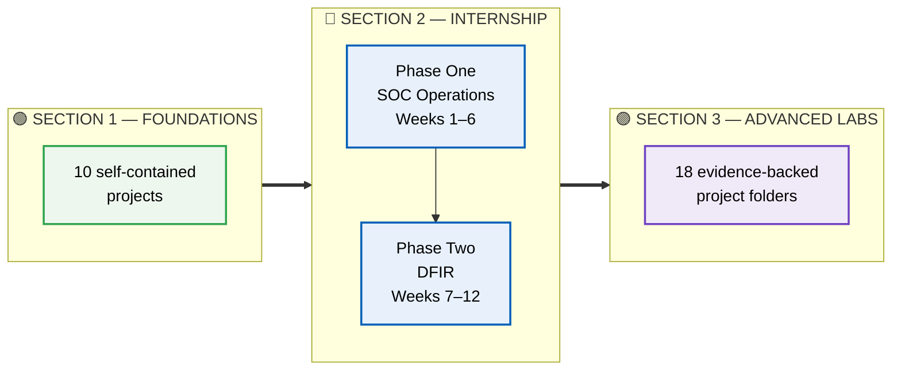
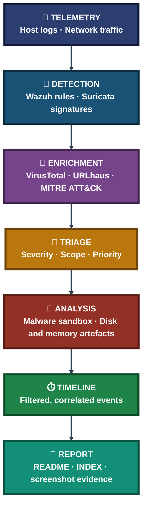

<div align="center">

# 🛡️ Cybersecurity Lab Projects

**Malaika Azhar · Blue Team Portfolio**

**Foundations → Internship → Advanced SOC & Forensics Labs**

Ten foundational projects, a twelve-week Blue Team internship, and eighteen advanced labs covering SIEM, network defense, malware analysis, and digital forensics — every project written around what was actually run, what was actually observed, and what was honestly left unfinished.


### [📂 Jump to the projects](#portfolio-map)

</div>

---

## 📑 Table of Contents

1. [At a Glance](#at-a-glance)
2. [About This Repository](#about)
3. [Environment & Tools](#environment)
4. [Portfolio Map](#portfolio-map)
5. [Section 1 — Foundational Projects](#section-1)
6. [Section 2 — Blue Team Internship](#section-2)
7. [Section 3 — Advanced Cyber Projects](#section-3)
8. [Coverage Snapshot](#coverage-snapshot)
9. [Detection-to-Response Pipeline](#pipeline)
10. [Verification, Not Assumption](#verification)
11. [Highlights in Numbers](#highlights)
12. [Challenges & Fixes](#challenges-fixes)
13. [Scope & Limitations](#scope-limitations)
14. [What I Learned](#what-i-learned)
15. [Skills Demonstrated](#skills-demonstrated)
16. [Repo Structure](#repo-structure)

---

<a id="at-a-glance"></a>
## 📊 At a Glance

| 🧩 Sections | 🧪 Foundational Projects | 📄 Internship Reports | 🔬 Advanced Labs | 📚 Report Pages |
|:---:|:---:|:---:|:---:|:---:|
| **3** | **10** | **12** | **18** | **298** |

---

<a id="about"></a>
## 📖 About This Repository

This repository is one portfolio told in three steps. It starts with ten self-contained foundational projects, moves into a twelve-week Blue Team internship documented as weekly technical reports, and finishes with eighteen advanced labs that turn that internship work into standalone, evidence-backed case files.

- **Section 1 — Foundations:** phishing investigation, secure network design, scanning, framework mapping, packet forensics, log analysis, cracking, assessment, and segmentation.
- **Section 2 — Internship:** SOC operations first (SIEM, FIM, IDS, perimeter, threat intel, malware), then digital forensics and incident response (imaging, artefacts, timelines, a final multi-source case).
- **Section 3 — Advanced Labs:** each internship topic rebuilt as its own project folder with a README, a visual INDEX, and numbered screenshot evidence.

> [!NOTE]
> Every project states plainly where a task was only partly finished and why. That is deliberate — a documented gap with a diagnosed cause is more useful than a result that only looks clean.

<div align="center">

### 🧩 How Each Advanced Project Is Laid Out

<table>
<tr>
<td align="center" valign="top" width="30%">

**📖 README.md**<br>
<sub>Objective, modules,<br>findings, limitations</sub>

</td>
<td align="center" valign="middle" width="10%">

**➜**

</td>
<td align="center" valign="top" width="30%">

**🗂️ INDEX.md**<br>
<sub>Step index, exhibit grid,<br>verification checklist</sub>

</td>
<td align="center" valign="middle" width="10%">

**➜**

</td>
<td align="center" valign="top" width="20%">

**🖼️ screenshots/**<br>
<sub>Numbered evidence,<br>ss-01 onward</sub>

</td>
</tr>
</table>

</div>

---

<a id="environment"></a>
## 🖧 Environment & Tools

| Area | Tools Used |
|---|---|
| **Virtualization & Lab** | VMware Workstation, VirtualBox, Kali Linux, Ubuntu and Windows endpoints |
| **SIEM & Endpoint Monitoring** | Wazuh (Manager, Indexer, Dashboard, agents), File Integrity Monitoring, Active Response |
| **Network Defense** | Suricata (IDS), pfSense (firewall), iptables / ipset |
| **Packet Analysis** | Wireshark |
| **Threat Intelligence** | VirusTotal, URLhaus feed, MITRE ATT&CK |
| **Malware Analysis** | `file`, `exiftool`, `binwalk`, `strings`, ANY.RUN sandbox |
| **Digital Forensics** | Autopsy, The Sleuth Kit, EZ Tools (EvtxECmd, PECmd, LECmd), CyberChef, BrowsingHistoryView |

---

<a id="portfolio-map"></a>
## 🗺️ Portfolio Map



| Section | Folder | Contents |
|:---:|---|---|
| **1** | [`1-Foundational-Projects`](1-Foundational-Projects) | 10 foundational projects |
| **2** | [`2-Blue-Team-Cybersecurity-Internship`](2-Blue-Team-Cybersecurity-Internship) | 12 weekly PDF reports, Executive Summary, INDEX |
| **3** | [`3-Advanced-Cyber-Projects`](3-Advanced-Cyber-Projects) | 18 advanced lab projects |

---

<a id="section-1"></a>
## 🟢 Section 1 — Foundational Projects

**Goal:** Build core skills one focused project at a time, from investigation to network design. Full write-ups live in each folder; see the [section README](1-Foundational-Projects/README.md).

| # | Project | Focus |
|:---:|---|---|
| **01** | [Phishing Email Investigation](1-Foundational-Projects/project-01-phishing-email-investigation) | Investigating a phishing email |
| **02** | [Cisco Infrastructure & Secure Routing](1-Foundational-Projects/project-02-cisco-infrastructure-secure-routing) | Cisco infrastructure with secure routing |
| **03** | [Automated Port Scanner](1-Foundational-Projects/project-03-automated-port-scanner) | Automating port scanning |
| **04** | [Threat Framework Mapping — WannaCry](1-Foundational-Projects/project-04-threat-framework-mapping-wannacry) | Mapping WannaCry to threat frameworks |
| **05** | [Network Forensics with Wireshark](1-Foundational-Projects/project-05-network-forensics-wireshark) | Packet-level network forensics |
| **06** | [SIEM Alert Triage](1-Foundational-Projects/project-06-siem-alert-triage) | Triaging SIEM alerts |
| **07** | [Linux Log Analysis & Forensics](1-Foundational-Projects/project-07-linux-log-analysis-forensics) | Analysing Linux logs for evidence |
| **08** | [Password Cracking & Hash Analysis](1-Foundational-Projects/project-08-password-cracking-hash-analysis) | Cracking and analysing password hashes |
| **09** | [Vulnerability Assessment Report](1-Foundational-Projects/project-09-vulnerability-assessment-report) | Assessing and reporting vulnerabilities |
| **10** | [VLAN Segmentation & Inter-VLAN Routing](1-Foundational-Projects/project-10-vlan-segmentation-intervlan-routing) | Segmenting a network with VLANs |

---

<a id="section-2"></a>
## 🔵 Section 2 — Blue Team Internship

**Goal:** Twelve weekly technical reports, each following the same structure — objective, work performed, captured evidence, interpretation, and a short "understanding" section. Start with the [Executive Summary](2-Blue-Team-Cybersecurity-Internship/Executive-Summary.md), the [INDEX](2-Blue-Team-Cybersecurity-Internship/INDEX.md), or the [section README](2-Blue-Team-Cybersecurity-Internship/README.md).

### 🔵 Phase One — SOC Operations (Weeks 1–6)

| Week | Focus | Report |
|:---:|---|:---:|
| **01** | SOC Foundations & Lab Setup | [📄 PDF](2-Blue-Team-Cybersecurity-Internship/Week01_Report.pdf) |
| **02** | FIM · Custom Rules · Log Analysis · Active Response | [📄 PDF](2-Blue-Team-Cybersecurity-Internship/Week02_Report.pdf) |
| **03** | Suricata IDS & Wazuh Integration | [📄 PDF](2-Blue-Team-Cybersecurity-Internship/Week03_Report.pdf) |
| **04** | pfSense · Threat Intel · Vulnerability Assessment · SOC Reporting | [📄 PDF](2-Blue-Team-Cybersecurity-Internship/Week04_Report.pdf) |
| **05** | Malware Analysis & Detection Engineering | [📄 PDF](2-Blue-Team-Cybersecurity-Internship/Week05_Report.pdf) |
| **06** | Phase One Capstone — Insider Threat & Incident Response | [📄 PDF](2-Blue-Team-Cybersecurity-Internship/Week06_Report.pdf) |

### 🟣 Phase Two — Digital Forensics & Incident Response (Weeks 7–12)

| Week | Focus | Report |
|:---:|---|:---:|
| **07** | Disk Imaging & File System Analysis | [📄 PDF](2-Blue-Team-Cybersecurity-Internship/Week07_Report.pdf) |
| **08** | Windows Artefact Analysis | [📄 PDF](2-Blue-Team-Cybersecurity-Internship/Week08_Report.pdf) |
| **09** | Browser Forensics & LNK Analysis | [📄 PDF](2-Blue-Team-Cybersecurity-Internship/Week09_Report.pdf) |
| **10** | Autopsy Triage & Registry Analysis | [📄 PDF](2-Blue-Team-Cybersecurity-Internship/Week10_Report.pdf) |
| **11** | Email Forensics & Super Timeline | [📄 PDF](2-Blue-Team-Cybersecurity-Internship/Week11_Report.pdf) |
| **12** | Final Case — M57.biz Capstone | [📄 PDF](2-Blue-Team-Cybersecurity-Internship/Week12_Report.pdf) |

---

<a id="section-3"></a>
## 🟣 Section 3 — Advanced Cyber Projects

**Goal:** Take the internship topics and give each one its own folder — README, INDEX, and numbered screenshots — so every claim can be checked against evidence. Browse the [section README](3-Advanced-Cyber-Projects/README.md) for the overview.

**Status legend:** ✅ Complete · 🟡 Partial (gap documented in the project)

### 🔵 Detection & Monitoring

| # | Project | Status | Highlights |
|:---:|---|:---:|---|
| **01** | [Home SOC Lab Setup](3-Advanced-Cyber-Projects/project-01-home-soc-lab-setup) | ✅ | One Ubuntu VM, Wazuh Cloud, two agents; every hardware-driven substitution disclosed |
| **02** | [FIM & Custom Detection Rules](3-Advanced-Cyber-Projects/project-02-fim-custom-detection-rules) | ✅ | FIM and custom rules complete; Active Response live test documented as pending |
| **06** | [SSH BruteForce Detection Lab](3-Advanced-Cyber-Projects/project-06-ssh-bruteforce-detection-lab) | ✅ | 2 custom rules; wrong base rule caught and fixed with `wazuh-logtest` |
| **08** | [SIEM Log Analysis & Alert Tuning](3-Advanced-Cyber-Projects/project-08-siem-log-analysis-alert-tuning) | ✅ | Real Linux logs plus clearly labelled simulated Windows events, exported to CSV |
| **09** | [SIEM Dashboard](3-Advanced-Cyber-Projects/project-09-siem-dashboard) | ✅ | Custom dashboard and reporting |

### 🟠 Network Defense & Traffic Analysis

| # | Project | Status | Highlights |
|:---:|---|:---:|---|
| **03** | [Network Perimeter Defense](3-Advanced-Cyber-Projects/project-03-network-perimeter-defense) | ✅ | Perimeter hardening |
| **04** | [Firewall Rules Configuration](3-Advanced-Cyber-Projects/project-04-firewall-rules-configuration) | ✅ | Rule design and logging |
| **05** | [Port Scan Detection Lab](3-Advanced-Cyber-Projects/project-05-port-scan-detection-lab) | ✅ | Detecting reconnaissance |
| **10** | [Network Traffic Analysis (Wireshark)](3-Advanced-Cyber-Projects/project-10-network-traffic-analysis-wireshark) | ✅ | ARP, DNS, HTTP, HTTPS/TLS and ICMP captured live, normal vs suspicious |

### 🟣 Threat Intelligence, Malware & Incident Response

| # | Project | Status | Highlights |
|:---:|---|:---:|---|
| **07** | [Threat Intelligence Enrichment & Vulnerability Assessment](3-Advanced-Cyber-Projects/project-07-threat-intelligence-enrichment-and-vulnerability-assessment) | ✅ | Feed enrichment plus patch-and-rescan |
| **11** | [Malware Analysis & Incident Response](3-Advanced-Cyber-Projects/project-11-malware-analysis-incident-response) | 🟡 | 2 samples analysed, custom Suricata rule verified 8/8; second rule, Wazuh rules and IR plan pending |
| **12** | [Insider Threat Detection System](3-Advanced-Cyber-Projects/project-12-insider-threat-detection-system) | ✅ | Detecting insider activity |
| **13** | [SOC Red vs Blue Capstone](3-Advanced-Cyber-Projects/project-13-soc-redvsblue-capstone) | ✅ | Full attack chain, decoded evidence, custom rule 100050 verified live |

### 🔍 Digital Forensics

| # | Project | Status | Highlights |
|:---:|---|:---:|---|
| **14** | [🔐 Windows Event Log Analysis](3-Advanced-Cyber-Projects/project-14-windows-event-log-analysis) | ✅ | Hash-verified Security.evtx parsed twice; Logon Type 7 absence documented |
| **15** | [DFIR Disk Imaging](3-Advanced-Cyber-Projects/project-15-dfir-disk-imaging) | ✅ | Forensic imaging with verification |
| **16** | [Windows Artifacts — Prefetch, Thumbcache & Recycle Bin](3-Advanced-Cyber-Projects/project-16-windows-artifacts-prefetch) | ✅ | 362 of 363 Prefetch files parsed; Temp-path installer closed by context |
| **17** | [Browser Forensics & LNK Analysis](3-Advanced-Cyber-Projects/project-17-browser-forensics-lnk-analysis) | ✅ | Browser and shortcut artefacts |
| **18** | [Mantooth Investigation & Registry Analysis](3-Advanced-Cyber-Projects/project-18-mantooth-investigation-registry-analysis) | 🟡 | Autopsy triage of a fraud image; registry lab documented as methodology only |

---

<a id="coverage-snapshot"></a>
## 🌟 Coverage Snapshot

| 🛡️ Domain | 📌 Where It Appears | ✅ What Was Demonstrated |
|---|---|---|
| SIEM & Host Monitoring | Advanced 01, 02, 06, 08, 09 · Internship Weeks 1, 2, 4 | Wazuh deployment, FIM, custom rules, dashboards |
| Network Defense | Advanced 03, 04, 05 · Foundations 02, 10 · Internship Weeks 3, 4 | Suricata rules, firewalling, perimeter and segmentation |
| Traffic & Packet Analysis | Advanced 10 · Foundations 05 | Live capture and normal-vs-suspicious protocol reading |
| Threat Intelligence & Vulnerability Mgmt | Advanced 07 · Foundations 09 · Internship Week 4 | Feed enrichment, MITRE mapping, verified patching |
| Malware Analysis & IR | Advanced 11, 12, 13 · Internship Weeks 5, 6 | Static + dynamic analysis, IOC/IOA extraction, red-vs-blue |
| Disk, Windows & Registry Forensics | Advanced 14–18 · Internship Weeks 7–12 | Imaging, event logs, Prefetch, browser, LNK, Autopsy |

---

<a id="pipeline"></a>
## 🧭 Detection-to-Response Pipeline

How the portfolio fits together — from raw telemetry to a finished report



---

<a id="verification"></a>
## ✅ Verification, Not Assumption

A recurring rule across the portfolio: a step is not done until it has been proven with direct evidence.

| Check | Method | Where |
|---|---|---|
| Custom rule works on its own | Isolated replay with only the custom rule loaded — 8 / 8 matches | Advanced 11 |
| Lab is truly isolated | A *failed* ping after disabling the adapter at the hypervisor | Advanced 11 |
| Downloaded samples are intact | Hashes compared against published values | Advanced 11 |
| Evidence log is untouched | SHA256 generated immediately after copying, before any parsing | Advanced 14 |
| A rule's base pattern is right | `wazuh-logtest` against the raw log line | Advanced 06 |
| Custom rule fires in production conditions | Re-running the attack steps and confirming the alert | Advanced 13 |

---

<a id="highlights"></a>
## 🔢 Highlights in Numbers

Figures below are taken directly from the project READMEs.

| Project | Highlight |
|:---:|---|
| Advanced 06 | **2** custom Wazuh rules; base pattern corrected **5716 → 5710** before the rule fired |
| Advanced 11 | **2** malware samples analysed; **12** consolidated IOC/IOA entries; custom rule matched **8 / 8** in isolation |
| Advanced 14 | **32,738 → 33,127** records parsed across two passes of the same Security log |
| Advanced 16 | **362 of 363** Prefetch files parsed; **149** `$R` and **74** `$I` Recycle Bin records enumerated |
| Advanced 18 | **276** deleted files surfaced in one image; Xcopy run count of **15** |
| Internship | **12** reports totalling **298** pages |

---

<a id="challenges-fixes"></a>
## ⚠️ Challenges & Fixes

| ❌ Challenge | ✅ Fix |
|---|---|
| Local hardware could not run the full Wazuh stack | Documented the pre-flight failure and moved the Manager to a hosted trial (Advanced 01) |
| An assumed base rule ID was wrong | Tested against the raw log with `wazuh-logtest` and corrected it (Advanced 06) |
| No Windows VM was available for the capstone | Substituted Kali with Bash equivalents and disclosed it up front (Advanced 13) |
| The dedicated FIM deletion rule never fired | Diagnosed step by step, then used the sudo audit log as a compensating control (Advanced 13) |
| Thumbcache files were locked by a live Explorer | Copied with `robocopy /B` backup mode (Advanced 16) |
| Autopsy case was created in the wrong time zone | Kept times as recorded and documented the offset (Advanced 18) |

---

<a id="scope-limitations"></a>
## 🚧 Scope & Limitations

- **Advanced 02:** FIM and custom rules are complete; the live Active Response enforcement run is documented but was not executed end to end.
- **Advanced 08:** The Windows Event IDs are simulated with `logger` to test decoders, not captured from a live Windows host — labelled that way wherever they appear.
- **Advanced 11:** Static and dynamic analysis and the first Suricata rule are verified. The second rule's live test, the Wazuh custom rules and the incident-response plan were not finished after a hardware failure.
- **Advanced 13:** Run on Kali rather than the specified Windows endpoint; the dedicated deletion rule did not fire in this environment.
- **Advanced 18:** Lab 1 is mostly complete; several questions were not finished, and the registry lab is a written methodology rather than executed work.
- **Internship Weeks 11–12:** Week 11 documents methodology because the evidence image was inaccessible that week; Week 12 covers USB scope, with disk and RAM analysis pending.
- **Screenshots:** Sensitive identifiers such as API keys and personal content are redacted.

These gaps are marked here instead of hidden, so the portfolio reflects exactly what was done.

---

<a id="what-i-learned"></a>
## 🧠 What I Learned

- **A rule that parses is not a rule that works.** Detection logic has to be tested against real traffic and real logs every time.
- **A hardware limit is a decision point, not a dead end.** A documented substitution beats a stalled build.
- **A near-empty result is still a finding** — almost no readable strings pointed to a packed executable.
- **Absence deserves a report too.** A Logon Type that never appeared, even after a deliberate test, is worth writing down.
- **Independent artefacts that agree carry far more weight** than any single trace.
- **Context closes a false positive.** A Temp-path execution looked suspicious until the same software was found installed legitimately.
- **Document blockers honestly.** A gap with a diagnosed cause holds up better under review than a result that only looks clean.

---

<a id="skills-demonstrated"></a>
## 🛠️ Skills Demonstrated

- Deploying and tuning a Wazuh SIEM with FIM, custom rules, dashboards and active response
- Writing and verifying Suricata and Wazuh detection rules against replayed and live activity
- Standing up firewall, perimeter and segmentation controls
- Live packet capture and protocol analysis in Wireshark
- Enriching alerts with threat intelligence and mapping them to MITRE ATT&CK
- Static and dynamic malware analysis with IOC and IOA extraction
- Forensic imaging with hash verification, and Autopsy-based investigation
- Parsing event-log, Prefetch, LNK, registry, browser and Recycle Bin artefacts
- Building correlated timelines and writing technical and executive summaries from the same data

---

<a id="repo-structure"></a>
## 📁 Repo Structure

```text
Cybersecurity-Lab-Projects/
|-- README.md
|-- LICENSE
|-- 1-Foundational-Projects/
|   |-- README.md
|   |-- project-01-phishing-email-investigation/
|   |-- project-02-cisco-infrastructure-secure-routing/
|   |-- project-03-automated-port-scanner/
|   |-- project-04-threat-framework-mapping-wannacry/
|   |-- project-05-network-forensics-wireshark/
|   |-- project-06-siem-alert-triage/
|   |-- project-07-linux-log-analysis-forensics/
|   |-- project-08-password-cracking-hash-analysis/
|   |-- project-09-vulnerability-assessment-report/
|   `-- project-10-vlan-segmentation-intervlan-routing/
|-- 2-Blue-Team-Cybersecurity-Internship/
|   |-- README.md
|   |-- INDEX.md
|   |-- Executive-Summary.md
|   `-- Week01_Report.pdf ... Week12_Report.pdf
`-- 3-Advanced-Cyber-Projects/
    |-- README.md
    |-- project-01-home-soc-lab-setup/
    |-- project-02-fim-custom-detection-rules/
    |-- project-03-network-perimeter-defense/
    |-- project-04-firewall-rules-configuration/
    |-- project-05-port-scan-detection-lab/
    |-- project-06-ssh-bruteforce-detection-lab/
    |-- project-07-threat-intelligence-enrichment-and-vulnerability-assessment/
    |-- project-08-siem-log-analysis-alert-tuning/
    |-- project-09-siem-dashboard/
    |-- project-10-network-traffic-analysis-wireshark/
    |-- project-11-malware-analysis-incident-response/
    |-- project-12-insider-threat-detection-system/
    |-- project-13-soc-redvsblue-capstone/
    |-- project-14-windows-event-log-analysis/
    |-- project-15-dfir-disk-imaging/
    |-- project-16-windows-artifacts-prefetch/
    |-- project-17-browser-forensics-lnk-analysis/
    `-- project-18-mantooth-investigation-registry-analysis/
```

<div align="center">

🛡️ **[Wazuh](https://wazuh.com)** · 🔎 **[Suricata](https://suricata.io)** · 🌐 **[pfSense](https://www.pfsense.org)** · 🦈 **[Wireshark](https://www.wireshark.org)** · 🧬 **[Autopsy](https://www.autopsy.com)** · 🧭 **[MITRE ATT&CK](https://attack.mitre.org)**

</div>
